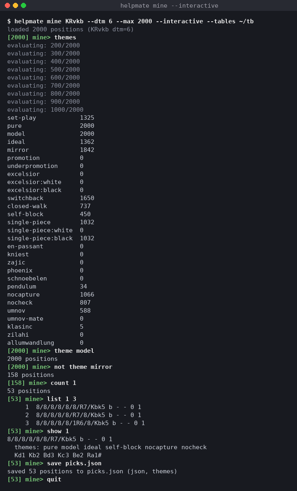

# helpmate-tablebase

**Every helpmate in a material class, solved exhaustively.** Not a solver you
point at one position — a table that already knows the answer for all of them.

Complete through five pieces. MIT licensed. The tables are a free download.

> [!IMPORTANT]
> **631 six-piece tablebases have never been computed, and 281 of them need
> only 32 GiB of RAM and about a day of CPU each.** If you have a machine that
> idles overnight, you can compute something nobody ever has — and get credited
> for it.
> **→ [How to contribute a tablebase](docs/CONTRIBUTING-TABLES.md)**

```
$ helpmate mine KQvk --dtm 2 --count 1 --max 3
8/8/8/8/8/8/8/k1KQ4 b - - 0 1
8/8/8/8/8/2Q5/8/k1K5 b - - 0 1
8/8/8/8/4Q3/8/8/k1K5 b - - 0 1
```

Those are h#1 positions with **exactly one** solution — sound compositions,
enumerated rather than found. That is what this is for.

## What a helpmate is

Both sides cooperate. Black moves first and *helps* White deliver mate in the
fewest possible moves. Composers publish these as `h#n` problems: a position
plus a claim that mate is reachable in exactly `n` moves, ideally by a
**unique** solution — a second solution is usually a flaw.

Because both sides want the same thing, solving is a cooperative
shortest-path problem rather than the min/max game tree an ordinary tablebase
faces. That is what makes whole material classes tractable instead of one
position at a time.

For every legal position in a class, the table stores:

- **dtm** — distance to mate in plies, under optimal cooperation.
- **h#n** — the composer's notation, derived from dtm.
- **count** — how many *distinct* optimal solutions tie for shortest.
  `count=1` is a sound composition. `count=2` is a dual.

That last field is the point. Anyone can search for a mate; the tablebase
tells you whether it is **unique**, across every position at once.

## Sixty seconds

```console
$ helpmate gen KQvk --tables tables
tables/Kvk.hm max_dtm=255
tables/KQvk.hm max_dtm=14

$ helpmate probe "8/7k/5K2/8/8/8/8/6Q1 b - - 0 1"
dtm=2 (h#1) count=4

$ helpmate line "8/7k/5K2/8/8/8/8/6Q1 b - - 0 1" --all
Kh6 Qh2#
Kh6 Qh1#
Kh6 Qg6#
Kh8 Qg7#
```

Black king h7, White king f6, White queen g1. Mate in one move each — and
four different ways to do it, so as a composition it is unsound. The table
answered in constant time; it did no search.

Generation is a one-off cost. Every query afterwards is a table lookup.

## What is solved today

| pieces | classes | status |
| --- | --- | --- |
| 2–4 | 66 | **complete** |
| 5 | 220 | **complete** |
| 6 | 645 | 14 done, 631 to go |
| 7+ | — | needs an out-of-core generator that does not exist |

**300 tables, 50.2 GiB** block-compressed, published as a Hugging Face
dataset. The deepest mate in the corpus is h#17.

[**The deepest sound problem in every material class →**](docs/DEEPEST.md)

**Or on a board:** [osick.github.io/helpmate-tablebase](https://osick.github.io/helpmate-tablebase/) — the deepest sound problems played through, 930 unique-solution puzzles to solve, and the corpus table by table. Static, no server, built from the same data.
One position per material, with a diagram and its solution — and a link that
opens each one in the [Helpmate Analyzer](https://helpman.komtera.lt/) with the
stipulation already set. The same data is typeset as a print booklet:
`make booklet`.

```bash
helpmate-tables pull --tables ./tables --repo osick/helpmate-tables
```

The server can also stream tables on demand instead, fetching and caching
each class the first time someone asks for it.

## Help solve the rest

Six hundred machine-days of work remain at six pieces, and it will not come
from one desk.

**281 of the missing tables need only 32 GiB of RAM** and about a day each.
If you have a machine that idles overnight, you can compute something nobody
ever has. Contributions land as pull requests on the dataset, and every
merged table is credited.

**→ [How to contribute a tablebase](docs/CONTRIBUTING-TABLES.md)**

Two pieces of tooling are also wanted and would help more than any table: a
`helpmate verify` command, and `--create-pr` support in the push CLI. Both
are described in that guide.

## The command line is the front door

`helpmate` is the primary interface, and
**[USAGE.md](docs/USAGE.md)** documents all of it:

| | |
| --- | --- |
| `gen` | build every table a material class needs |
| `probe` | look up one position |
| `line` | print optimal solutions as SAN |
| `mine` | scan a class for compositions by dtm, solution count, shape and theme; annotate, export as JSON, or refine interactively |
| `stats` | generation statistics and corpus summaries |
| `themes` | list the pattern detectors `mine --theme` accepts |
| `compact` | compress tables, or shrink provably-unsolvable ones to markers |

`mine --theme` recognises named composition patterns — model mates, echoes,
battery mates and more. The **[theme catalogue](docs/THEME-CATALOG.md)** has
the full list with the exact definition each detector uses.

## Mining, from a scan to a shortlist

`mine` is where compositions come from, and since 0.18.0 a scan is something
you can hold on to rather than a stream of FENs you have to probe one by one.

**Annotate every hit.** `--themes` adds the themes each position shows,
`--solutions` adds every optimal solution. Text stays greppable: the FEN is
the only unindented line.

```console
$ helpmate mine KRvkb --dtm 6 --max 1 --themes --solutions --tables ~/tb
8/8/8/8/8/8/8/K1k1bR2 b - - 0 1
  themes: pure model ideal mirror switchback single-piece single-piece:black nocheck
  Kd1 Ka2 Kc1 Kb3 Kb1 Rxe1#
  Kc2 Ka2 Kc1 Kb3 Kb1 Rxe1#
  Kd2 Ka2 Kc1 Kb3 Kb1 Rxe1#
```

**Take everything.** `--max infinity` (or `inf`) lifts the cap, and `--json`
turns the result into one document with the material, the filter that was
asked, and a `positions` array carrying `fen`, `dtm`, `count` and, with the
flags above, `themes`, `starts`, `ends` and `solutions`. For a result too
big to parse in one piece, `--jsonl` writes the same records one per line,
streamed as the scan finds them, between a header line and a footer line
with the counts:

```console
$ helpmate mine KRvkb --dtm 6 --max infinity --json --themes --solutions --tables ~/tb > krvkb-h3.json
$ helpmate mine KRvkb --dtm 6 --max infinity --jsonl --themes --tables ~/tb | jq -c 'select(.fen and (.themes|index("ideal")))'
```

**Refine instead of rescanning.** `--interactive` runs the scan once, keeps
the hits in memory, and opens a prompt. Narrowing by theme, solution count
or shape works on the held set; each position's themes and solutions are
computed the first time they are needed and cached, so `back` is free and
a second filter on the same set costs nothing.



| Command | Effect |
| --- | --- |
| `theme NAME`, `not theme NAME` | keep or drop positions showing NAME (`promotions:qrr` works too) |
| `count N`, `starts N`, `ends N` | keep positions with exactly that value |
| `back`, `reset` | undo the last narrowing, or return to the loaded set |
| `list [FROM [N]]`, `show I` | page through the FENs; print one hit with its themes and every solution |
| `themes` | how many positions in the current set show each theme, the map for what to narrow on next |
| `save FILE` | `.json` writes the document above, `.jsonl` the JSON Lines form; anything else writes bare FENs |
| `help`, `quit` | |

Results go to stdout and the prompt, progress and notes to stderr, so a
scripted session (`helpmate mine ... --interactive < script > out`) leaves a
clean file. There is no line editing built in; `rlwrap helpmate ...` adds
history. The whole thing is in [USAGE.md](docs/USAGE.md#mine--scan-for-composition-candidates),
with the JSON keys and the exact text layout.

### Also available

- **Python.** `from helpmate import Tablebase` — probe, enumerate lines, and
  mine from a script. See [USAGE.md](docs/USAGE.md#python-api).
- **HTTP API and web dashboard.** `helpmate-server` serves a read-only JSON
  API and a browser board for exploring positions. Secondary to the CLI, and
  documented in [USAGE.md](docs/USAGE.md#api-server).

## Documentation

| | |
| --- | --- |
| [USAGE.md](docs/USAGE.md) | the full guide — every command, every flag, every field |
| [DEEPEST.md](docs/DEEPEST.md) | **the deepest sound problem in every material class**, with diagrams |
| [DEEPEST.tex](docs/DEEPEST.tex) | the same showcase as an A5 booklet — `make booklet` |
| [BUILD.md](docs/BUILD.md) | prerequisites, build targets, offline dependencies, troubleshooting |
| [CONTRIBUTING-TABLES.md](docs/CONTRIBUTING-TABLES.md) | **contribute CPU time and tables** |
| [CONTRIBUTING.md](docs/CONTRIBUTING.md) | contribute code — CI checks and PR requirements |
| [INTERNALS.md](docs/INTERNALS.md) | indexing, generation, storage format, verification, limits |
| [the showcase site](https://osick.github.io/helpmate-tablebase/) | deepest sound problems on a board, puzzles to solve, the corpus table by table (source in `site/`) |
| [COOPERATIVE-TABLEBASE.md](docs/COOPERATIVE-TABLEBASE.md) | the short technical account for people who know Syzygy: why a cooperative game changes the algorithm, and what the data says |
| [THEME-CATALOG.md](docs/THEME-CATALOG.md) | every theme detector and its definition |
| [ROADMAP.md](docs/ROADMAP.md) | where this is going |

## Why you can trust it

A tablebase is worth exactly as much as your reason to believe it. This one
does not grade its own homework:

- **An independent oracle** — a from-scratch cooperative search sharing only
  the move generator with the real generator — re-solves sampled positions
  from every slice and checks both dtm and solution count.
- **Every one of the 368,452 legal `KQvk` positions** is cross-checked against
  a reference implementation written directly on python-chess, with no
  helpmate code involved in computing the expected answers.
- **Multithreaded output is required to be byte-identical** to
  single-threaded output, and that is asserted, not assumed.

[INTERNALS.md](docs/INTERNALS.md) has the full account, including measured
coverage and one unresolved bug stated plainly rather than buried.

## Building

```bash
git clone https://github.com/osick/helpmate-tablebase
cd helpmate-tablebase
make install
```

Needs a C++20 compiler and CMake. No PyPI release yet.
[BUILD.md](docs/BUILD.md) covers the rest.

## Licence

MIT. See [LICENSE](LICENSE).
