# The deepest sound problem in every material class

One position per material: the deepest position with a **unique solution**.

In problem chess uniqueness is the quality criterion. A second solution is a
dual and the composition is unsound, so `count = 1` is what makes a position
worth anything as a problem.

**The deepest problem in a material class is almost never the longest one.**
Across all 234 classes here, the deepest *unique* position is shallower
than the class maximum **every single time** — 234/234, mean gap
4.4 plies, worst case 20. The reason is visible
in the data: in 225 of 234 classes every position at maximum depth has a
**saturated** solution count (255 or more). The longest helpmates have hundreds
of ways to reach mate, which is exactly what disqualifies them as compositions.

The extreme case is **KRBvkp**: it runs to h#16,
but its deepest sound problem is h#6 — 20 plies shallower.

These positions are also rare. 21 classes contain **exactly one** unique
position at their deepest sound depth; 117
contain ten or fewer.

Black moves first and cooperates. `h#n` means mate after n moves by each side;
`h#n.5` means White is to move and needs one extra half-move. Under each
diagram stands the stipulation and the material count, white men + black men;
each problem carries its number (the same one as in the booklet), the themes it
shows (see the [theme catalogue](THEME-CATALOG.md)), and a *solve* link that
opens it in the Helpmate Analyzer with the stipulation set. The piece drawings
are Cburnett's (Wikimedia Commons, CC BY-SA 3.0).

Generated by [`tools/deepest_showcase.py`](../tools/deepest_showcase.py) and
rendered by [`tools/render_deepest.py`](../tools/render_deepest.py) — nothing here
is hand-written. Depths and position counts come from each table's exact
`uniqueness` histogram, not from sampling; every FEN is verified by probing
before it is used.

The same data is also typeset as a print booklet:
[`docs/DEEPEST.tex`](DEEPEST.tex), built by
[`tools/deepest_booklet.py`](../tools/deepest_booklet.py).

Deepest sound problem in the whole corpus: **h#13** (KBvkrp, 2 such positions).

## Index

Sorted by how deep a *sound* problem gets. `class max` is the longest helpmate in that material at any solution count.

| material | pieces | deepest sound | class max | gap | unique positions there |
| --- | --- | --- | --- | --- | --- |
| [KBvkrp](#kbvkrp) | 5 | **h#13** | h#16.5 | −7 | 2 |
| [KBvkqp](#kbvkqp) | 5 | **h#12** | h#17 | −10 | 3 |
| [KBvkbp](#kbvkbp) | 5 | **h#11.5** | h#16 | −9 | 8 |
| [KBPvkp](#kbpvkp) | 5 | **h#10.5** | h#16 | −11 | 1 |
| [KBvkqnn](#kbvkqnn) | 6 | **h#10** | h#13 | −6 | 5 |
| [KPvkpp](#kpvkpp) | 5 | **h#10** | h#15.5 | −11 | 2 |
| [KBvknp](#kbvknp) | 5 | **h#9.5** | h#15.5 | −12 | 2 |
| [KBvkqbn](#kbvkqbn) | 6 | **h#9.5** | h#12.5 | −6 | 90 |
| [KBvkqn](#kbvkqn) | 5 | **h#9.5** | h#13 | −7 | 46 |
| [KBvkqqn](#kbvkqqn) | 6 | **h#9.5** | h#12.5 | −6 | 341 |
| [KBvkqrn](#kbvkqrn) | 6 | **h#9.5** | h#12.5 | −6 | 394 |
| [KBvkrn](#kbvkrn) | 5 | **h#9.5** | h#12.5 | −6 | 24 |
| [KNvkpp](#knvkpp) | 5 | **h#9.5** | h#11.5 | −4 | 2 |
| [KNvkqb](#knvkqb) | 5 | **h#9.5** | h#11.5 | −4 | 1 |
| [KNvkqp](#knvkqp) | 5 | **h#9.5** | h#11.5 | −4 | 194 |
| [KPvkbp](#kpvkbp) | 5 | **h#9.5** | h#14.5 | −10 | 9 |
| [KBBvkbn](#kbbvkbn) | 6 | **h#9** | h#12 | −6 | 244 |
| [KBBvkn](#kbbvkn) | 5 | **h#9** | h#12 | −6 | 2 |
| [KBBvkp](#kbbvkp) | 5 | **h#9** | h#16 | −14 | 1 |
| [KBvkbn](#kbvkbn) | 5 | **h#9** | h#12 | −6 | 57 |
| [KBvknn](#kbvknn) | 5 | **h#9** | h#12.5 | −7 | 34 |
| [KBvkpp](#kbvkpp) | 5 | **h#9** | h#16 | −14 | 51 |
| [KNPvkp](#knpvkp) | 5 | **h#9** | h#14 | −10 | 9 |
| [KPvknp](#kpvknp) | 5 | **h#9** | h#14.5 | −11 | 4 |
| [KBBvknn](#kbbvknn) | 6 | **h#8.5** | h#13 | −9 | 17 |
| [KBvkqbb](#kbvkqbb) | 6 | **h#8.5** | h#10.5 | −4 | 25 |
| [KBvkrbb](#kbvkrbb) | 6 | **h#8.5** | h#9.5 | −2 | 2 |
| [KNvkbb](#knvkbb) | 5 | **h#8.5** | h#10.5 | −4 | 69 |
| [KNvkbp](#knvkbp) | 5 | **h#8.5** | h#10.5 | −4 | 12 |
| [KNvknn](#knvknn) | 5 | **h#8.5** | h#9.5 | −2 | 3 |
| [KNvknnn](#knvknnn) | 6 | **h#8.5** | h#9.5 | −2 | 4 |
| [KNvknp](#knvknp) | 5 | **h#8.5** | h#10 | −3 | 1 |
| [KNvkqr](#knvkqr) | 5 | **h#8.5** | h#9.5 | −2 | 8 |
| [KNvkrn](#knvkrn) | 5 | **h#8.5** | h#10.5 | −4 | 1 |
| [KNvkrp](#knvkrp) | 5 | **h#8.5** | h#11.5 | −6 | 46 |
| [KNvkrr](#knvkrr) | 5 | **h#8.5** | h#9.5 | −2 | 5 |
| [KPPvkp](#kppvkp) | 5 | **h#8.5** | h#14.5 | −12 | 6 |
| [KPvkp](#kpvkp) | 4 | **h#8.5** | h#14.5 | −12 | 2 |
| [KPvkqn](#kpvkqn) | 5 | **h#8.5** | h#9.5 | −2 | 1 |
| [KPvkqp](#kpvkqp) | 5 | **h#8.5** | h#14.5 | −12 | 9 |
| [KPvkrp](#kpvkrp) | 5 | **h#8.5** | h#14.5 | −12 | 101 |
| [KBBvkbb](#kbbvkbb) | 6 | **h#8** | h#10 | −4 | 129 |
| [KBvkbb](#kbvkbb) | 5 | **h#8** | h#10 | −4 | 8 |
| [KBvkn](#kbvkn) | 4 | **h#8** | h#12 | −8 | 19 |
| [KBvkp](#kbvkp) | 4 | **h#8** | h#16 | −16 | 16 |
| [KNvkb](#knvkb) | 4 | **h#8** | h#10.5 | −5 | 5 |
| [KNvkbn](#knvkbn) | 5 | **h#8** | h#10 | −4 | 5 |
| [KNvkp](#knvkp) | 4 | **h#8** | h#11.5 | −7 | 4 |
| [KNvkqn](#knvkqn) | 5 | **h#8** | h#10.5 | −5 | 2 |
| [KNvkr](#knvkr) | 4 | **h#8** | h#9.5 | −3 | 9 |
| [KQBvkn](#kqbvkn) | 5 | **h#8** | h#12 | −8 | 25 |
| [KQNvkb](#kqnvkb) | 5 | **h#8** | h#11 | −6 | 5 |
| [KQNvkn](#kqnvkn) | 5 | **h#8** | h#10 | −4 | 16 |
| [KQNvkp](#kqnvkp) | 5 | **h#8** | h#11 | −6 | 2 |
| [KQNvkr](#kqnvkr) | 5 | **h#8** | h#10 | −4 | 11 |
| [KQPvkb](#kqpvkb) | 5 | **h#8** | h#9 | −2 | 4 |
| [KQPvkn](#kqpvkn) | 5 | **h#8** | h#9 | −2 | 7 |
| [KQPvkp](#kqpvkp) | 5 | **h#8** | h#15 | −14 | 42 |
| [KRBvkn](#krbvkn) | 5 | **h#8** | h#12 | −8 | 4 |
| [KRNvkn](#krnvkn) | 5 | **h#8** | h#10 | −4 | 2 |
| [KBNvkq](#kbnvkq) | 5 | **h#7.5** | h#8.5 | −2 | 1 |
| [KBvkqqb](#kbvkqqb) | 6 | **h#7.5** | h#8.5 | −2 | 8 |
| [KBvkqrb](#kbvkqrb) | 6 | **h#7.5** | h#8.5 | −2 | 2 |
| [KNPvkb](#knpvkb) | 5 | **h#7.5** | h#11 | −7 | 4 |
| [KNPvkn](#knpvkn) | 5 | **h#7.5** | h#9 | −3 | 2 |
| [KNPvkq](#knpvkq) | 5 | **h#7.5** | h#8.5 | −2 | 17 |
| [KNPvkr](#knpvkr) | 5 | **h#7.5** | h#9 | −3 | 3 |
| [KNvkn](#knvkn) | 4 | **h#7.5** | h#10 | −5 | 14 |
| [KNvkrb](#knvkrb) | 5 | **h#7.5** | h#10.5 | −6 | 12 |
| [KPPvkb](#kppvkb) | 5 | **h#7.5** | h#8.5 | −2 | 1 |
| [KPPvkn](#kppvkn) | 5 | **h#7.5** | h#8.5 | −2 | 1 |
| [KPPvkq](#kppvkq) | 5 | **h#7.5** | h#8.5 | −2 | 1 |
| [KPvkb](#kpvkb) | 4 | **h#7.5** | h#8.5 | −2 | 13 |
| [KPvkbb](#kpvkbb) | 5 | **h#7.5** | h#9.5 | −4 | 448 |
| [KPvkbn](#kpvkbn) | 5 | **h#7.5** | h#9.5 | −4 | 1,222 |
| [KPvkn](#kpvkn) | 4 | **h#7.5** | h#8.5 | −2 | 8 |
| [KPvknn](#kpvknn) | 5 | **h#7.5** | h#9.5 | −4 | 476 |
| [KPvkq](#kpvkq) | 4 | **h#7.5** | h#9 | −3 | 32 |
| [KPvkqb](#kpvkqb) | 5 | **h#7.5** | h#11.5 | −8 | 342 |
| [KPvkqq](#kpvkqq) | 5 | **h#7.5** | h#9.5 | −4 | 367 |
| [KPvkqr](#kpvkqr) | 5 | **h#7.5** | h#8.5 | −2 | 40 |
| [KPvkr](#kpvkr) | 4 | **h#7.5** | h#8.5 | −2 | 1 |
| [KPvkrb](#kpvkrb) | 5 | **h#7.5** | h#8.5 | −2 | 6 |
| [KPvkrn](#kpvkrn) | 5 | **h#7.5** | h#9.5 | −4 | 50 |
| [KBBBvk](#kbbbvk) | 5 | **h#7** | h#8 | −2 | 3 |
| [KBBNvk](#kbbnvk) | 5 | **h#7** | h#8 | −2 | 1 |
| [KBBPvk](#kbbpvk) | 5 | **h#7** | h#9 | −4 | 556 |
| [KBBvkb](#kbbvkb) | 5 | **h#7** | h#10.5 | −7 | 95 |
| [KBNPvk](#kbnpvk) | 5 | **h#7** | h#8 | −2 | 9 |
| [KBNvkb](#kbnvkb) | 5 | **h#7** | h#11 | −8 | 7 |
| [KBNvkn](#kbnvkn) | 5 | **h#7** | h#12 | −10 | 7 |
| [KBNvkp](#kbnvkp) | 5 | **h#7** | h#16 | −18 | 50 |
| [KBNvkr](#kbnvkr) | 5 | **h#7** | h#9 | −4 | 2 |
| [KBPPvk](#kbppvk) | 5 | **h#7** | h#8 | −2 | 12 |
| [KBPvk](#kbpvk) | 4 | **h#7** | h#8 | −2 | 12 |
| [KBPvkb](#kbpvkb) | 5 | **h#7** | h#10 | −6 | 65 |
| [KBPvkn](#kbpvkn) | 5 | **h#7** | h#12 | −10 | 101 |
| [KBPvkq](#kbpvkq) | 5 | **h#7** | h#8.5 | −3 | 75 |
| [KBPvkr](#kbpvkr) | 5 | **h#7** | h#8.5 | −3 | 69 |
| [KNNPvk](#knnpvk) | 5 | **h#7** | h#8 | −2 | 5 |
| [KNNvkp](#knnvkp) | 5 | **h#7** | h#11 | −8 | 3 |
| [KNNvkq](#knnvkq) | 5 | **h#7** | h#8.5 | −3 | 1 |
| [KNNvkr](#knnvkr) | 5 | **h#7** | h#10 | −6 | 1 |
| [KNPPvk](#knppvk) | 5 | **h#7** | h#8.5 | −3 | 18 |
| [KNPvk](#knpvk) | 4 | **h#7** | h#8.5 | −3 | 49 |
| [KPPPvk](#kpppvk) | 5 | **h#7** | h#8 | −2 | 2 |
| [KPPvk](#kppvk) | 4 | **h#7** | h#8 | −2 | 2 |
| [KPvkrr](#kpvkrr) | 5 | **h#7** | h#8.5 | −3 | 5 |
| [KQBBvk](#kqbbvk) | 5 | **h#7** | h#8 | −2 | 1 |
| [KQBPvk](#kqbpvk) | 5 | **h#7** | h#8 | −2 | 73 |
| [KQBvkb](#kqbvkb) | 5 | **h#7** | h#10 | −6 | 4 |
| [KQBvkp](#kqbvkp) | 5 | **h#7** | h#16 | −18 | 55 |
| [KQNNvk](#kqnnvk) | 5 | **h#7** | h#8 | −2 | 3 |
| [KQNPvk](#kqnpvk) | 5 | **h#7** | h#9 | −4 | 160 |
| [KQPPvk](#kqppvk) | 5 | **h#7** | h#8 | −2 | 37 |
| [KQPvk](#kqpvk) | 4 | **h#7** | h#8 | −2 | 12 |
| [KQPvkq](#kqpvkq) | 5 | **h#7** | h#9 | −4 | 521 |
| [KQPvkr](#kqpvkr) | 5 | **h#7** | h#9 | −4 | 105 |
| [KRBBvk](#krbbvk) | 5 | **h#7** | h#8 | −2 | 1 |
| [KRBPvk](#krbpvk) | 5 | **h#7** | h#8 | −2 | 17 |
| [KRNPvk](#krnpvk) | 5 | **h#7** | h#8 | −2 | 31 |
| [KRNvkp](#krnvkp) | 5 | **h#7** | h#11.5 | −9 | 6 |
| [KRNvkr](#krnvkr) | 5 | **h#7** | h#10 | −6 | 9 |
| [KRPPvk](#krppvk) | 5 | **h#7** | h#8 | −2 | 2 |
| [KRPvkb](#krpvkb) | 5 | **h#7** | h#8 | −2 | 7 |
| [KRPvkn](#krpvkn) | 5 | **h#7** | h#8.5 | −3 | 14 |
| [KRPvkp](#krpvkp) | 5 | **h#7** | h#14 | −14 | 41 |
| [KRPvkq](#krpvkq) | 5 | **h#7** | h#9 | −4 | 7 |
| [KRPvkr](#krpvkr) | 5 | **h#7** | h#8.5 | −3 | 2 |
| [KBBvk](#kbbvk) | 4 | **h#6.5** | h#8 | −3 | 1 |
| [KBBvkq](#kbbvkq) | 5 | **h#6.5** | h#7.5 | −2 | 3 |
| [KBNNvk](#kbnnvk) | 5 | **h#6.5** | h#8 | −3 | 8 |
| [KBvkb](#kbvkb) | 4 | **h#6.5** | h#10 | −7 | 8 |
| [KBvkqb](#kbvkqb) | 5 | **h#6.5** | h#9.5 | −6 | 256 |
| [KBvkrb](#kbvkrb) | 5 | **h#6.5** | h#9.5 | −6 | 128 |
| [KNNvk](#knnvk) | 4 | **h#6.5** | h#8 | −3 | 9 |
| [KNNvkb](#knnvkb) | 5 | **h#6.5** | h#10 | −7 | 21 |
| [KNNvkn](#knnvkn) | 5 | **h#6.5** | h#7.5 | −2 | 2 |
| [KNNvknn](#knnvknn) | 6 | **h#6.5** | h#8 | −3 | 31 |
| [KPPvkr](#kppvkr) | 5 | **h#6.5** | h#8.5 | −4 | 784 |
| [KPvk](#kpvk) | 3 | **h#6.5** | h#8.5 | −4 | 13 |
| [KRBvkq](#krbvkq) | 5 | **h#6.5** | h#7.5 | −2 | 3 |
| [KRvkqb](#krvkqb) | 5 | **h#6.5** | h#7.5 | −2 | 1 |
| [KRvkqp](#krvkqp) | 5 | **h#6.5** | h#7.5 | −2 | 17 |
| [KRvkqq](#krvkqq) | 5 | **h#6.5** | h#8 | −3 | 6 |
| [KRvkqr](#krvkqr) | 5 | **h#6.5** | h#8 | −3 | 5 |
| [KBBvkr](#kbbvkr) | 5 | **h#6** | h#7.5 | −3 | 28 |
| [KBNvk](#kbnvk) | 4 | **h#6** | h#8 | −4 | 23 |
| [KNNNvk](#knnnvk) | 5 | **h#6** | h#8 | −4 | 4 |
| [KQBNvk](#kqbnvk) | 5 | **h#6** | h#8 | −4 | 98 |
| [KQBvk](#kqbvk) | 4 | **h#6** | h#7 | −2 | 3 |
| [KQNvk](#kqnvk) | 4 | **h#6** | h#7 | −2 | 3 |
| [KQQPvk](#kqqpvk) | 5 | **h#6** | h#7 | −2 | 6 |
| [KQQvk](#kqqvk) | 4 | **h#6** | h#7 | −2 | 2 |
| [KQQvkn](#kqqvkn) | 5 | **h#6** | h#7 | −2 | 4 |
| [KQQvkp](#kqqvkp) | 5 | **h#6** | h#7 | −2 | 6 |
| [KQRBvk](#kqrbvk) | 5 | **h#6** | h#7 | −2 | 29 |
| [KQRPvk](#kqrpvk) | 5 | **h#6** | h#7 | −2 | 14 |
| [KQRvk](#kqrvk) | 4 | **h#6** | h#7 | −2 | 2 |
| [KQRvkn](#kqrvkn) | 5 | **h#6** | h#7 | −2 | 4 |
| [KQRvkp](#kqrvkp) | 5 | **h#6** | h#7 | −2 | 72 |
| [KQRvkq](#kqrvkq) | 5 | **h#6** | h#7 | −2 | 2 |
| [KQRvkr](#kqrvkr) | 5 | **h#6** | h#7 | −2 | 6 |
| [KQvk](#kqvk) | 3 | **h#6** | h#7 | −2 | 3 |
| [KQvkbn](#kqvkbn) | 5 | **h#6** | h#7 | −2 | 1 |
| [KQvkn](#kqvkn) | 4 | **h#6** | h#7 | −2 | 4 |
| [KQvknn](#kqvknn) | 5 | **h#6** | h#7 | −2 | 9 |
| [KQvknp](#kqvknp) | 5 | **h#6** | h#7 | −2 | 18 |
| [KQvkp](#kqvkp) | 4 | **h#6** | h#7 | −2 | 4 |
| [KQvkpp](#kqvkpp) | 5 | **h#6** | h#7 | −2 | 15 |
| [KQvkqn](#kqvkqn) | 5 | **h#6** | h#7 | −2 | 2 |
| [KQvkqp](#kqvkqp) | 5 | **h#6** | h#7 | −2 | 4 |
| [KRBNvk](#krbnvk) | 5 | **h#6** | h#8 | −4 | 36 |
| [KRBvk](#krbvk) | 4 | **h#6** | h#7 | −2 | 20 |
| [KRBvkb](#krbvkb) | 5 | **h#6** | h#10 | −8 | 28 |
| [KRBvkp](#krbvkp) | 5 | **h#6** | h#16 | −20 | 175 |
| [KRNNvk](#krnnvk) | 5 | **h#6** | h#8 | −4 | 27 |
| [KRNvkb](#krnvkb) | 5 | **h#6** | h#10 | −8 | 33 |
| [KRPvk](#krpvk) | 4 | **h#6** | h#8 | −4 | 25 |
| [KRRBvk](#krrbvk) | 5 | **h#6** | h#7 | −2 | 17 |
| [KRRPvk](#krrpvk) | 5 | **h#6** | h#7 | −2 | 5 |
| [KRRvkp](#krrvkp) | 5 | **h#6** | h#7 | −2 | 43 |
| [KRRvkr](#krrvkr) | 5 | **h#6** | h#7 | −2 | 1 |
| [KRvkbb](#krvkbb) | 5 | **h#6** | h#7 | −2 | 3 |
| [KRvkbn](#krvkbn) | 5 | **h#6** | h#7 | −2 | 12 |
| [KRvkbp](#krvkbp) | 5 | **h#6** | h#7 | −2 | 817 |
| [KRvknn](#krvknn) | 5 | **h#6** | h#7 | −2 | 38 |
| [KRvknp](#krvknp) | 5 | **h#6** | h#7 | −2 | 1,731 |
| [KRvkp](#krvkp) | 4 | **h#6** | h#7 | −2 | 84 |
| [KRvkpp](#krvkpp) | 5 | **h#6** | h#7 | −2 | 1,085 |
| [KRvkqn](#krvkqn) | 5 | **h#6** | h#7.5 | −3 | 66 |
| [KRvkrb](#krvkrb) | 5 | **h#6** | h#7 | −2 | 55 |
| [KRvkrn](#krvkrn) | 5 | **h#6** | h#7.5 | −3 | 22 |
| [KRvkrp](#krvkrp) | 5 | **h#6** | h#7.5 | −3 | 175 |
| [KRvkrr](#krvkrr) | 5 | **h#6** | h#7.5 | −3 | 100 |
| [KQBvkq](#kqbvkq) | 5 | **h#5.5** | h#7 | −3 | 6 |
| [KQNvkq](#kqnvkq) | 5 | **h#5.5** | h#7 | −3 | 6 |
| [KQvkbb](#kqvkbb) | 5 | **h#5.5** | h#7 | −3 | 4 |
| [KQvkbp](#kqvkbp) | 5 | **h#5.5** | h#7 | −3 | 2 |
| [KQvkq](#kqvkq) | 4 | **h#5.5** | h#7 | −3 | 7 |
| [KQvkqb](#kqvkqb) | 5 | **h#5.5** | h#7.5 | −4 | 25 |
| [KQvkqq](#kqvkqq) | 5 | **h#5.5** | h#7.5 | −4 | 58 |
| [KQvkqr](#kqvkqr) | 5 | **h#5.5** | h#6.5 | −2 | 10 |
| [KQvkrn](#kqvkrn) | 5 | **h#5.5** | h#6.5 | −2 | 2 |
| [KRNvkq](#krnvkq) | 5 | **h#5.5** | h#7 | −3 | 2 |
| [KRvkq](#krvkq) | 4 | **h#5.5** | h#7.5 | −4 | 6 |
| [KRvkr](#krvkr) | 4 | **h#5.5** | h#7 | −3 | 9 |
| [KQBvkr](#kqbvkr) | 5 | **h#5** | h#6 | −2 | 15 |
| [KQQvkb](#kqqvkb) | 5 | **h#5** | h#6 | −2 | 408 |
| [KQQvkq](#kqqvkq) | 5 | **h#5** | h#7 | −4 | 441 |
| [KQQvkr](#kqqvkr) | 5 | **h#5** | h#6 | −2 | 46 |
| [KQRNvk](#kqrnvk) | 5 | **h#5** | h#7 | −4 | 26 |
| [KQRvkb](#kqrvkb) | 5 | **h#5** | h#7 | −4 | 1,113 |
| [KQvkb](#kqvkb) | 4 | **h#5** | h#6 | −2 | 64 |
| [KQvkr](#kqvkr) | 4 | **h#5** | h#6 | −2 | 7 |
| [KQvkrb](#kqvkrb) | 5 | **h#5** | h#6.5 | −3 | 23 |
| [KQvkrp](#kqvkrp) | 5 | **h#5** | h#6.5 | −3 | 631 |
| [KRBvkr](#krbvkr) | 5 | **h#5** | h#7 | −4 | 3 |
| [KRNvk](#krnvk) | 4 | **h#5** | h#7 | −4 | 19 |
| [KRRNvk](#krrnvk) | 5 | **h#5** | h#7 | −4 | 4 |
| [KRRvkb](#krrvkb) | 5 | **h#5** | h#7 | −4 | 290 |
| [KRRvkn](#krrvkn) | 5 | **h#5** | h#7 | −4 | 229 |
| [KRRvkq](#krrvkq) | 5 | **h#5** | h#7 | −4 | 219 |
| [KRvkb](#krvkb) | 4 | **h#5** | h#7 | −4 | 365 |
| [KRvkn](#krvkn) | 4 | **h#5** | h#7 | −4 | 247 |
| [KQvkrr](#kqvkrr) | 5 | **h#4.5** | h#6 | −3 | 460 |
| [KRvk](#krvk) | 3 | **h#4.5** | h#7 | −5 | 1 |
| [KQQNvk](#kqqnvk) | 5 | **h#4** | h#5 | −2 | 18 |
| [KRRvk](#krrvk) | 4 | **h#4** | h#7 | −6 | 27 |
| [KQQBvk](#kqqbvk) | 5 | **h#3** | h#4 | −2 | 293 |
| [KQQRvk](#kqqrvk) | 5 | **h#3** | h#4 | −2 | 775 |
| [KQRRvk](#kqrrvk) | 5 | **h#3** | h#5 | −4 | 1,116 |
| [KRRRvk](#krrrvk) | 5 | **h#3** | h#5 | −4 | 217 |
| [KQQQvk](#kqqqvk) | 5 | **h#2** | h#3 | −2 | 3,150 |

## KPvk

<table><tr>
<td width="220" valign="top">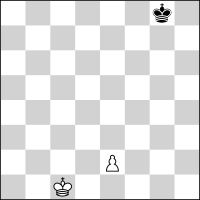 <b>h#6.5</b> &nbsp;·&nbsp; 2 + 1</td>
<td valign="top">
<b>No. 1</b> &nbsp;·&nbsp; <b>h#6.5</b>, unique solution &nbsp;·&nbsp; <a href="https://helpman.komtera.lt/?fen=6k1/8/8/8/8/8/4P3/2K5&moves=6.5">solve ↗</a> 
13 positions of 86,688 indexed have a unique solution at h#6.5. The class runs to h#8.5, so the deepest sound problem is 4 plies shallower. Every position at that depth is saturated (255+ solutions). 
 <b>Solution:</b> 1...e3 2.Kf7 e4 3.Ke6 e5 4.Kd5 e6 5.Kc4 e7 6.Kb3 e8=Q 7.Ka2 Qa4# 
 <b>Themes:</b> <code>set-play</code> <code>pure</code> <code>model</code> <code>ideal</code> <code>mirror</code> <code>promotion</code> <code>excelsior</code> <code>excelsior:white</code> <code>single-piece</code> <code>single-piece:white</code> <code>single-piece:black</code> <code>nocapture</code> <code>nocheck</code> <code>umnov</code> <code>promotions:q</code> 
 <code>6k1/8/8/8/8/8/4P3/2K5 w - - 0 1</code>
</td>
</tr></table>

## KQvk

<table><tr>
<td width="220" valign="top">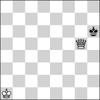 <b>h#6</b> &nbsp;·&nbsp; 2 + 1</td>
<td valign="top">
<b>No. 2</b> &nbsp;·&nbsp; <b>h#6</b>, unique solution &nbsp;·&nbsp; <a href="https://helpman.komtera.lt/?fen=8/8/7k/6Q1/8/8/8/K7&moves=6">solve ↗</a> 
3 positions of 29,568 indexed have a unique solution at h#6. The class runs to h#7, so the deepest sound problem is 2 plies shallower. Every position at that depth is saturated (255+ solutions). 
 <b>Solution:</b> 1.Kh7 Kb2 2.Kh8 Kc3 3.Kh7 Kd4 4.Kh8 Ke5 5.Kh7 Kf6 6.Kh8 Qg7# 
 <b>Themes:</b> <code>pure</code> <code>model</code> <code>ideal</code> <code>switchback</code> <code>single-piece</code> <code>single-piece:black</code> <code>nocapture</code> <code>nocheck</code> 
 <code>8/8/7k/6Q1/8/8/8/K7 b - - 0 1</code>
</td>
</tr></table>

## KRvk

<table><tr>
<td width="220" valign="top">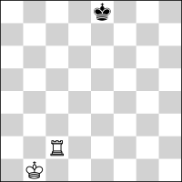 <b>h#4.5</b> &nbsp;·&nbsp; 2 + 1</td>
<td valign="top">
<b>No. 3</b> &nbsp;·&nbsp; <b>h#4.5</b>, unique solution &nbsp;·&nbsp; <a href="https://helpman.komtera.lt/?fen=4k3/8/8/8/8/8/2R5/1K6&moves=4.5">solve ↗</a> 
1 position of 29,568 indexed has a unique solution at h#4.5. The class runs to h#7, so the deepest sound problem is 5 plies shallower. Every position at that depth is saturated (255+ solutions). 
 <b>Solution:</b> 1...Kc1 2.Kf7 Kd2 3.Kg6 Ke3 4.Kh5 Kf4 5.Kh4 Rh2# 
 <b>Themes:</b> <code>pure</code> <code>model</code> <code>ideal</code> <code>mirror</code> <code>single-piece</code> <code>single-piece:black</code> <code>nocapture</code> <code>nocheck</code> 
 <code>4k3/8/8/8/8/8/2R5/1K6 w - - 0 1</code>
</td>
</tr></table>

## KPvkp

<table><tr>
<td width="220" valign="top">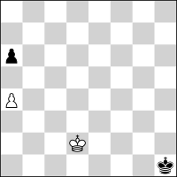 <b>h#8.5</b> &nbsp;·&nbsp; 2 + 2</td>
<td valign="top">
<b>No. 4</b> &nbsp;·&nbsp; <b>h#8.5</b>, unique solution &nbsp;·&nbsp; <a href="https://helpman.komtera.lt/?fen=8/8/p7/8/P7/8/3K4/7k&moves=8.5">solve ↗</a> 
2 positions of 4,161,024 indexed have a unique solution at h#8.5. The class runs to h#14.5, so the deepest sound problem is 12 plies shallower. Every position at that depth is saturated (255+ solutions). 
 <b>Solution:</b> 1...Kc3 2.Kg2 Kb4 3.a5+ Kxa5 4.Kf3 Kb4 5.Ke4 a5 6.Kd5 a6 7.Kc6 a7 8.Kb7 Kc5 9.Ka6 a8=Q# 
 <b>Themes:</b> <code>pure</code> <code>model</code> <code>ideal</code> <code>mirror</code> <code>promotion</code> <code>switchback</code> <code>promotions:q</code> 
 <code>8/8/p7/8/P7/8/3K4/7k w - - 0 1</code>
</td>
</tr></table>

## KBvkn

<table><tr>
<td width="220" valign="top">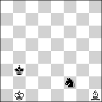 <b>h#8</b> &nbsp;·&nbsp; 2 + 2</td>
<td valign="top">
<b>No. 5</b> &nbsp;·&nbsp; <b>h#8</b>, unique solution &nbsp;·&nbsp; <a href="https://helpman.komtera.lt/?fen=8/8/8/8/8/1k6/5n2/1K1B4&moves=8">solve ↗</a> 
19 positions of 1,892,352 indexed have a unique solution at h#8. The class runs to h#12, so the deepest sound problem is 8 plies shallower. Every position at that depth is saturated (255+ solutions). 
 <b>Solution:</b> 1.Kc3 Be2 2.Kd2 Bf1 3.Ke1 Kc2 4.Nh3 Kd3 5.Kf2 Ke4 6.Kg1 Kf3 7.Kh1 Kg3 8.Ng1 Bg2# 
 <b>Themes:</b> <code>pure</code> <code>model</code> <code>ideal</code> <code>self-block</code> <code>nocapture</code> <code>nocheck</code> 
 <code>8/8/8/8/8/1k6/5n2/1K1B4 b - - 0 1</code>
</td>
</tr></table>

## KBvkp

<table><tr>
<td width="220" valign="top">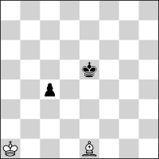 <b>h#8</b> &nbsp;·&nbsp; 2 + 2</td>
<td valign="top">
<b>No. 6</b> &nbsp;·&nbsp; <b>h#8</b>, unique solution &nbsp;·&nbsp; <a href="https://helpman.komtera.lt/?fen=8/8/8/4k3/2p5/8/8/K3B3&moves=8">solve ↗</a> 
16 positions of 5,548,032 indexed have a unique solution at h#8. The class runs to h#16, so the deepest sound problem is 16 plies shallower. Every position at that depth is saturated (255+ solutions). 
 <b>Solution:</b> 1.c3 Bh4 2.c2 Kb2 3.c1=N Kc2 4.Kd4 Kd1 5.Kc3 Be7 6.Kb2 Ba3+ 7.Ka1 Kc2 8.Na2 Bb2# 
 <b>Themes:</b> <code>pure</code> <code>model</code> <code>ideal</code> <code>promotion</code> <code>underpromotion</code> <code>switchback</code> <code>self-block</code> <code>nocapture</code> <code>umnov</code> <code>promotions:n</code> 
 <code>8/8/8/4k3/2p5/8/8/K3B3 b - - 0 1</code>
</td>
</tr></table>

## KNvkb

<table><tr>
<td width="220" valign="top">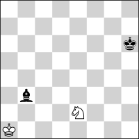 <b>h#8</b> &nbsp;·&nbsp; 2 + 2</td>
<td valign="top">
<b>No. 7</b> &nbsp;·&nbsp; <b>h#8</b>, unique solution &nbsp;·&nbsp; <a href="https://helpman.komtera.lt/?fen=8/8/7k/8/8/1b6/4N3/K7&moves=8">solve ↗</a> 
5 positions of 1,892,352 indexed have a unique solution at h#8. The class runs to h#10.5, so the deepest sound problem is 5 plies shallower. Every position at that depth is saturated (255+ solutions). 
 <b>Solution:</b> 1.Kg5 Nd4 2.Kf4 Kb2 3.Ke3 Ka3 4.Kd2 Kb4 5.Kc1 Kc3 6.Kb1 Kd2 7.Ka1 Kc1 8.Ba2 Nc2# 
 <b>Themes:</b> <code>pure</code> <code>model</code> <code>ideal</code> <code>self-block</code> <code>nocapture</code> <code>nocheck</code> 
 <code>8/8/7k/8/8/1b6/4N3/K7 b - - 0 1</code>
</td>
</tr></table>

## KNvkp

<table><tr>
<td width="220" valign="top">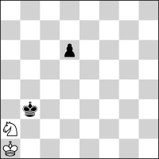 <b>h#8</b> &nbsp;·&nbsp; 2 + 2</td>
<td valign="top">
<b>No. 8</b> &nbsp;·&nbsp; <b>h#8</b>, unique solution &nbsp;·&nbsp; <a href="https://helpman.komtera.lt/?fen=8/8/3p4/8/8/1k6/N7/K7&moves=8">solve ↗</a> 
4 positions of 5,548,032 indexed have a unique solution at h#8. The class runs to h#11.5, so the deepest sound problem is 7 plies shallower. Every position at that depth is saturated (255+ solutions). 
 <b>Solution:</b> 1.d5 Kb1 2.d4 Kc1 3.d3 Kd2 4.Kb2 Nb4 5.Ka1 Kc3 6.d2 Kb3 7.d1=R Ka3 8.Rb1 Nc2# 
 <b>Themes:</b> <code>pure</code> <code>model</code> <code>ideal</code> <code>promotion</code> <code>underpromotion</code> <code>self-block</code> <code>nocapture</code> <code>nocheck</code> <code>umnov</code> <code>promotions:r</code> 
 <code>8/8/3p4/8/8/1k6/N7/K7 b - - 0 1</code>
</td>
</tr></table>

## KNvkr

<table><tr>
<td width="220" valign="top">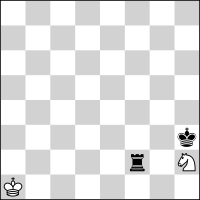 <b>h#8</b> &nbsp;·&nbsp; 2 + 2</td>
<td valign="top">
<b>No. 9</b> &nbsp;·&nbsp; <b>h#8</b>, unique solution &nbsp;·&nbsp; <a href="https://helpman.komtera.lt/?fen=8/8/8/8/8/7k/5r1N/K7&moves=8">solve ↗</a> 
9 positions of 1,892,352 indexed have a unique solution at h#8. The class runs to h#9.5, so the deepest sound problem is 3 plies shallower. Every position at that depth is saturated (255+ solutions). 
 <b>Solution:</b> 1.Kg2 Nf3 2.Kf1 Kb1 3.Ke2 Kb2 4.Kd3+ Kc1 5.Kc3 Kd1 6.Kb2 Nd4 7.Ka1 Kc1 8.Ra2 Nb3# 
 <b>Themes:</b> <code>pure</code> <code>model</code> <code>ideal</code> <code>switchback</code> <code>self-block</code> <code>nocapture</code> 
 <code>8/8/8/8/8/7k/5r1N/K7 b - - 0 1</code>
</td>
</tr></table>

## KNvkn

<table><tr>
<td width="220" valign="top">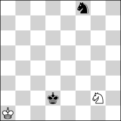 <b>h#7.5</b> &nbsp;·&nbsp; 2 + 2</td>
<td valign="top">
<b>No. 10</b> &nbsp;·&nbsp; <b>h#7.5</b>, unique solution &nbsp;·&nbsp; <a href="https://helpman.komtera.lt/?fen=5n2/8/8/8/8/8/3k2N1/K7&moves=7.5">solve ↗</a> 
14 positions of 1,892,352 indexed have a unique solution at h#7.5. The class runs to h#10, so the deepest sound problem is 5 plies shallower. Every position at that depth is saturated (255+ solutions). 
 <b>Solution:</b> 1...Nh4 2.Ke3 Kb2 3.Kf4 Kc3 4.Kg5 Kd4 5.Kh6 Ke5 6.Kh7 Kf6 7.Kh8 Kf7 8.Nh7 Ng6# 
 <b>Themes:</b> <code>pure</code> <code>model</code> <code>ideal</code> <code>self-block</code> <code>nocapture</code> <code>nocheck</code> 
 <code>5n2/8/8/8/8/8/3k2N1/K7 w - - 0 1</code>
</td>
</tr></table>

## KPvkb

<table><tr>
<td width="220" valign="top">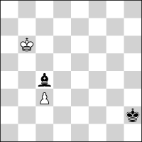 <b>h#7.5</b> &nbsp;·&nbsp; 2 + 2</td>
<td valign="top">
<b>No. 11</b> &nbsp;·&nbsp; <b>h#7.5</b>, unique solution &nbsp;·&nbsp; <a href="https://helpman.komtera.lt/?fen=6k1/8/8/8/8/3b4/3P4/1K6&moves=7.5">solve ↗</a> 
13 positions of 5,548,032 indexed have a unique solution at h#7.5. The class runs to h#8.5, so the deepest sound problem is 2 plies shallower. Every position at that depth is saturated (255+ solutions). 
 <b>Solution:</b> 1...Kc1 2.Be4 d3 3.Kf7 dxe4 4.Ke6 e5 5.Kd5 e6 6.Kc4 e7 7.Kb3 e8=Q 8.Ka2 Qa4# 
 <b>Themes:</b> <code>pure</code> <code>model</code> <code>ideal</code> <code>mirror</code> <code>promotion</code> <code>excelsior</code> <code>excelsior:white</code> <code>nocheck</code> <code>umnov</code> <code>promotions:q</code> 
 <code>6k1/8/8/8/8/3b4/3P4/1K6 w - - 0 1</code>
</td>
</tr></table>

## KPvkn

<table><tr>
<td width="220" valign="top">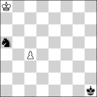 <b>h#7.5</b> &nbsp;·&nbsp; 2 + 2</td>
<td valign="top">
<b>No. 12</b> &nbsp;·&nbsp; <b>h#7.5</b>, unique solution &nbsp;·&nbsp; <a href="https://helpman.komtera.lt/?fen=K7/8/8/n7/2P5/8/8/7k&moves=7.5">solve ↗</a> 
8 positions of 5,548,032 indexed have a unique solution at h#7.5. The class runs to h#8.5, so the deepest sound problem is 2 plies shallower. Every position at that depth is saturated (255+ solutions). 
 <b>Solution:</b> 1...c5 2.Kg2 c6 3.Kf3 c7 4.Ke4 c8=Q 5.Kd5 Qf5+ 6.Kc6 Kb8 7.Kb6 Kc8 8.Ka7 Qxa5# 
 <b>Themes:</b> <code>pure</code> <code>model</code> <code>ideal</code> <code>mirror</code> <code>promotion</code> <code>single-piece</code> <code>single-piece:black</code> <code>promotions:q</code> 
 <code>K7/8/8/n7/2P5/8/8/7k w - - 0 1</code>
</td>
</tr></table>

## KPvkq

<table><tr>
<td width="220" valign="top">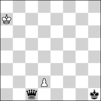 <b>h#7.5</b> &nbsp;·&nbsp; 2 + 2</td>
<td valign="top">
<b>No. 13</b> &nbsp;·&nbsp; <b>h#7.5</b>, unique solution &nbsp;·&nbsp; <a href="https://helpman.komtera.lt/?fen=6k1/8/8/8/8/1q6/3P4/1K6&moves=7.5">solve ↗</a> 
32 positions of 5,548,032 indexed have a unique solution at h#7.5. The class runs to h#9, so the deepest sound problem is 3 plies shallower. Every position at that depth is saturated (255+ solutions). 
 <b>Solution:</b> 1...Kc1 2.Qe3 dxe3 3.Kf7 e4 4.Ke6 e5 5.Kd5 e6 6.Kc4 e7 7.Kb3 e8=Q 8.Ka2 Qa4# 
 <b>Themes:</b> <code>pure</code> <code>model</code> <code>ideal</code> <code>mirror</code> <code>promotion</code> <code>excelsior</code> <code>excelsior:white</code> <code>nocheck</code> <code>umnov</code> <code>promotions:q</code> 
 <code>6k1/8/8/8/8/1q6/3P4/1K6 w - - 0 1</code>
</td>
</tr></table>

## KPvkr

<table><tr>
<td width="220" valign="top">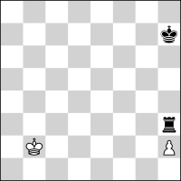 <b>h#7.5</b> &nbsp;·&nbsp; 2 + 2</td>
<td valign="top">
<b>No. 14</b> &nbsp;·&nbsp; <b>h#7.5</b>, unique solution &nbsp;·&nbsp; <a href="https://helpman.komtera.lt/?fen=8/7k/8/8/8/7r/1K5P/8&moves=7.5">solve ↗</a> 
1 position of 5,548,032 indexed has a unique solution at h#7.5. The class runs to h#8.5, so the deepest sound problem is 2 plies shallower. Every position at that depth is saturated (255+ solutions). 
 <b>Solution:</b> 1...Ka2 2.Ra3+ Kxa3 3.Kg6 h4 4.Kf5 h5 5.Ke4 h6 6.Kd3 h7 7.Kc2 h8=Q 8.Kb1 Qb2# 
 <b>Themes:</b> <code>set-play</code> <code>promotion</code> <code>excelsior</code> <code>excelsior:white</code> <code>promotions:q</code> 
 <code>8/7k/8/8/8/7r/1K5P/8 w - - 0 1</code>
</td>
</tr></table>

## KBPvk

<table><tr>
<td width="220" valign="top">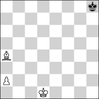 <b>h#7</b> &nbsp;·&nbsp; 3 + 1</td>
<td valign="top">
<b>No. 15</b> &nbsp;·&nbsp; <b>h#7</b>, unique solution &nbsp;·&nbsp; <a href="https://helpman.komtera.lt/?fen=7k/8/8/8/B7/8/P7/3K4&moves=7">solve ↗</a> 
12 positions of 5,548,032 indexed have a unique solution at h#7. The class runs to h#8, so the deepest sound problem is 2 plies shallower. Every position at that depth is saturated (255+ solutions). 
 <b>Solution:</b> 1.Kg7 Bb3 2.Kf6 a4 3.Ke5 a5 4.Kd4 a6 5.Kc3 a7 6.Kb2 a8=Q 7.Kb1 Qa2# 
 <b>Themes:</b> <code>promotion</code> <code>excelsior</code> <code>excelsior:white</code> <code>closed-walk</code> <code>single-piece</code> <code>single-piece:black</code> <code>nocapture</code> <code>nocheck</code> <code>promotions:q</code> 
 <code>7k/8/8/8/B7/8/P7/3K4 b - - 0 1</code>
</td>
</tr></table>

## KNPvk

<table><tr>
<td width="220" valign="top">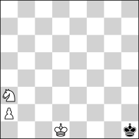 <b>h#7</b> &nbsp;·&nbsp; 3 + 1</td>
<td valign="top">
<b>No. 16</b> &nbsp;·&nbsp; <b>h#7</b>, unique solution &nbsp;·&nbsp; <a href="https://helpman.komtera.lt/?fen=8/8/8/8/8/N7/P7/3K3k&moves=7">solve ↗</a> 
49 positions of 5,548,032 indexed have a unique solution at h#7. The class runs to h#8.5, so the deepest sound problem is 3 plies shallower. Every position at that depth is saturated (255+ solutions). 
 <b>Solution:</b> 1.Kg2 Nc2 2.Kf3 a4 3.Ke4 a5 4.Kd3 a6 5.Kc3 a7 6.Kb2 a8=Q 7.Kb1 Qa1# 
 <b>Themes:</b> <code>promotion</code> <code>excelsior</code> <code>excelsior:white</code> <code>single-piece</code> <code>single-piece:black</code> <code>nocapture</code> <code>nocheck</code> <code>promotions:q</code> 
 <code>8/8/8/8/8/N7/P7/3K3k b - - 0 1</code>
</td>
</tr></table>

## KPPvk

<table><tr>
<td width="220" valign="top">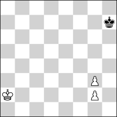 <b>h#7</b> &nbsp;·&nbsp; 3 + 1</td>
<td valign="top">
<b>No. 17</b> &nbsp;·&nbsp; <b>h#7</b>, unique solution &nbsp;·&nbsp; <a href="https://helpman.komtera.lt/?fen=8/7k/8/8/8/6P1/K5P1/8&moves=7">solve ↗</a> 
2 positions of 4,161,024 indexed have a unique solution at h#7. The class runs to h#8, so the deepest sound problem is 2 plies shallower. Every position at that depth is saturated (255+ solutions). 
 <b>Solution:</b> 1.Kg6 Ka3 2.Kf5 g4+ 3.Ke4 g5 4.Kd3 g6 5.Kc2 g7 6.Kb1 g8=Q 7.Ka1 Qa2# 
 <b>Themes:</b> <code>promotion</code> <code>single-piece</code> <code>single-piece:black</code> <code>nocapture</code> <code>promotions:q</code> 
 <code>8/7k/8/8/8/6P1/K5P1/8 b - - 0 1</code>
</td>
</tr></table>

## KQPvk

<table><tr>
<td width="220" valign="top">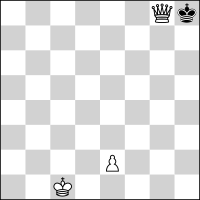 <b>h#7</b> &nbsp;·&nbsp; 3 + 1</td>
<td valign="top">
<b>No. 18</b> &nbsp;·&nbsp; <b>h#7</b>, unique solution &nbsp;·&nbsp; <a href="https://helpman.komtera.lt/?fen=6Qk/8/8/8/8/8/4P3/2K5&moves=7">solve ↗</a> 
12 positions of 5,548,032 indexed have a unique solution at h#7. The class runs to h#8, so the deepest sound problem is 2 plies shallower. 
 <b>Solution:</b> 1.Kxg8 e3 2.Kf7 e4 3.Ke6 e5 4.Kd5 e6 5.Kc4 e7 6.Kb3 e8=Q 7.Ka2 Qa4# 
 <b>Themes:</b> <code>pure</code> <code>model</code> <code>ideal</code> <code>mirror</code> <code>promotion</code> <code>excelsior</code> <code>excelsior:white</code> <code>single-piece</code> <code>single-piece:white</code> <code>single-piece:black</code> <code>phoenix</code> <code>nocheck</code> <code>umnov</code> <code>promotions:q</code> 
 <code>6Qk/8/8/8/8/8/4P3/2K5 b - - 0 1</code>
</td>
</tr></table>

## KBBvk

<table><tr>
<td width="220" valign="top">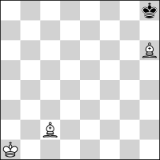 <b>h#6.5</b> &nbsp;·&nbsp; 3 + 1</td>
<td valign="top">
<b>No. 19</b> &nbsp;·&nbsp; <b>h#6.5</b>, unique solution &nbsp;·&nbsp; <a href="https://helpman.komtera.lt/?fen=7k/8/7B/8/8/8/2B5/K7&moves=6.5">solve ↗</a> 
1 position of 1,892,352 indexed has a unique solution at h#6.5. The class runs to h#8, so the deepest sound problem is 3 plies shallower. Every position at that depth is saturated (255+ solutions). 
 <b>Solution:</b> 1...Kb2 2.Kg8 Kc3 3.Kf7 Kd3 4.Kg6 Ke4 5.Kh5 Kf5 6.Kh4 Bg5+ 7.Kh5 Bd1# 
 <b>Themes:</b> <code>switchback</code> <code>single-piece</code> <code>single-piece:black</code> <code>nocapture</code> 
 <code>7k/8/7B/8/8/8/2B5/K7 w - - 0 1</code>
</td>
</tr></table>

## KBvkb

<table><tr>
<td width="220" valign="top">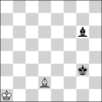 <b>h#6.5</b> &nbsp;·&nbsp; 2 + 2</td>
<td valign="top">
<b>No. 20</b> &nbsp;·&nbsp; <b>h#6.5</b>, unique solution &nbsp;·&nbsp; <a href="https://helpman.komtera.lt/?fen=8/8/6b1/8/8/6k1/3B4/K7&moves=6.5">solve ↗</a> 
8 positions of 1,892,352 indexed have a unique solution at h#6.5. The class runs to h#10, so the deepest sound problem is 7 plies shallower. Every position at that depth is saturated (255+ solutions). 
 <b>Solution:</b> 1...Kb2 2.Kg4 Kc3 3.Kf5 Kd4 4.Kf6 Bc3 5.Kg7 Ke5 6.Kh8 Kf6 7.Bh7 Kf7# 
 <b>Themes:</b> <code>self-block</code> <code>nocapture</code> <code>nocheck</code> 
 <code>8/8/6b1/8/8/6k1/3B4/K7 w - - 0 1</code>
</td>
</tr></table>

## KNNvk

<table><tr>
<td width="220" valign="top">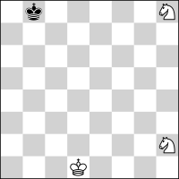 <b>h#6.5</b> &nbsp;·&nbsp; 3 + 1</td>
<td valign="top">
<b>No. 21</b> &nbsp;·&nbsp; <b>h#6.5</b>, unique solution &nbsp;·&nbsp; <a href="https://helpman.komtera.lt/?fen=1k5N/8/8/8/8/8/7N/3K4&moves=6.5">solve ↗</a> 
9 positions of 1,892,352 indexed have a unique solution at h#6.5. The class runs to h#8, so the deepest sound problem is 3 plies shallower. Every position at that depth is saturated (255+ solutions). 
 <b>Solution:</b> 1...Ke2 2.Kc7 Kf3 3.Kd6 Kg4 4.Ke5 Kh5 5.Kf4 Ng6+ 6.Kg3 Nf1+ 7.Kh3 Nf4# 
 <b>Themes:</b> <code>pure</code> <code>model</code> <code>ideal</code> <code>mirror</code> <code>single-piece</code> <code>single-piece:black</code> <code>nocapture</code> 
 <code>1k5N/8/8/8/8/8/7N/3K4 w - - 0 1</code>
</td>
</tr></table>

## KBNvk

<table><tr>
<td width="220" valign="top">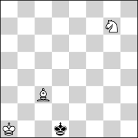 <b>h#6</b> &nbsp;·&nbsp; 3 + 1</td>
<td valign="top">
<b>No. 22</b> &nbsp;·&nbsp; <b>h#6</b>, unique solution &nbsp;·&nbsp; <a href="https://helpman.komtera.lt/?fen=8/6N1/8/8/8/2B5/8/K2k4&moves=6">solve ↗</a> 
23 positions of 1,892,352 indexed have a unique solution at h#6. The class runs to h#8, so the deepest sound problem is 4 plies shallower. Every position at that depth is saturated (255+ solutions). 
 <b>Solution:</b> 1.Kc2 Ka2 2.Kc1 Kb3 3.Kb1 Kc4 4.Ka2 Ne6 5.Ka3 Bb4+ 6.Ka4 Nc5# 
 <b>Themes:</b> <code>set-play</code> <code>single-piece</code> <code>single-piece:black</code> <code>nocapture</code> 
 <code>8/6N1/8/8/8/2B5/8/K2k4 b - - 0 1</code>
</td>
</tr></table>

## KQBvk

<table><tr>
<td width="220" valign="top"> <b>h#6</b> &nbsp;·&nbsp; 3 + 1</td>
<td valign="top">
<b>No. 23</b> &nbsp;·&nbsp; <b>h#6</b>, unique solution &nbsp;·&nbsp; <a href="https://helpman.komtera.lt/?fen=8/7B/7k/6Q1/8/8/8/K7&moves=6">solve ↗</a> 
3 positions of 1,892,352 indexed have a unique solution at h#6. The class runs to h#7, so the deepest sound problem is 2 plies shallower. Every position at that depth is saturated (255+ solutions). 
 <b>Solution:</b> 1.Kxh7 Kb2 2.Kh8 Kc3 3.Kh7 Kd4 4.Kh8 Ke5 5.Kh7 Kf6 6.Kh8 Qg7# 
 <b>Themes:</b> <code>pure</code> <code>model</code> <code>ideal</code> <code>switchback</code> <code>single-piece</code> <code>single-piece:black</code> <code>nocheck</code> 
 <code>8/7B/7k/6Q1/8/8/8/K7 b - - 0 1</code>
</td>
</tr></table>

## KQNvk

<table><tr>
<td width="220" valign="top">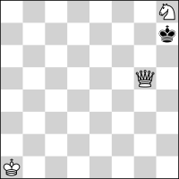 <b>h#6</b> &nbsp;·&nbsp; 3 + 1</td>
<td valign="top">
<b>No. 24</b> &nbsp;·&nbsp; <b>h#6</b>, unique solution &nbsp;·&nbsp; <a href="https://helpman.komtera.lt/?fen=8/7N/7k/6Q1/8/8/8/K7&moves=6">solve ↗</a> 
3 positions of 1,892,352 indexed have a unique solution at h#6. The class runs to h#7, so the deepest sound problem is 2 plies shallower. Every position at that depth is saturated (255+ solutions). 
 <b>Solution:</b> 1.Kxh7 Kb2 2.Kh8 Kc3 3.Kh7 Kd4 4.Kh8 Ke5 5.Kh7 Kf6 6.Kh8 Qg7# 
 <b>Themes:</b> <code>pure</code> <code>model</code> <code>ideal</code> <code>switchback</code> <code>single-piece</code> <code>single-piece:black</code> <code>nocheck</code> 
 <code>8/7N/7k/6Q1/8/8/8/K7 b - - 0 1</code>
</td>
</tr></table>

## KQQvk

<table><tr>
<td width="220" valign="top">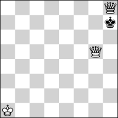 <b>h#6</b> &nbsp;·&nbsp; 3 + 1</td>
<td valign="top">
<b>No. 25</b> &nbsp;·&nbsp; <b>h#6</b>, unique solution &nbsp;·&nbsp; <a href="https://helpman.komtera.lt/?fen=7Q/7k/8/6Q1/8/8/8/K7&moves=6">solve ↗</a> 
2 positions of 1,892,352 indexed have a unique solution at h#6. The class runs to h#7, so the deepest sound problem is 2 plies shallower. Every position at that depth is saturated (255+ solutions). 
 <b>Solution:</b> 1.Kxh8 Kb2 2.Kh7 Kc3 3.Kh8 Kd4 4.Kh7 Ke5 5.Kh8 Kf6 6.Kh7 Qg7# 
 <b>Themes:</b> <code>switchback</code> <code>single-piece</code> <code>single-piece:black</code> <code>pendulum</code> <code>nocheck</code> 
 <code>7Q/7k/8/6Q1/8/8/8/K7 b - - 0 1</code>
</td>
</tr></table>

## KQRvk

<table><tr>
<td width="220" valign="top">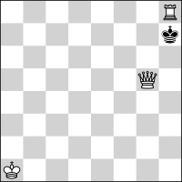 <b>h#6</b> &nbsp;·&nbsp; 3 + 1</td>
<td valign="top">
<b>No. 26</b> &nbsp;·&nbsp; <b>h#6</b>, unique solution &nbsp;·&nbsp; <a href="https://helpman.komtera.lt/?fen=7R/7k/8/6Q1/8/8/8/K7&moves=6">solve ↗</a> 
2 positions of 1,892,352 indexed have a unique solution at h#6. The class runs to h#7, so the deepest sound problem is 2 plies shallower. Every position at that depth is saturated (255+ solutions). 
 <b>Solution:</b> 1.Kxh8 Kb2 2.Kh7 Kc3 3.Kh8 Kd4 4.Kh7 Ke5 5.Kh8 Kf6 6.Kh7 Qg7# 
 <b>Themes:</b> <code>switchback</code> <code>single-piece</code> <code>single-piece:black</code> <code>pendulum</code> <code>nocheck</code> 
 <code>7R/7k/8/6Q1/8/8/8/K7 b - - 0 1</code>
</td>
</tr></table>

## KQvkn

<table><tr>
<td width="220" valign="top">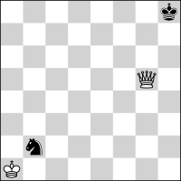 <b>h#6</b> &nbsp;·&nbsp; 2 + 2</td>
<td valign="top">
<b>No. 27</b> &nbsp;·&nbsp; <b>h#6</b>, unique solution &nbsp;·&nbsp; <a href="https://helpman.komtera.lt/?fen=8/8/7k/6Q1/8/8/1n6/K7&moves=6">solve ↗</a> 
4 positions of 1,892,352 indexed have a unique solution at h#6. The class runs to h#7, so the deepest sound problem is 2 plies shallower. Every position at that depth is saturated (255+ solutions). 
 <b>Solution:</b> 1.Kh7 Kxb2 2.Kh8 Kc3 3.Kh7 Kd4 4.Kh8 Ke5 5.Kh7 Kf6 6.Kh8 Qg7# 
 <b>Themes:</b> <code>pure</code> <code>model</code> <code>ideal</code> <code>switchback</code> <code>single-piece</code> <code>single-piece:black</code> <code>nocheck</code> 
 <code>8/8/7k/6Q1/8/8/1n6/K7 b - - 0 1</code>
</td>
</tr></table>

## KQvkp

<table><tr>
<td width="220" valign="top">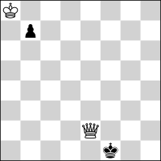 <b>h#6</b> &nbsp;·&nbsp; 2 + 2</td>
<td valign="top">
<b>No. 28</b> &nbsp;·&nbsp; <b>h#6</b>, unique solution &nbsp;·&nbsp; <a href="https://helpman.komtera.lt/?fen=K7/1p6/8/8/8/8/4Q3/5k2&moves=6">solve ↗</a> 
4 positions of 5,548,032 indexed have a unique solution at h#6. The class runs to h#7, so the deepest sound problem is 2 plies shallower. Every position at that depth is saturated (255+ solutions). 
 <b>Solution:</b> 1.Kg1 Kxb7 2.Kh1 Kc6 3.Kg1 Kd5 4.Kh1 Ke4 5.Kg1 Kf3 6.Kh1 Qg2# 
 <b>Themes:</b> <code>pure</code> <code>model</code> <code>ideal</code> <code>switchback</code> <code>single-piece</code> <code>single-piece:black</code> <code>nocheck</code> 
 <code>K7/1p6/8/8/8/8/4Q3/5k2 b - - 0 1</code>
</td>
</tr></table>

## KRBvk

<table><tr>
<td width="220" valign="top">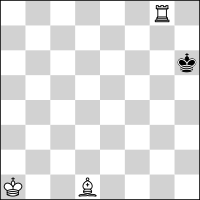 <b>h#6</b> &nbsp;·&nbsp; 3 + 1</td>
<td valign="top">
<b>No. 29</b> &nbsp;·&nbsp; <b>h#6</b>, unique solution &nbsp;·&nbsp; <a href="https://helpman.komtera.lt/?fen=6R1/8/7k/8/8/8/8/K2B4&moves=6">solve ↗</a> 
20 positions of 1,892,352 indexed have a unique solution at h#6. The class runs to h#7, so the deepest sound problem is 2 plies shallower. 
 <b>Solution:</b> 1.Kh7 Kb2 2.Kh6 Kc3 3.Kh7 Kd4 4.Kh6 Ke5 5.Kh7 Kf6 6.Kh6 Rh8# 
 <b>Themes:</b> <code>set-play</code> <code>mirror</code> <code>switchback</code> <code>single-piece</code> <code>single-piece:black</code> <code>pendulum</code> <code>nocapture</code> <code>nocheck</code> 
 <code>6R1/8/7k/8/8/8/8/K2B4 b - - 0 1</code>
</td>
</tr></table>

## KRPvk

<table><tr>
<td width="220" valign="top">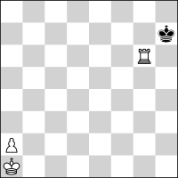 <b>h#6</b> &nbsp;·&nbsp; 3 + 1</td>
<td valign="top">
<b>No. 30</b> &nbsp;·&nbsp; <b>h#6</b>, unique solution &nbsp;·&nbsp; <a href="https://helpman.komtera.lt/?fen=8/7k/6R1/8/8/8/P7/K7&moves=6">solve ↗</a> 
25 positions of 5,548,032 indexed have a unique solution at h#6. The class runs to h#8, so the deepest sound problem is 4 plies shallower. Every position at that depth is saturated (255+ solutions). 
 <b>Solution:</b> 1.Kh8 a4 2.Kh7 a5 3.Kh8 a6 4.Kh7 a7 5.Kh8 a8=Q+ 6.Kh7 Qg8# 
 <b>Themes:</b> <code>promotion</code> <code>excelsior</code> <code>excelsior:white</code> <code>switchback</code> <code>single-piece</code> <code>single-piece:white</code> <code>single-piece:black</code> <code>pendulum</code> <code>nocapture</code> <code>promotions:q</code> 
 <code>8/7k/6R1/8/8/8/P7/K7 b - - 0 1</code>
</td>
</tr></table>

## KRvkp

<table><tr>
<td width="220" valign="top">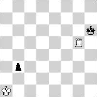 <b>h#6</b> &nbsp;·&nbsp; 2 + 2</td>
<td valign="top">
<b>No. 31</b> &nbsp;·&nbsp; <b>h#6</b>, unique solution &nbsp;·&nbsp; <a href="https://helpman.komtera.lt/?fen=8/8/7k/6R1/8/1p6/8/K7&moves=6">solve ↗</a> 
84 positions of 5,548,032 indexed have a unique solution at h#6. The class runs to h#7, so the deepest sound problem is 2 plies shallower. Every position at that depth is saturated (255+ solutions). 
 <b>Solution:</b> 1.Kh7 Kb2 2.Kh8 Kc3 3.b2 Kd4 4.b1=R Ke5 5.Rb8 Kf6 6.Rg8 Rh5# 
 <b>Themes:</b> <code>set-play</code> <code>pure</code> <code>model</code> <code>ideal</code> <code>promotion</code> <code>underpromotion</code> <code>self-block</code> <code>nocapture</code> <code>nocheck</code> <code>umnov</code> <code>promotions:r</code> 
 <code>8/8/7k/6R1/8/1p6/8/K7 b - - 0 1</code>
</td>
</tr></table>

## KQvkq

<table><tr>
<td width="220" valign="top">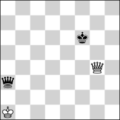 <b>h#5.5</b> &nbsp;·&nbsp; 2 + 2</td>
<td valign="top">
<b>No. 32</b> &nbsp;·&nbsp; <b>h#5.5</b>, unique solution &nbsp;·&nbsp; <a href="https://helpman.komtera.lt/?fen=8/8/5k2/8/6Q1/q7/8/K7&moves=5.5">solve ↗</a> 
7 positions of 1,892,352 indexed have a unique solution at h#5.5. The class runs to h#7, so the deepest sound problem is 3 plies shallower. Every position at that depth is saturated (255+ solutions). 
 <b>Solution:</b> 1...Kb1 2.Qd3+ Kc1 3.Qg6 Kd2 4.Kg7 Ke3 5.Kh6 Kf4 6.Qh7 Qg5# 
 <b>Themes:</b> <code>pure</code> <code>model</code> <code>ideal</code> <code>self-block</code> <code>nocapture</code> 
 <code>8/8/5k2/8/6Q1/q7/8/K7 w - - 0 1</code>
</td>
</tr></table>

## KRvkq

<table><tr>
<td width="220" valign="top">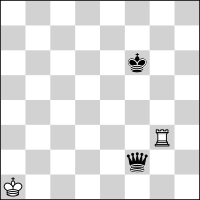 <b>h#5.5</b> &nbsp;·&nbsp; 2 + 2</td>
<td valign="top">
<b>No. 33</b> &nbsp;·&nbsp; <b>h#5.5</b>, unique solution &nbsp;·&nbsp; <a href="https://helpman.komtera.lt/?fen=8/8/5k2/8/8/6R1/5q2/K7&moves=5.5">solve ↗</a> 
6 positions of 1,892,352 indexed have a unique solution at h#5.5. The class runs to h#7.5, so the deepest sound problem is 4 plies shallower. Every position at that depth is saturated (255+ solutions). 
 <b>Solution:</b> 1...Kb1 2.Qf5+ Kc1 3.Qg6 Kd2 4.Kg7 Ke3 5.Kh6 Kf4 6.Kh5 Rh3# 
 <b>Themes:</b> <code>pure</code> <code>model</code> <code>ideal</code> <code>self-block</code> <code>nocapture</code> 
 <code>8/8/5k2/8/8/6R1/5q2/K7 w - - 0 1</code>
</td>
</tr></table>

## KRvkr

<table><tr>
<td width="220" valign="top">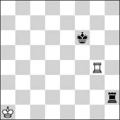 <b>h#5.5</b> &nbsp;·&nbsp; 2 + 2</td>
<td valign="top">
<b>No. 34</b> &nbsp;·&nbsp; <b>h#5.5</b>, unique solution &nbsp;·&nbsp; <a href="https://helpman.komtera.lt/?fen=8/8/5k2/8/6R1/8/7r/K7&moves=5.5">solve ↗</a> 
9 positions of 1,892,352 indexed have a unique solution at h#5.5. The class runs to h#7, so the deepest sound problem is 3 plies shallower. Every position at that depth is saturated (255+ solutions). 
 <b>Solution:</b> 1...Kb1 2.Rh6 Kc2 3.Rg6 Kd3 4.Kg7 Ke4 5.Kh6 Kf5 6.Rg7 Rh4# 
 <b>Themes:</b> <code>pure</code> <code>model</code> <code>ideal</code> <code>self-block</code> <code>nocapture</code> <code>nocheck</code> 
 <code>8/8/5k2/8/6R1/8/7r/K7 w - - 0 1</code>
</td>
</tr></table>

## KQvkb

<table><tr>
<td width="220" valign="top">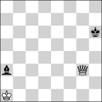 <b>h#5</b> &nbsp;·&nbsp; 2 + 2</td>
<td valign="top">
<b>No. 35</b> &nbsp;·&nbsp; <b>h#5</b>, unique solution &nbsp;·&nbsp; <a href="https://helpman.komtera.lt/?fen=8/8/8/8/7k/b5Q1/8/K7&moves=5">solve ↗</a> 
64 positions of 1,892,352 indexed have a unique solution at h#5. The class runs to h#6, so the deepest sound problem is 2 plies shallower. 
 <b>Solution:</b> 1.Kh5 Qxa3 2.Kg4 Qa2 3.Kf3 Kb2 4.Ke2 Kc3+ 5.Kd1 Qd2# 
 <b>Themes:</b> <code>single-piece</code> <code>single-piece:black</code> 
 <code>8/8/8/8/7k/b5Q1/8/K7 b - - 0 1</code>
</td>
</tr></table>

## KQvkr

<table><tr>
<td width="220" valign="top">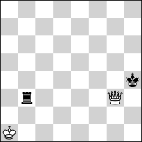 <b>h#5</b> &nbsp;·&nbsp; 2 + 2</td>
<td valign="top">
<b>No. 36</b> &nbsp;·&nbsp; <b>h#5</b>, unique solution &nbsp;·&nbsp; <a href="https://helpman.komtera.lt/?fen=8/8/8/8/7k/1r4Q1/8/K7&moves=5">solve ↗</a> 
7 positions of 1,892,352 indexed have a unique solution at h#5. The class runs to h#6, so the deepest sound problem is 2 plies shallower. Every position at that depth is saturated (255+ solutions). 
 <b>Solution:</b> 1.Kh5 Qxb3 2.Kg4 Qa2 3.Kf3 Kb2 4.Ke2 Kc3+ 5.Kd1 Qd2# 
 <b>Themes:</b> <code>single-piece</code> <code>single-piece:black</code> 
 <code>8/8/8/8/7k/1r4Q1/8/K7 b - - 0 1</code>
</td>
</tr></table>

## KRNvk

<table><tr>
<td width="220" valign="top">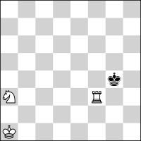 <b>h#5</b> &nbsp;·&nbsp; 3 + 1</td>
<td valign="top">
<b>No. 37</b> &nbsp;·&nbsp; <b>h#5</b>, unique solution &nbsp;·&nbsp; <a href="https://helpman.komtera.lt/?fen=8/8/8/8/6k1/N4R2/8/K7&moves=5">solve ↗</a> 
19 positions of 1,892,352 indexed have a unique solution at h#5. The class runs to h#7, so the deepest sound problem is 4 plies shallower. Every position at that depth is saturated (255+ solutions). 
 <b>Solution:</b> 1.Kg5 Rb3 2.Kf4 Rb2 3.Ke3 Nc2+ 4.Kd2 Ne3+ 5.Kc1 Rc2# 
 <b>Themes:</b> <code>set-play</code> <code>single-piece</code> <code>single-piece:black</code> <code>nocapture</code> <code>umnov</code> 
 <code>8/8/8/8/6k1/N4R2/8/K7 b - - 0 1</code>
</td>
</tr></table>

## KRvkb

<table><tr>
<td width="220" valign="top">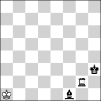 <b>h#5</b> &nbsp;·&nbsp; 2 + 2</td>
<td valign="top">
<b>No. 38</b> &nbsp;·&nbsp; <b>h#5</b>, unique solution &nbsp;·&nbsp; <a href="https://helpman.komtera.lt/?fen=8/8/8/8/8/8/6Rk/K1b5&moves=5">solve ↗</a> 
365 positions of 1,892,352 indexed have a unique solution at h#5. The class runs to h#7, so the deepest sound problem is 4 plies shallower. Every position at that depth is saturated (255+ solutions). 
 <b>Solution:</b> 1.Kh1 Rh2+ 2.Kg1 Kb1 3.Kf1 Kc2 4.Ke1 Kd3 5.Kd1 Rh1# 
 <b>Themes:</b> <code>single-piece</code> <code>single-piece:black</code> <code>nocapture</code> <code>umnov</code> 
 <code>8/8/8/8/8/8/6Rk/K1b5 b - - 0 1</code>
</td>
</tr></table>

## KRvkn

<table><tr>
<td width="220" valign="top">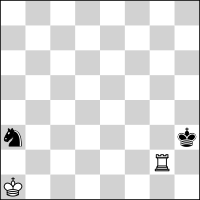 <b>h#5</b> &nbsp;·&nbsp; 2 + 2</td>
<td valign="top">
<b>No. 39</b> &nbsp;·&nbsp; <b>h#5</b>, unique solution &nbsp;·&nbsp; <a href="https://helpman.komtera.lt/?fen=8/8/8/8/8/n7/6Rk/K7&moves=5">solve ↗</a> 
247 positions of 1,892,352 indexed have a unique solution at h#5. The class runs to h#7, so the deepest sound problem is 4 plies shallower. Every position at that depth is saturated (255+ solutions). 
 <b>Solution:</b> 1.Kh1 Rh2+ 2.Kg1 Kb2 3.Kf1 Kc3 4.Ke1 Kd3 5.Kd1 Rh1# 
 <b>Themes:</b> <code>pure</code> <code>model</code> <code>mirror</code> <code>single-piece</code> <code>single-piece:black</code> <code>nocapture</code> <code>umnov</code> 
 <code>8/8/8/8/8/n7/6Rk/K7 b - - 0 1</code>
</td>
</tr></table>

## KRRvk

<table><tr>
<td width="220" valign="top">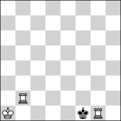 <b>h#4</b> &nbsp;·&nbsp; 3 + 1</td>
<td valign="top">
<b>No. 40</b> &nbsp;·&nbsp; <b>h#4</b>, unique solution &nbsp;·&nbsp; <a href="https://helpman.komtera.lt/?fen=8/8/8/8/8/8/1R6/K4kR1&moves=4">solve ↗</a> 
27 positions of 1,892,352 indexed have a unique solution at h#4. The class runs to h#7, so the deepest sound problem is 6 plies shallower. Every position at that depth is saturated (255+ solutions). 
 <b>Solution:</b> 1.Kxg1 Kb1 2.Kf1 Kc2 3.Ke1 Kd3 4.Kd1 Rb1# 
 <b>Themes:</b> <code>pure</code> <code>model</code> <code>ideal</code> <code>mirror</code> <code>switchback</code> <code>single-piece</code> <code>single-piece:black</code> <code>nocheck</code> 
 <code>8/8/8/8/8/8/1R6/K4kR1 b - - 0 1</code>
</td>
</tr></table>

## KBvkrp

<table><tr>
<td width="220" valign="top">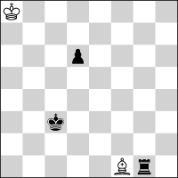 <b>h#13</b> &nbsp;·&nbsp; 2 + 3</td>
<td valign="top">
<b>No. 41</b> &nbsp;·&nbsp; <b>h#13</b>, unique solution &nbsp;·&nbsp; <a href="https://helpman.komtera.lt/?fen=K7/8/3p4/8/8/2k5/8/5Br1&moves=13">solve ↗</a> 
2 positions of 355,074,048 indexed have a unique solution at h#13. The class runs to h#16.5, so the deepest sound problem is 7 plies shallower. Every position at that depth is saturated (255+ solutions). 
 <b>Solution:</b> 1.d5 Kb7 2.d4 Kc6 3.d3 Kd5 4.d2 Ke4 5.d1=N Kf3 6.Ne3 Kf2 7.Kd2 Kxg1 8.Ke1 Kh2 9.Kf2 Kh3 10.Kg1 Kg3 11.Kh1 Bh3 12.Nf1+ Kf2 13.Nh2 Bg2# 
 <b>Themes:</b> <code>pure</code> <code>model</code> <code>ideal</code> <code>promotion</code> <code>underpromotion</code> <code>closed-walk</code> <code>self-block</code> <code>umnov</code> <code>promotions:n</code> 
 <code>K7/8/3p4/8/8/2k5/8/5Br1 b - - 0 1</code>
</td>
</tr></table>

## KBvkqp

<table><tr>
<td width="220" valign="top">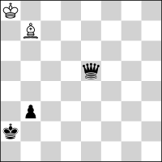 <b>h#12</b> &nbsp;·&nbsp; 2 + 3</td>
<td valign="top">
<b>No. 42</b> &nbsp;·&nbsp; <b>h#12</b>, unique solution &nbsp;·&nbsp; <a href="https://helpman.komtera.lt/?fen=K7/1B6/8/4q3/8/1p6/k7/8&moves=12">solve ↗</a> 
3 positions of 355,074,048 indexed have a unique solution at h#12. The class runs to h#17, so the deepest sound problem is 10 plies shallower. Every position at that depth is saturated (255+ solutions). 
 <b>Solution:</b> 1.b2 Ka7 2.Kb3 Kb6 3.Kc4 Ba6+ 4.Kd5 Kb5 5.Ke4+ Kc4 6.Kf3 Kd3 7.Kg2 Kd2 8.Kh1 Be2 9.b1=N+ Ke1 10.Nd2 Kf2 11.Nf3 Bf1 12.Nh2 Bg2# 
 <b>Themes:</b> <code>pure</code> <code>model</code> <code>promotion</code> <code>underpromotion</code> <code>self-block</code> <code>nocapture</code> <code>umnov</code> <code>promotions:n</code> 
 <code>K7/1B6/8/4q3/8/1p6/k7/8 b - - 0 1</code>
</td>
</tr></table>

## KBvkbp

<table><tr>
<td width="220" valign="top">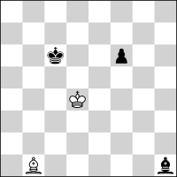 <b>h#11.5</b> &nbsp;·&nbsp; 2 + 3</td>
<td valign="top">
<b>No. 43</b> &nbsp;·&nbsp; <b>h#11.5</b>, unique solution &nbsp;·&nbsp; <a href="https://helpman.komtera.lt/?fen=8/8/2k2p2/8/3K4/8/8/1B5b&moves=11.5">solve ↗</a> 
8 positions of 355,074,048 indexed have a unique solution at h#11.5. The class runs to h#16, so the deepest sound problem is 9 plies shallower. Every position at that depth is saturated (255+ solutions). 
 <b>Solution:</b> 1...Ke3 2.f5 Kf2 3.f4 Kg1 4.f3 Kxh1 5.f2 Kg2 6.f1=N Kf2 7.Kd5 Ba2+ 8.Ke4 Ke1 9.Kf3 Be6 10.Kg2 Bh3+ 11.Kh1 Kf2 12.Nh2 Bg2# 
 <b>Themes:</b> <code>pure</code> <code>model</code> <code>ideal</code> <code>promotion</code> <code>underpromotion</code> <code>switchback</code> <code>closed-walk</code> <code>self-block</code> <code>kniest</code> <code>umnov</code> <code>promotions:n</code> 
 <code>8/8/2k2p2/8/3K4/8/8/1B5b w - - 0 1</code>
</td>
</tr></table>

## KBPvkp

<table><tr>
<td width="220" valign="top">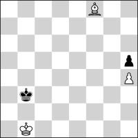 <b>h#10.5</b> &nbsp;·&nbsp; 3 + 2</td>
<td valign="top">
<b>No. 44</b> &nbsp;·&nbsp; <b>h#10.5</b>, unique solution &nbsp;·&nbsp; <a href="https://helpman.komtera.lt/?fen=5B2/8/8/7p/7P/1k6/8/1K6&moves=10.5">solve ↗</a> 
1 position of 266,305,536 indexed has a unique solution at h#10.5. The class runs to h#16, so the deepest sound problem is 11 plies shallower. Every position at that depth is saturated (255+ solutions). 
 <b>Solution:</b> 1...Kc1 2.Kc4 Kd2 3.Kd5 Ke3 4.Ke6 Kf4 5.Kf7 Kg5 6.Kg8 Kxh5 7.Kh8 Kg6 8.Kg8 h5 9.Kh8 h6 10.Kg8 h7+ 11.Kh8 Bg7# 
 <b>Themes:</b> <code>pure</code> <code>model</code> <code>ideal</code> <code>switchback</code> <code>single-piece</code> <code>single-piece:black</code> 
 <code>5B2/8/8/7p/7P/1k6/8/1K6 w - - 0 1</code>
</td>
</tr></table>

## KPvkpp

<table><tr>
<td width="220" valign="top">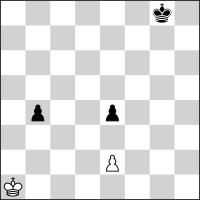 <b>h#10</b> &nbsp;·&nbsp; 2 + 3</td>
<td valign="top">
<b>No. 45</b> &nbsp;·&nbsp; <b>h#10</b>, unique solution &nbsp;·&nbsp; <a href="https://helpman.komtera.lt/?fen=6k1/8/8/8/1p2p3/8/4P3/K7&moves=10">solve ↗</a> 
2 positions of 199,729,152 indexed have a unique solution at h#10. The class runs to h#15.5, so the deepest sound problem is 11 plies shallower. Every position at that depth is saturated (255+ solutions). 
 <b>Solution:</b> 1.b3 Kb1 2.b2 Kc2 3.b1=B+ Kc1 4.Bd3 exd3 5.Kf7 dxe4 6.Ke6 e5 7.Kd5 e6 8.Kc4 e7 9.Kb3 e8=Q 10.Ka2 Qa4# 
 <b>Themes:</b> <code>pure</code> <code>model</code> <code>ideal</code> <code>mirror</code> <code>promotion</code> <code>underpromotion</code> <code>excelsior</code> <code>excelsior:white</code> <code>umnov</code> <code>promotions:qb</code> 
 <code>6k1/8/8/8/1p2p3/8/4P3/K7 b - - 0 1</code>
</td>
</tr></table>

## KBvknp

<table><tr>
<td width="220" valign="top">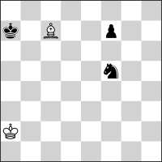 <b>h#9.5</b> &nbsp;·&nbsp; 2 + 3</td>
<td valign="top">
<b>No. 46</b> &nbsp;·&nbsp; <b>h#9.5</b>, unique solution &nbsp;·&nbsp; <a href="https://helpman.komtera.lt/?fen=8/k1B2p2/8/5n2/8/8/K7/8&moves=9.5">solve ↗</a> 
2 positions of 355,074,048 indexed have a unique solution at h#9.5. The class runs to h#15.5, so the deepest sound problem is 12 plies shallower. Every position at that depth is saturated (255+ solutions). 
 <b>Solution:</b> 1...Kb3 2.Kb7 Kc4 3.Kc8 Kd5 4.Kd7 Ke5 5.Ke8 Kf6 6.Kf8 Bd6+ 7.Kg8 Bf8 8.Kh8 Kxf7 9.Nh6+ Kg6 10.Ng8 Bg7# 
 <b>Themes:</b> <code>pure</code> <code>model</code> <code>ideal</code> <code>self-block</code> <code>umnov</code> 
 <code>8/k1B2p2/8/5n2/8/8/K7/8 w - - 0 1</code>
</td>
</tr></table>

## KBvkqn

<table><tr>
<td width="220" valign="top">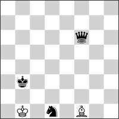 <b>h#9.5</b> &nbsp;·&nbsp; 2 + 3</td>
<td valign="top">
<b>No. 47</b> &nbsp;·&nbsp; <b>h#9.5</b>, unique solution &nbsp;·&nbsp; <a href="https://helpman.komtera.lt/?fen=8/8/8/8/n7/2q5/2k5/K4B2&moves=9.5">solve ↗</a> 
46 positions of 121,110,528 indexed have a unique solution at h#9.5. The class runs to h#13, so the deepest sound problem is 7 plies shallower. Every position at that depth is saturated (255+ solutions). 
 <b>Solution:</b> 1...Ka2 2.Nc5 Bc4 3.Na6 Bb3+ 4.Kd3 Ka3 5.Kd4 Ka4 6.Kc5 Be6 7.Kb6 Bc8 8.Ka7 Kb5 9.Ka8 Kb6 10.Nb8 Bb7# 
 <b>Themes:</b> <code>pure</code> <code>model</code> <code>self-block</code> <code>nocapture</code> 
 <code>8/8/8/8/n7/2q5/2k5/K4B2 w - - 0 1</code>
</td>
</tr></table>

## KBvkrn

<table><tr>
<td width="220" valign="top">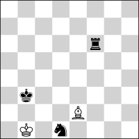 <b>h#9.5</b> &nbsp;·&nbsp; 2 + 3</td>
<td valign="top">
<b>No. 48</b> &nbsp;·&nbsp; <b>h#9.5</b>, unique solution &nbsp;·&nbsp; <a href="https://helpman.komtera.lt/?fen=8/8/5r2/8/8/1k6/4B3/1K1n4&moves=9.5">solve ↗</a> 
24 positions of 121,110,528 indexed have a unique solution at h#9.5. The class runs to h#12.5, so the deepest sound problem is 6 plies shallower. Every position at that depth is saturated (255+ solutions). 
 <b>Solution:</b> 1...Kc1 2.Nf2 Kd2 3.Nh3 Ke3 4.Kc2 Bd3+ 5.Kd1 Bf5 6.Ke1 Kf3 7.Kf1 Kg3 8.Kg1 Bd3 9.Kh1 Bf1 10.Ng1 Bg2# 
 <b>Themes:</b> <code>pure</code> <code>model</code> <code>switchback</code> <code>self-block</code> <code>nocapture</code> 
 <code>8/8/5r2/8/8/1k6/4B3/1K1n4 w - - 0 1</code>
</td>
</tr></table>

## KNvkpp

<table><tr>
<td width="220" valign="top">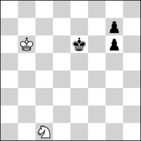 <b>h#9.5</b> &nbsp;·&nbsp; 2 + 3</td>
<td valign="top">
<b>No. 49</b> &nbsp;·&nbsp; <b>h#9.5</b>, unique solution &nbsp;·&nbsp; <a href="https://helpman.komtera.lt/?fen=8/6p1/1K2k1p1/8/8/8/8/2N5&moves=9.5">solve ↗</a> 
2 positions of 266,305,536 indexed have a unique solution at h#9.5. The class runs to h#11.5, so the deepest sound problem is 4 plies shallower. Every position at that depth is saturated (255+ solutions). 
 <b>Solution:</b> 1...Kc7 2.g5 Kd8 3.g4 Ke8 4.g3 Kf8 5.g2 Kxg7 6.g1=R+ Kh7 7.Kf7 Kh6 8.Kg8 Nd3 9.Kh8 Ne5 10.Rg8 Nf7# 
 <b>Themes:</b> <code>pure</code> <code>model</code> <code>ideal</code> <code>promotion</code> <code>underpromotion</code> <code>self-block</code> <code>promotions:r</code> 
 <code>8/6p1/1K2k1p1/8/8/8/8/2N5 w - - 0 1</code>
</td>
</tr></table>

## KNvkqb

<table><tr>
<td width="220" valign="top">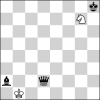 <b>h#9.5</b> &nbsp;·&nbsp; 2 + 3</td>
<td valign="top">
<b>No. 50</b> &nbsp;·&nbsp; <b>h#9.5</b>, unique solution &nbsp;·&nbsp; <a href="https://helpman.komtera.lt/?fen=7k/6N1/8/8/8/8/b2q4/1K6&moves=9.5">solve ↗</a> 
1 position of 121,110,528 indexed has a unique solution at h#9.5. The class runs to h#11.5, so the deepest sound problem is 4 plies shallower. Every position at that depth is saturated (255+ solutions). 
 <b>Solution:</b> 1...Ka1 2.Kg8 Nf5 3.Kf7 Ne3 4.Ke6 Nc2 5.Kd5 Kb2 6.Kc4 Ka3 7.Kc3 Ka4 8.Kb2 Nd4 9.Ka1 Ka3 10.Bb1 Nb3# 
 <b>Themes:</b> <code>pure</code> <code>model</code> <code>switchback</code> <code>self-block</code> <code>nocapture</code> <code>nocheck</code> 
 <code>7k/6N1/8/8/8/8/b2q4/1K6 w - - 0 1</code>
</td>
</tr></table>

## KNvkqp

<table><tr>
<td width="220" valign="top">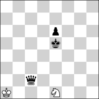 <b>h#9.5</b> &nbsp;·&nbsp; 2 + 3</td>
<td valign="top">
<b>No. 51</b> &nbsp;·&nbsp; <b>h#9.5</b>, unique solution &nbsp;·&nbsp; <a href="https://helpman.komtera.lt/?fen=8/8/6p1/8/8/q1N5/8/K1k5&moves=9.5">solve ↗</a> 
194 positions of 355,074,048 indexed have a unique solution at h#9.5. The class runs to h#11.5, so the deepest sound problem is 4 plies shallower. Every position at that depth is saturated (255+ solutions). 
 <b>Solution:</b> 1...Na2+ 2.Kd2 Kb1 3.g5 Nc3 4.Qc1+ Ka2 5.g4 Kb3 6.g3 Kc4 7.g2 Kd4 8.g1=R Ne4+ 9.Kd1 Kd3 10.Re1 Nf2# 
 <b>Themes:</b> <code>pure</code> <code>model</code> <code>ideal</code> <code>promotion</code> <code>underpromotion</code> <code>switchback</code> <code>self-block</code> <code>nocapture</code> <code>promotions:r</code> 
 <code>8/8/6p1/8/8/q1N5/8/K1k5 w - - 0 1</code>
</td>
</tr></table>

## KPvkbp

<table><tr>
<td width="220" valign="top"> <b>h#9.5</b> &nbsp;·&nbsp; 2 + 3</td>
<td valign="top">
<b>No. 52</b> &nbsp;·&nbsp; <b>h#9.5</b>, unique solution &nbsp;·&nbsp; <a href="https://helpman.komtera.lt/?fen=8/8/6p1/8/6P1/k7/8/Kb6&moves=9.5">solve ↗</a> 
9 positions of 266,305,536 indexed have a unique solution at h#9.5. The class runs to h#14.5, so the deepest sound problem is 10 plies shallower. Every position at that depth is saturated (255+ solutions). 
 <b>Solution:</b> 1...g5 2.Kb4 Kb2 3.Kc5 Kc3 4.Kd6 Kd4 5.Ke7 Ke5 6.Kf8 Kf6 7.Ba2 Kxg6 8.Kg8 Kh6 9.Kh8 g6 10.Bg8 g7# 
 <b>Themes:</b> <code>pure</code> <code>model</code> <code>ideal</code> <code>self-block</code> <code>nocheck</code> 
 <code>8/8/6p1/8/6P1/k7/8/Kb6 w - - 0 1</code>
</td>
</tr></table>

## KBBvkn

<table><tr>
<td width="220" valign="top"> <b>h#9</b> &nbsp;·&nbsp; 3 + 2</td>
<td valign="top">
<b>No. 53</b> &nbsp;·&nbsp; <b>h#9</b>, unique solution &nbsp;·&nbsp; <a href="https://helpman.komtera.lt/?fen=8/8/4n3/8/3B4/8/1B4k1/3K4&moves=9">solve ↗</a> 
2 positions of 121,110,528 indexed have a unique solution at h#9. The class runs to h#12, so the deepest sound problem is 6 plies shallower. Every position at that depth is saturated (255+ solutions). 
 <b>Solution:</b> 1.Kf3 Bc1 2.Ke4 Ke2 3.Kxd4 Kf3 4.Ke5 Kg4 5.Kf6 Kh5 6.Kg7 Bh6+ 7.Kh8 Kg6 8.Nf8+ Kf7 9.Nh7 Bg7# 
 <b>Themes:</b> <code>pure</code> <code>model</code> <code>ideal</code> <code>self-block</code> 
 <code>8/8/4n3/8/3B4/8/1B4k1/3K4 b - - 0 1</code>
</td>
</tr></table>

## KBBvkp

<table><tr>
<td width="220" valign="top"> <b>h#9</b> &nbsp;·&nbsp; 3 + 2</td>
<td valign="top">
<b>No. 54</b> &nbsp;·&nbsp; <b>h#9</b>, unique solution &nbsp;·&nbsp; <a href="https://helpman.komtera.lt/?fen=3K4/1B6/2B5/8/1k6/8/5p2/8&moves=9">solve ↗</a> 
1 position of 355,074,048 indexed has a unique solution at h#9. The class runs to h#16, so the deepest sound problem is 14 plies shallower. Every position at that depth is saturated (255+ solutions). 
 <b>Solution:</b> 1.Kc5 Bc8 2.Kxc6 Ke7 3.Kd5 Kf6 4.Ke4 Kg5 5.Kf3 Kh4 6.Kg2 Bh3+ 7.Kh1 Kg3 8.f1=N+ Kf2 9.Nh2 Bg2# 
 <b>Themes:</b> <code>pure</code> <code>model</code> <code>ideal</code> <code>promotion</code> <code>underpromotion</code> <code>self-block</code> <code>umnov</code> <code>promotions:n</code> 
 <code>3K4/1B6/2B5/8/1k6/8/5p2/8 b - - 0 1</code>
</td>
</tr></table>

## KBvkbn

<table><tr>
<td width="220" valign="top"> <b>h#9</b> &nbsp;·&nbsp; 2 + 3</td>
<td valign="top">
<b>No. 55</b> &nbsp;·&nbsp; <b>h#9</b>, unique solution &nbsp;·&nbsp; <a href="https://helpman.komtera.lt/?fen=8/8/1n6/3b4/8/8/8/KBk5&moves=9">solve ↗</a> 
57 positions of 121,110,528 indexed have a unique solution at h#9. The class runs to h#12, so the deepest sound problem is 6 plies shallower. Every position at that depth is saturated (255+ solutions). 
 <b>Solution:</b> 1.Kd2 Bd3 2.Kc3 Ba6 3.Kb4 Kb2 4.Ka5 Kc3 5.Nc8 Kd4 6.Kb6 Kxd5 7.Ka7 Kc6 8.Ka8 Kc7 9.Na7 Bb7# 
 <b>Themes:</b> <code>pure</code> <code>model</code> <code>ideal</code> <code>self-block</code> <code>nocheck</code> 
 <code>8/8/1n6/3b4/8/8/8/KBk5 b - - 0 1</code>
</td>
</tr></table>

## KBvknn

<table><tr>
<td width="220" valign="top"> <b>h#9</b> &nbsp;·&nbsp; 2 + 3</td>
<td valign="top">
<b>No. 56</b> &nbsp;·&nbsp; <b>h#9</b>, unique solution &nbsp;·&nbsp; <a href="https://helpman.komtera.lt/?fen=8/8/8/8/8/8/5n2/kBK4n&moves=9">solve ↗</a> 
34 positions of 121,110,528 indexed have a unique solution at h#9. The class runs to h#12.5, so the deepest sound problem is 7 plies shallower. Every position at that depth is saturated (255+ solutions). 
 <b>Solution:</b> 1.Nh3 Kd2 2.Kb2 Ke3 3.Kc1 Be4 4.Kd1 Bxh1 5.Ke1 Kf3 6.Kf1 Bg2+ 7.Kg1 Bf1 8.Kh1 Kg3 9.Ng1 Bg2# 
 <b>Themes:</b> <code>pure</code> <code>model</code> <code>ideal</code> <code>switchback</code> <code>self-block</code> <code>kniest</code> <code>umnov</code> 
 <code>8/8/8/8/8/8/5n2/kBK4n b - - 0 1</code>
</td>
</tr></table>

## KBvkpp

<table><tr>
<td width="220" valign="top"> <b>h#9</b> &nbsp;·&nbsp; 2 + 3</td>
<td valign="top">
<b>No. 57</b> &nbsp;·&nbsp; <b>h#9</b>, unique solution &nbsp;·&nbsp; <a href="https://helpman.komtera.lt/?fen=8/6k1/8/p3p3/8/8/1B6/K7&moves=9">solve ↗</a> 
51 positions of 266,305,536 indexed have a unique solution at h#9. The class runs to h#16, so the deepest sound problem is 14 plies shallower. Every position at that depth is saturated (255+ solutions). 
 <b>Solution:</b> 1.Kh8 Ba3 2.e4 Kb2 3.e3 Kc3 4.e2 Kd4 5.e1=N Ke5 6.Nf3+ Kf6 7.Ng5 Bf8 8.Nh7+ Kf7 9.a4 Bg7# 
 <b>Themes:</b> <code>pure</code> <code>model</code> <code>promotion</code> <code>underpromotion</code> <code>self-block</code> <code>nocapture</code> <code>promotions:n</code> 
 <code>8/6k1/8/p3p3/8/8/1B6/K7 b - - 0 1</code>
</td>
</tr></table>

## KNPvkp

<table><tr>
<td width="220" valign="top"> <b>h#9</b> &nbsp;·&nbsp; 3 + 2</td>
<td valign="top">
<b>No. 58</b> &nbsp;·&nbsp; <b>h#9</b>, unique solution &nbsp;·&nbsp; <a href="https://helpman.komtera.lt/?fen=N7/8/8/8/6k1/4p3/4P3/K7&moves=9">solve ↗</a> 
9 positions of 266,305,536 indexed have a unique solution at h#9. The class runs to h#14, so the deepest sound problem is 10 plies shallower. Every position at that depth is saturated (255+ solutions). 
 <b>Solution:</b> 1.Kg3 Nb6 2.Kf2 Nc4 3.Ke1 Nd2 4.exd2 e4 5.Kd1 e5 6.Kc1 e6 7.d1=R e7 8.Rd2 e8=Q 9.Rc2 Qe1# 
 <b>Themes:</b> <code>promotion</code> <code>underpromotion</code> <code>excelsior</code> <code>excelsior:white</code> <code>switchback</code> <code>self-block</code> <code>nocheck</code> <code>promotions:qr</code> 
 <code>N7/8/8/8/6k1/4p3/4P3/K7 b - - 0 1</code>
</td>
</tr></table>

## KPvknp

<table><tr>
<td width="220" valign="top"> <b>h#9</b> &nbsp;·&nbsp; 2 + 3</td>
<td valign="top">
<b>No. 59</b> &nbsp;·&nbsp; <b>h#9</b>, unique solution &nbsp;·&nbsp; <a href="https://helpman.komtera.lt/?fen=6k1/8/7n/8/8/p7/P7/K7&moves=9">solve ↗</a> 
4 positions of 266,305,536 indexed have a unique solution at h#9. The class runs to h#14.5, so the deepest sound problem is 11 plies shallower. Every position at that depth is saturated (255+ solutions). 
 <b>Solution:</b> 1.Nf5 Kb1 2.Nd4 Kc1 3.Nb3+ axb3 4.Kf7 b4 5.Ke6 b5 6.Kd5 b6 7.Kc4 b7 8.Kb3 b8=Q+ 9.Ka2 Qb1# 
 <b>Themes:</b> <code>promotion</code> <code>excelsior</code> <code>excelsior:white</code> <code>promotions:q</code> 
 <code>6k1/8/7n/8/8/p7/P7/K7 b - - 0 1</code>
</td>
</tr></table>

## KNvkbb

<table><tr>
<td width="220" valign="top"> <b>h#8.5</b> &nbsp;·&nbsp; 2 + 3</td>
<td valign="top">
<b>No. 60</b> &nbsp;·&nbsp; <b>h#8.5</b>, unique solution &nbsp;·&nbsp; <a href="https://helpman.komtera.lt/?fen=8/8/N7/7k/b1b5/8/8/K7&moves=8.5">solve ↗</a> 
69 positions of 121,110,528 indexed have a unique solution at h#8.5. The class runs to h#10.5, so the deepest sound problem is 4 plies shallower. Every position at that depth is saturated (255+ solutions). 
 <b>Solution:</b> 1...Kb2 2.Kg4 Ka3 3.Kf3 Kxa4 4.Ke2 Kb4 5.Kd1 Kc3 6.Kc1 Nb4 7.Kb1 Kd2 8.Ka1 Kc1 9.Ba2 Nc2# 
 <b>Themes:</b> <code>pure</code> <code>model</code> <code>ideal</code> <code>self-block</code> <code>nocheck</code> 
 <code>8/8/N7/7k/b1b5/8/8/K7 w - - 0 1</code>
</td>
</tr></table>

## KNvkbp

<table><tr>
<td width="220" valign="top"> <b>h#8.5</b> &nbsp;·&nbsp; 2 + 3</td>
<td valign="top">
<b>No. 61</b> &nbsp;·&nbsp; <b>h#8.5</b>, unique solution &nbsp;·&nbsp; <a href="https://helpman.komtera.lt/?fen=7k/8/8/p7/8/8/2b5/NK6&moves=8.5">solve ↗</a> 
12 positions of 355,074,048 indexed have a unique solution at h#8.5. The class runs to h#10.5, so the deepest sound problem is 4 plies shallower. Every position at that depth is saturated (255+ solutions). 
 <b>Solution:</b> 1...Kb2 2.Kg7 Kc3 3.Kf6 Kc4 4.Ke5 Kb5 5.Kd4 Nb3+ 6.Kc3 Nxa5 7.Kb2 Kb4 8.Ka1 Ka3 9.Bb1 Nb3# 
 <b>Themes:</b> <code>pure</code> <code>model</code> <code>ideal</code> <code>switchback</code> <code>self-block</code> 
 <code>7k/8/8/p7/8/8/2b5/NK6 w - - 0 1</code>
</td>
</tr></table>

## KNvknn

<table><tr>
<td width="220" valign="top"> <b>h#8.5</b> &nbsp;·&nbsp; 2 + 3</td>
<td valign="top">
<b>No. 62</b> &nbsp;·&nbsp; <b>h#8.5</b>, unique solution &nbsp;·&nbsp; <a href="https://helpman.komtera.lt/?fen=7k/8/8/8/8/8/8/KNn1n3&moves=8.5">solve ↗</a> 
3 positions of 121,110,528 indexed have a unique solution at h#8.5. The class runs to h#9.5, so the deepest sound problem is 2 plies shallower. Every position at that depth is saturated (255+ solutions). 
 <b>Solution:</b> 1...Kb2 2.Kg7 Kc3 3.Kf6 Kd2 4.Ke5 Kd1 5.Kd4 Nd2 6.Kc3 Kxe1 7.Kb2 Kd1 8.Ka1 Kc2 9.Na2 Nb3# 
 <b>Themes:</b> <code>pure</code> <code>model</code> <code>ideal</code> <code>switchback</code> <code>self-block</code> <code>nocheck</code> 
 <code>7k/8/8/8/8/8/8/KNn1n3 w - - 0 1</code>
</td>
</tr></table>

## KNvknp

<table><tr>
<td width="220" valign="top"> <b>h#8.5</b> &nbsp;·&nbsp; 2 + 3</td>
<td valign="top">
<b>No. 63</b> &nbsp;·&nbsp; <b>h#8.5</b>, unique solution &nbsp;·&nbsp; <a href="https://helpman.komtera.lt/?fen=N5k1/8/8/8/8/1p6/8/Kn6&moves=8.5">solve ↗</a> 
1 position of 355,074,048 indexed has a unique solution at h#8.5. The class runs to h#10, so the deepest sound problem is 3 plies shallower. Every position at that depth is saturated (255+ solutions). 
 <b>Solution:</b> 1...Kb2 2.Nc3 Ka3 3.Kf7 Kb4 4.Ke6 Ka5 5.Kd5 Kb6 6.Kc4 Ka6 7.Kb4 Nb6 8.Ka3 Ka5 9.Na2 Nc4# 
 <b>Themes:</b> <code>set-play</code> <code>pure</code> <code>model</code> <code>ideal</code> <code>closed-walk</code> <code>self-block</code> <code>nocapture</code> <code>nocheck</code> 
 <code>N5k1/8/8/8/8/1p6/8/Kn6 w - - 0 1</code>
</td>
</tr></table>

## KNvkqr

<table><tr>
<td width="220" valign="top"> <b>h#8.5</b> &nbsp;·&nbsp; 2 + 3</td>
<td valign="top">
<b>No. 64</b> &nbsp;·&nbsp; <b>h#8.5</b>, unique solution &nbsp;·&nbsp; <a href="https://helpman.komtera.lt/?fen=8/7k/N7/8/8/8/4r3/Kq6&moves=8.5">solve ↗</a> 
8 positions of 121,110,528 indexed have a unique solution at h#8.5. The class runs to h#9.5, so the deepest sound problem is 2 plies shallower. Every position at that depth is saturated (255+ solutions). 
 <b>Solution:</b> 1...Kxb1 2.Kg6 Nb4 3.Kf5 Nc2 4.Ke4 Kb2 5.Kd3 Kc1 6.Kc3 Kd1 7.Kb2 Nd4 8.Ka1 Kc1 9.Ra2 Nb3# 
 <b>Themes:</b> <code>pure</code> <code>model</code> <code>ideal</code> <code>switchback</code> <code>self-block</code> <code>nocheck</code> 
 <code>8/7k/N7/8/8/8/4r3/Kq6 w - - 0 1</code>
</td>
</tr></table>

## KNvkrn

<table><tr>
<td width="220" valign="top"> <b>h#8.5</b> &nbsp;·&nbsp; 2 + 3</td>
<td valign="top">
<b>No. 65</b> &nbsp;·&nbsp; <b>h#8.5</b>, unique solution &nbsp;·&nbsp; <a href="https://helpman.komtera.lt/?fen=6k1/8/8/8/8/n7/4r3/1KN5&moves=8.5">solve ↗</a> 
1 position of 121,110,528 indexed has a unique solution at h#8.5. The class runs to h#10.5, so the deepest sound problem is 4 plies shallower. Every position at that depth is saturated (255+ solutions). 
 <b>Solution:</b> 1...Ka1 2.Kf7 Nxe2 3.Ke6 Kb2 4.Kd5 Kc1 5.Kc4 Kd2 6.Kb3 Nd4+ 7.Ka2 Kc3 8.Ka1 Kb3 9.Nb1 Nc2# 
 <b>Themes:</b> <code>pure</code> <code>model</code> <code>ideal</code> <code>self-block</code> 
 <code>6k1/8/8/8/8/n7/4r3/1KN5 w - - 0 1</code>
</td>
</tr></table>

## KNvkrp

<table><tr>
<td width="220" valign="top"> <b>h#8.5</b> &nbsp;·&nbsp; 2 + 3</td>
<td valign="top">
<b>No. 66</b> &nbsp;·&nbsp; <b>h#8.5</b>, unique solution &nbsp;·&nbsp; <a href="https://helpman.komtera.lt/?fen=6k1/8/8/1p6/8/8/1r6/K6N&moves=8.5">solve ↗</a> 
46 positions of 355,074,048 indexed have a unique solution at h#8.5. The class runs to h#11.5, so the deepest sound problem is 6 plies shallower. Every position at that depth is saturated (255+ solutions). 
 <b>Solution:</b> 1...Ng3 2.Rh2 Kb1 3.Rh8 Kc2 4.b4 Kd3 5.b3 Ke4 6.b2 Kf5 7.b1=R Kg6 8.Rb8 Nf5 9.Rf8 Ne7# 
 <b>Themes:</b> <code>pure</code> <code>model</code> <code>ideal</code> <code>promotion</code> <code>underpromotion</code> <code>self-block</code> <code>nocapture</code> <code>nocheck</code> <code>promotions:r</code> 
 <code>6k1/8/8/1p6/8/8/1r6/K6N w - - 0 1</code>
</td>
</tr></table>

## KNvkrr

<table><tr>
<td width="220" valign="top"> <b>h#8.5</b> &nbsp;·&nbsp; 2 + 3</td>
<td valign="top">
<b>No. 67</b> &nbsp;·&nbsp; <b>h#8.5</b>, unique solution &nbsp;·&nbsp; <a href="https://helpman.komtera.lt/?fen=8/7k/N7/8/8/8/4r3/Kr6&moves=8.5">solve ↗</a> 
5 positions of 121,110,528 indexed have a unique solution at h#8.5. The class runs to h#9.5, so the deepest sound problem is 2 plies shallower. Every position at that depth is saturated (255+ solutions). 
 <b>Solution:</b> 1...Kxb1 2.Kg6 Nb4 3.Kf5 Nc2 4.Ke4 Kb2 5.Kd3 Kc1 6.Kc3 Kd1 7.Kb2 Nd4 8.Ka1 Kc1 9.Ra2 Nb3# 
 <b>Themes:</b> <code>pure</code> <code>model</code> <code>ideal</code> <code>switchback</code> <code>self-block</code> <code>nocheck</code> 
 <code>8/7k/N7/8/8/8/4r3/Kr6 w - - 0 1</code>
</td>
</tr></table>

## KPPvkp

<table><tr>
<td width="220" valign="top"> <b>h#8.5</b> &nbsp;·&nbsp; 3 + 2</td>
<td valign="top">
<b>No. 68</b> &nbsp;·&nbsp; <b>h#8.5</b>, unique solution &nbsp;·&nbsp; <a href="https://helpman.komtera.lt/?fen=8/8/p7/8/P7/P7/K7/7k&moves=8.5">solve ↗</a> 
6 positions of 199,729,152 indexed have a unique solution at h#8.5. The class runs to h#14.5, so the deepest sound problem is 12 plies shallower. Every position at that depth is saturated (255+ solutions). 
 <b>Solution:</b> 1...Kb3 2.Kg2 Kb4 3.a5+ Kxa5 4.Kf3 Kb4 5.Ke4 a5 6.Kd5 a6 7.Kc6 a7 8.Kb7 Kc5 9.Ka6 a8=Q# 
 <b>Themes:</b> <code>pure</code> <code>model</code> <code>mirror</code> <code>promotion</code> <code>switchback</code> <code>promotions:q</code> 
 <code>8/8/p7/8/P7/P7/K7/7k w - - 0 1</code>
</td>
</tr></table>

## KPvkqn

<table><tr>
<td width="220" valign="top"> <b>h#8.5</b> &nbsp;·&nbsp; 2 + 3</td>
<td valign="top">
<b>No. 69</b> &nbsp;·&nbsp; <b>h#8.5</b>, unique solution &nbsp;·&nbsp; <a href="https://helpman.komtera.lt/?fen=K7/8/8/8/8/2n5/2P5/2q4k&moves=8.5">solve ↗</a> 
1 position of 355,074,048 indexed has a unique solution at h#8.5. The class runs to h#9.5, so the deepest sound problem is 2 plies shallower. Every position at that depth is saturated (255+ solutions). 
 <b>Solution:</b> 1...Ka7 2.Nd5 c4 3.Kg2 cxd5 4.Kf3 d6 5.Ke4 d7 6.Kd5 d8=Q+ 7.Kc6 Qd5+ 8.Kc7 Ka6 9.Kb8 Qb7# 
 <b>Themes:</b> <code>promotion</code> <code>excelsior</code> <code>excelsior:white</code> <code>closed-walk</code> <code>umnov</code> <code>promotions:q</code> 
 <code>K7/8/8/8/8/2n5/2P5/2q4k w - - 0 1</code>
</td>
</tr></table>

## KPvkqp

<table><tr>
<td width="220" valign="top"> <b>h#8.5</b> &nbsp;·&nbsp; 2 + 3</td>
<td valign="top">
<b>No. 70</b> &nbsp;·&nbsp; <b>h#8.5</b>, unique solution &nbsp;·&nbsp; <a href="https://helpman.komtera.lt/?fen=8/7k/q7/8/7p/8/7P/K7&moves=8.5">solve ↗</a> 
9 positions of 266,305,536 indexed have a unique solution at h#8.5. The class runs to h#14.5, so the deepest sound problem is 12 plies shallower. Every position at that depth is saturated (255+ solutions). 
 <b>Solution:</b> 1...Kb2 2.Qg6 Ka3 3.Qg3+ hxg3 4.Kg6 gxh4 5.Kf5 h5 6.Ke4 h6 7.Kd3 h7 8.Kc2 h8=Q 9.Kb1 Qb2# 
 <b>Themes:</b> <code>promotion</code> <code>excelsior</code> <code>excelsior:white</code> <code>promotions:q</code> 
 <code>8/7k/q7/8/7p/8/7P/K7 w - - 0 1</code>
</td>
</tr></table>

## KPvkrp

<table><tr>
<td width="220" valign="top"> <b>h#8.5</b> &nbsp;·&nbsp; 2 + 3</td>
<td valign="top">
<b>No. 71</b> &nbsp;·&nbsp; <b>h#8.5</b>, unique solution &nbsp;·&nbsp; <a href="https://helpman.komtera.lt/?fen=8/8/8/8/6k1/5p2/2r2P2/K7&moves=8.5">solve ↗</a> 
101 positions of 266,305,536 indexed have a unique solution at h#8.5. The class runs to h#14.5, so the deepest sound problem is 12 plies shallower. Every position at that depth is saturated (255+ solutions). 
 <b>Solution:</b> 1...Kb1 2.Re2 Kc1 3.Re3 fxe3 4.Kf5 e4+ 5.Ke6 e5 6.Kd5 e6 7.Kc4 e7 8.Kb3 e8=Q 9.Ka2 Qa4# 
 <b>Themes:</b> <code>pure</code> <code>model</code> <code>mirror</code> <code>promotion</code> <code>excelsior</code> <code>excelsior:white</code> <code>umnov</code> <code>promotions:q</code> 
 <code>8/8/8/8/6k1/5p2/2r2P2/K7 w - - 0 1</code>
</td>
</tr></table>

## KBvkbb

<table><tr>
<td width="220" valign="top"> <b>h#8</b> &nbsp;·&nbsp; 2 + 3</td>
<td valign="top">
<b>No. 72</b> &nbsp;·&nbsp; <b>h#8</b>, unique solution &nbsp;·&nbsp; <a href="https://helpman.komtera.lt/?fen=5b2/8/8/8/7B/7b/7k/K7&moves=8">solve ↗</a> 
8 positions of 121,110,528 indexed have a unique solution at h#8. The class runs to h#10, so the deepest sound problem is 4 plies shallower. Every position at that depth is saturated (255+ solutions). 
 <b>Solution:</b> 1.Bf5 Kb2 2.Kh3 Kc3 3.Kg4 Kd4 4.Kh5 Ke5 5.Kh6 Kf6 6.Kh7 Kf7 7.Kh8 Kxf8 8.Bh7 Bf6# 
 <b>Themes:</b> <code>self-block</code> <code>nocheck</code> 
 <code>5b2/8/8/8/7B/7b/7k/K7 b - - 0 1</code>
</td>
</tr></table>

## KNvkbn

<table><tr>
<td width="220" valign="top"> <b>h#8</b> &nbsp;·&nbsp; 2 + 3</td>
<td valign="top">
<b>No. 73</b> &nbsp;·&nbsp; <b>h#8</b>, unique solution &nbsp;·&nbsp; <a href="https://helpman.komtera.lt/?fen=7k/8/8/8/8/1b6/8/Kn2N3&moves=8">solve ↗</a> 
5 positions of 121,110,528 indexed have a unique solution at h#8. The class runs to h#10, so the deepest sound problem is 4 plies shallower. Every position at that depth is saturated (255+ solutions). 
 <b>Solution:</b> 1.Kg7 Kxb1 2.Kf6 Kc1 3.Ke5 Kd2 4.Kd4 Ke2 5.Kc3 Ke3 6.Kb2 Kd2 7.Ka1 Kc1 8.Ba2 Nc2# 
 <b>Themes:</b> <code>pure</code> <code>model</code> <code>ideal</code> <code>closed-walk</code> <code>self-block</code> <code>nocheck</code> 
 <code>7k/8/8/8/8/1b6/8/Kn2N3 b - - 0 1</code>
</td>
</tr></table>

## KNvkqn

<table><tr>
<td width="220" valign="top"> <b>h#8</b> &nbsp;·&nbsp; 2 + 3</td>
<td valign="top">
<b>No. 74</b> &nbsp;·&nbsp; <b>h#8</b>, unique solution &nbsp;·&nbsp; <a href="https://helpman.komtera.lt/?fen=8/7k/8/8/8/N7/1nq5/K7&moves=8">solve ↗</a> 
2 positions of 121,110,528 indexed have a unique solution at h#8. The class runs to h#10.5, so the deepest sound problem is 5 plies shallower. Every position at that depth is saturated (255+ solutions). 
 <b>Solution:</b> 1.Qa4 Kb1 2.Kg6 Kc1 3.Kf5 Kd2 4.Ke4 Ke1 5.Kd3 Nb5 6.Kc2 Ke2 7.Kb1 Kd2 8.Qa1 Nc3# 
 <b>Themes:</b> <code>pure</code> <code>model</code> <code>ideal</code> <code>closed-walk</code> <code>self-block</code> <code>nocapture</code> <code>nocheck</code> 
 <code>8/7k/8/8/8/N7/1nq5/K7 b - - 0 1</code>
</td>
</tr></table>

## KQBvkn

<table><tr>
<td width="220" valign="top"> <b>h#8</b> &nbsp;·&nbsp; 3 + 2</td>
<td valign="top">
<b>No. 75</b> &nbsp;·&nbsp; <b>h#8</b>, unique solution &nbsp;·&nbsp; <a href="https://helpman.komtera.lt/?fen=8/8/8/7B/8/2Q5/3k1n2/1K6&moves=8">solve ↗</a> 
25 positions of 121,110,528 indexed have a unique solution at h#8. The class runs to h#12, so the deepest sound problem is 8 plies shallower. Every position at that depth is saturated (255+ solutions). 
 <b>Solution:</b> 1.Kxc3 Be2 2.Kd2 Bf1 3.Ke1 Kc2 4.Nh3 Kd3 5.Kf2 Ke4 6.Kg1 Kf3 7.Kh1 Kg3 8.Ng1 Bg2# 
 <b>Themes:</b> <code>pure</code> <code>model</code> <code>ideal</code> <code>switchback</code> <code>self-block</code> <code>nocheck</code> 
 <code>8/8/8/7B/8/2Q5/3k1n2/1K6 b - - 0 1</code>
</td>
</tr></table>

## KQNvkb

<table><tr>
<td width="220" valign="top"> <b>h#8</b> &nbsp;·&nbsp; 3 + 2</td>
<td valign="top">
<b>No. 76</b> &nbsp;·&nbsp; <b>h#8</b>, unique solution &nbsp;·&nbsp; <a href="https://helpman.komtera.lt/?fen=8/8/8/6Qk/8/1b6/4N3/K7&moves=8">solve ↗</a> 
5 positions of 121,110,528 indexed have a unique solution at h#8. The class runs to h#11, so the deepest sound problem is 6 plies shallower. Every position at that depth is saturated (255+ solutions). 
 <b>Solution:</b> 1.Kxg5 Nd4 2.Kf4 Kb2 3.Ke3 Ka3 4.Kd2 Kb4 5.Kc1 Kc3 6.Kb1 Kd2 7.Ka1 Kc1 8.Ba2 Nc2# 
 <b>Themes:</b> <code>pure</code> <code>model</code> <code>ideal</code> <code>self-block</code> <code>nocheck</code> 
 <code>8/8/8/6Qk/8/1b6/4N3/K7 b - - 0 1</code>
</td>
</tr></table>

## KQNvkn

<table><tr>
<td width="220" valign="top"> <b>h#8</b> &nbsp;·&nbsp; 3 + 2</td>
<td valign="top">
<b>No. 77</b> &nbsp;·&nbsp; <b>h#8</b>, unique solution &nbsp;·&nbsp; <a href="https://helpman.komtera.lt/?fen=5n2/8/8/8/8/8/3Q2N1/K1k5&moves=8">solve ↗</a> 
16 positions of 121,110,528 indexed have a unique solution at h#8. The class runs to h#10, so the deepest sound problem is 4 plies shallower. Every position at that depth is saturated (255+ solutions). 
 <b>Solution:</b> 1.Kxd2 Nh4 2.Ke3 Kb2 3.Kf4 Kc3 4.Kg5 Kd4 5.Kh6 Ke5 6.Kh7 Kf6 7.Kh8 Kf7 8.Nh7 Ng6# 
 <b>Themes:</b> <code>pure</code> <code>model</code> <code>ideal</code> <code>self-block</code> <code>nocheck</code> 
 <code>5n2/8/8/8/8/8/3Q2N1/K1k5 b - - 0 1</code>
</td>
</tr></table>

## KQNvkp

<table><tr>
<td width="220" valign="top"> <b>h#8</b> &nbsp;·&nbsp; 3 + 2</td>
<td valign="top">
<b>No. 78</b> &nbsp;·&nbsp; <b>h#8</b>, unique solution &nbsp;·&nbsp; <a href="https://helpman.komtera.lt/?fen=8/8/8/3p4/8/kQ6/N7/K7&moves=8">solve ↗</a> 
2 positions of 355,074,048 indexed have a unique solution at h#8. The class runs to h#11, so the deepest sound problem is 6 plies shallower. Every position at that depth is saturated (255+ solutions). 
 <b>Solution:</b> 1.Kxb3 Kb1 2.d4 Kc1 3.d3 Kd2 4.Kb2 Nb4 5.Ka1 Kc3 6.d2 Kb3 7.d1=R Ka3 8.Rb1 Nc2# 
 <b>Themes:</b> <code>pure</code> <code>model</code> <code>ideal</code> <code>promotion</code> <code>underpromotion</code> <code>self-block</code> <code>nocheck</code> <code>umnov</code> <code>promotions:r</code> 
 <code>8/8/8/3p4/8/kQ6/N7/K7 b - - 0 1</code>
</td>
</tr></table>

## KQNvkr

<table><tr>
<td width="220" valign="top"> <b>h#8</b> &nbsp;·&nbsp; 3 + 2</td>
<td valign="top">
<b>No. 79</b> &nbsp;·&nbsp; <b>h#8</b>, unique solution &nbsp;·&nbsp; <a href="https://helpman.komtera.lt/?fen=8/8/8/8/8/8/5r1N/K5Qk&moves=8">solve ↗</a> 
11 positions of 121,110,528 indexed have a unique solution at h#8. The class runs to h#10, so the deepest sound problem is 4 plies shallower. Every position at that depth is saturated (255+ solutions). 
 <b>Solution:</b> 1.Kxg1 Nf3+ 2.Kf1 Kb1 3.Ke2 Kb2 4.Kd3+ Kc1 5.Kc3 Kd1 6.Kb2 Nd4 7.Ka1 Kc1 8.Ra2 Nb3# 
 <b>Themes:</b> <code>pure</code> <code>model</code> <code>ideal</code> <code>switchback</code> <code>self-block</code> 
 <code>8/8/8/8/8/8/5r1N/K5Qk b - - 0 1</code>
</td>
</tr></table>

## KQPvkb

<table><tr>
<td width="220" valign="top"> <b>h#8</b> &nbsp;·&nbsp; 3 + 2</td>
<td valign="top">
<b>No. 80</b> &nbsp;·&nbsp; <b>h#8</b>, unique solution &nbsp;·&nbsp; <a href="https://helpman.komtera.lt/?fen=8/8/1K6/8/2b5/2P5/7Q/7k&moves=8">solve ↗</a> 
4 positions of 355,074,048 indexed have a unique solution at h#8. The class runs to h#9, so the deepest sound problem is 2 plies shallower. Every position at that depth is saturated (255+ solutions). 
 <b>Solution:</b> 1.Kxh2 Ka5 2.Bd5 c4 3.Kg3 cxd5 4.Kf4 d6 5.Ke5 d7 6.Kd6 Kb5 7.Kc7 Ka6 8.Kb8 d8=Q# 
 <b>Themes:</b> <code>pure</code> <code>model</code> <code>ideal</code> <code>mirror</code> <code>promotion</code> <code>phoenix</code> <code>nocheck</code> <code>umnov</code> <code>promotions:q</code> 
 <code>8/8/1K6/8/2b5/2P5/7Q/7k b - - 0 1</code>
</td>
</tr></table>

## KQPvkn

<table><tr>
<td width="220" valign="top"> <b>h#8</b> &nbsp;·&nbsp; 3 + 2</td>
<td valign="top">
<b>No. 81</b> &nbsp;·&nbsp; <b>h#8</b>, unique solution &nbsp;·&nbsp; <a href="https://helpman.komtera.lt/?fen=K7/8/2n5/8/8/8/2P4Q/7k&moves=8">solve ↗</a> 
7 positions of 355,074,048 indexed have a unique solution at h#8. The class runs to h#9, so the deepest sound problem is 2 plies shallower. Every position at that depth is saturated (255+ solutions). 
 <b>Solution:</b> 1.Kxh2 c3 2.Nd4 cxd4 3.Kg3 d5 4.Kf4 d6 5.Ke5 d7 6.Kd6 Ka7 7.Kc7 Ka6 8.Kb8 d8=Q# 
 <b>Themes:</b> <code>pure</code> <code>model</code> <code>ideal</code> <code>mirror</code> <code>promotion</code> <code>excelsior</code> <code>excelsior:white</code> <code>phoenix</code> <code>nocheck</code> <code>umnov</code> <code>promotions:q</code> 
 <code>K7/8/2n5/8/8/8/2P4Q/7k b - - 0 1</code>
</td>
</tr></table>

## KQPvkp

<table><tr>
<td width="220" valign="top"> <b>h#8</b> &nbsp;·&nbsp; 3 + 2</td>
<td valign="top">
<b>No. 82</b> &nbsp;·&nbsp; <b>h#8</b>, unique solution &nbsp;·&nbsp; <a href="https://helpman.komtera.lt/?fen=8/8/p7/8/P7/K7/6Q1/6k1&moves=8">solve ↗</a> 
42 positions of 266,305,536 indexed have a unique solution at h#8. The class runs to h#15, so the deepest sound problem is 14 plies shallower. Every position at that depth is saturated (255+ solutions). 
 <b>Solution:</b> 1.Kxg2 Kb4 2.a5+ Kxa5 3.Kf3 Kb4 4.Ke4 a5 5.Kd5 a6 6.Kc6 a7 7.Kb7 Kc5 8.Ka6 a8=Q# 
 <b>Themes:</b> <code>pure</code> <code>model</code> <code>ideal</code> <code>mirror</code> <code>promotion</code> <code>switchback</code> <code>phoenix</code> <code>promotions:q</code> 
 <code>8/8/p7/8/P7/K7/6Q1/6k1 b - - 0 1</code>
</td>
</tr></table>

## KRBvkn

<table><tr>
<td width="220" valign="top"> <b>h#8</b> &nbsp;·&nbsp; 3 + 2</td>
<td valign="top">
<b>No. 83</b> &nbsp;·&nbsp; <b>h#8</b>, unique solution &nbsp;·&nbsp; <a href="https://helpman.komtera.lt/?fen=8/8/7n/8/8/8/1K1R1B2/3k4&moves=8">solve ↗</a> 
4 positions of 121,110,528 indexed have a unique solution at h#8. The class runs to h#12, so the deepest sound problem is 8 plies shallower. Every position at that depth is saturated (255+ solutions). 
 <b>Solution:</b> 1.Kxd2 Bc5 2.Kd3 Bf8 3.Ke4 Kc3 4.Kf5 Kd4 5.Kg6 Ke5 6.Kh7 Kf6 7.Kh8 Kg6 8.Ng8 Bg7# 
 <b>Themes:</b> <code>pure</code> <code>model</code> <code>ideal</code> <code>self-block</code> <code>nocheck</code> 
 <code>8/8/7n/8/8/8/1K1R1B2/3k4 b - - 0 1</code>
</td>
</tr></table>

## KRNvkn

<table><tr>
<td width="220" valign="top"> <b>h#8</b> &nbsp;·&nbsp; 3 + 2</td>
<td valign="top">
<b>No. 84</b> &nbsp;·&nbsp; <b>h#8</b>, unique solution &nbsp;·&nbsp; <a href="https://helpman.komtera.lt/?fen=5n2/8/8/8/8/3N4/3R4/1K1k4&moves=8">solve ↗</a> 
2 positions of 121,110,528 indexed have a unique solution at h#8. The class runs to h#10, so the deepest sound problem is 4 plies shallower. Every position at that depth is saturated (255+ solutions). 
 <b>Solution:</b> 1.Kxd2 Ne5 2.Ke3 Kc2 3.Kf4 Kd3 4.Kg5 Ke4 5.Kh6 Kf5 6.Kh7 Kf6 7.Kh8 Kf7 8.Nh7 Ng6# 
 <b>Themes:</b> <code>pure</code> <code>model</code> <code>ideal</code> <code>self-block</code> <code>nocheck</code> 
 <code>5n2/8/8/8/8/3N4/3R4/1K1k4 b - - 0 1</code>
</td>
</tr></table>

## KBNvkq

<table><tr>
<td width="220" valign="top"> <b>h#7.5</b> &nbsp;·&nbsp; 3 + 2</td>
<td valign="top">
<b>No. 85</b> &nbsp;·&nbsp; <b>h#7.5</b>, unique solution &nbsp;·&nbsp; <a href="https://helpman.komtera.lt/?fen=1N6/7k/8/B7/8/1q6/8/1K6&moves=7.5">solve ↗</a> 
1 position of 121,110,528 indexed has a unique solution at h#7.5. The class runs to h#8.5, so the deepest sound problem is 2 plies shallower. Every position at that depth is saturated (255+ solutions). 
 <b>Solution:</b> 1...Ka1 2.Kg6 Nc6 3.Kf5 Nd4+ 4.Ke4 Nxb3 5.Kd3 Ka2 6.Kc2 Ka3 7.Kb1 Nd2+ 8.Ka1 Bc3# 
 <b>Themes:</b> <code>mirror</code> <code>single-piece</code> <code>single-piece:black</code> 
 <code>1N6/7k/8/B7/8/1q6/8/1K6 w - - 0 1</code>
</td>
</tr></table>

## KNPvkb

<table><tr>
<td width="220" valign="top"> <b>h#7.5</b> &nbsp;·&nbsp; 3 + 2</td>
<td valign="top">
<b>No. 86</b> &nbsp;·&nbsp; <b>h#7.5</b>, unique solution &nbsp;·&nbsp; <a href="https://helpman.komtera.lt/?fen=8/8/2K5/8/N7/8/P5b1/7k&moves=7.5">solve ↗</a> 
4 positions of 355,074,048 indexed have a unique solution at h#7.5. The class runs to h#11, so the deepest sound problem is 7 plies shallower. Every position at that depth is saturated (255+ solutions). 
 <b>Solution:</b> 1...Kd6 2.Kg1 Nc5 3.Kf2 a4 4.Ke3 a5 5.Kd4 a6 6.Kc4 a7 7.Kb5 a8=Q 8.Kb6 Qa6# 
 <b>Themes:</b> <code>promotion</code> <code>excelsior</code> <code>excelsior:white</code> <code>closed-walk</code> <code>single-piece</code> <code>single-piece:black</code> <code>nocapture</code> <code>nocheck</code> <code>promotions:q</code> 
 <code>8/8/2K5/8/N7/8/P5b1/7k w - - 0 1</code>
</td>
</tr></table>

## KNPvkn

<table><tr>
<td width="220" valign="top"> <b>h#7.5</b> &nbsp;·&nbsp; 3 + 2</td>
<td valign="top">
<b>No. 87</b> &nbsp;·&nbsp; <b>h#7.5</b>, unique solution &nbsp;·&nbsp; <a href="https://helpman.komtera.lt/?fen=N7/K7/8/7n/8/8/P7/7k&moves=7.5">solve ↗</a> 
2 positions of 355,074,048 indexed have a unique solution at h#7.5. The class runs to h#9, so the deepest sound problem is 3 plies shallower. Every position at that depth is saturated (255+ solutions). 
 <b>Solution:</b> 1...a4 2.Nf6 a5 3.Nd7 a6 4.Nb8 Kb6 5.Kg2 a7 6.Kf3 axb8=Q 7.Ke4 Qf4+ 8.Kd5 Nc7# 
 <b>Themes:</b> <code>pure</code> <code>model</code> <code>ideal</code> <code>mirror</code> <code>promotion</code> <code>excelsior</code> <code>excelsior:white</code> <code>promotions:q</code> 
 <code>N7/K7/8/7n/8/8/P7/7k w - - 0 1</code>
</td>
</tr></table>

## KNPvkq

<table><tr>
<td width="220" valign="top"> <b>h#7.5</b> &nbsp;·&nbsp; 3 + 2</td>
<td valign="top">
<b>No. 88</b> &nbsp;·&nbsp; <b>h#7.5</b>, unique solution &nbsp;·&nbsp; <a href="https://helpman.komtera.lt/?fen=8/8/8/8/8/5N2/q4P2/K6k&moves=7.5">solve ↗</a> 
17 positions of 355,074,048 indexed have a unique solution at h#7.5. The class runs to h#8.5, so the deepest sound problem is 2 plies shallower. Every position at that depth is saturated (255+ solutions). 
 <b>Solution:</b> 1...Kxa2 2.Kg2 Nd4 3.Kf1 f4 4.Ke1 f5 5.Kd2 f6 6.Kc3 f7 7.Kb4 f8=Q+ 8.Ka4 Qa3# 
 <b>Themes:</b> <code>promotion</code> <code>excelsior</code> <code>excelsior:white</code> <code>single-piece</code> <code>single-piece:black</code> <code>promotions:q</code> 
 <code>8/8/8/8/8/5N2/q4P2/K6k w - - 0 1</code>
</td>
</tr></table>

## KNPvkr

<table><tr>
<td width="220" valign="top"> <b>h#7.5</b> &nbsp;·&nbsp; 3 + 2</td>
<td valign="top">
<b>No. 89</b> &nbsp;·&nbsp; <b>h#7.5</b>, unique solution &nbsp;·&nbsp; <a href="https://helpman.komtera.lt/?fen=N7/8/8/8/r7/K1k5/P7/8&moves=7.5">solve ↗</a> 
3 positions of 355,074,048 indexed have a unique solution at h#7.5. The class runs to h#9, so the deepest sound problem is 3 plies shallower. Every position at that depth is saturated (255+ solutions). 
 <b>Solution:</b> 1...Kxa4 2.Kd4 Kb4 3.Kd5 a4 4.Kc6 a5 5.Kb7 a6+ 6.Kxa8 a7 7.Kb7 Kc5 8.Ka6 a8=Q# 
 <b>Themes:</b> <code>pure</code> <code>model</code> <code>ideal</code> <code>mirror</code> <code>promotion</code> <code>excelsior</code> <code>excelsior:white</code> <code>switchback</code> <code>single-piece</code> <code>single-piece:black</code> <code>promotions:q</code> 
 <code>N7/8/8/8/r7/K1k5/P7/8 w - - 0 1</code>
</td>
</tr></table>

## KNvkrb

<table><tr>
<td width="220" valign="top"> <b>h#7.5</b> &nbsp;·&nbsp; 2 + 3</td>
<td valign="top">
<b>No. 90</b> &nbsp;·&nbsp; <b>h#7.5</b>, unique solution &nbsp;·&nbsp; <a href="https://helpman.komtera.lt/?fen=8/8/8/8/6k1/1b6/1N6/Kr6&moves=7.5">solve ↗</a> 
12 positions of 121,110,528 indexed have a unique solution at h#7.5. The class runs to h#10.5, so the deepest sound problem is 6 plies shallower. Every position at that depth is saturated (255+ solutions). 
 <b>Solution:</b> 1...Kxb1 2.Kf3 Nc4 3.Ke2 Kb2 4.Kd1 Kc3 5.Kc1 Ne3 6.Kb1 Kd2 7.Ka1 Kc1 8.Ba2 Nc2# 
 <b>Themes:</b> <code>pure</code> <code>model</code> <code>ideal</code> <code>self-block</code> <code>nocheck</code> 
 <code>8/8/8/8/6k1/1b6/1N6/Kr6 w - - 0 1</code>
</td>
</tr></table>

## KPPvkb

<table><tr>
<td width="220" valign="top"> <b>h#7.5</b> &nbsp;·&nbsp; 3 + 2</td>
<td valign="top">
<b>No. 91</b> &nbsp;·&nbsp; <b>h#7.5</b>, unique solution &nbsp;·&nbsp; <a href="https://helpman.komtera.lt/?fen=K7/8/8/b7/8/P7/P7/7k&moves=7.5">solve ↗</a> 
1 position of 266,305,536 indexed has a unique solution at h#7.5. The class runs to h#8.5, so the deepest sound problem is 2 plies shallower. Every position at that depth is saturated (255+ solutions). 
 <b>Solution:</b> 1...Kb8 2.Bb4 axb4 3.Kg2 a4 4.Kf3 a5 5.Ke4 a6 6.Kd5 a7 7.Kc6 a8=Q+ 8.Kb6 Qb7# 
 <b>Themes:</b> <code>promotion</code> <code>excelsior</code> <code>excelsior:white</code> <code>promotions:q</code> 
 <code>K7/8/8/b7/8/P7/P7/7k w - - 0 1</code>
</td>
</tr></table>

## KPPvkn

<table><tr>
<td width="220" valign="top"> <b>h#7.5</b> &nbsp;·&nbsp; 3 + 2</td>
<td valign="top">
<b>No. 92</b> &nbsp;·&nbsp; <b>h#7.5</b>, unique solution &nbsp;·&nbsp; <a href="https://helpman.komtera.lt/?fen=1K6/8/n7/8/8/P7/P7/7k&moves=7.5">solve ↗</a> 
1 position of 266,305,536 indexed has a unique solution at h#7.5. The class runs to h#8.5, so the deepest sound problem is 2 plies shallower. Every position at that depth is saturated (255+ solutions). 
 <b>Solution:</b> 1...Kc8 2.Nb4 axb4 3.Kg2 a4 4.Kf3 a5 5.Ke4 a6 6.Kd5 a7 7.Kc6 a8=Q+ 8.Kb6 Qb7# 
 <b>Themes:</b> <code>promotion</code> <code>excelsior</code> <code>excelsior:white</code> <code>promotions:q</code> 
 <code>1K6/8/n7/8/8/P7/P7/7k w - - 0 1</code>
</td>
</tr></table>

## KPPvkq

<table><tr>
<td width="220" valign="top"> <b>h#7.5</b> &nbsp;·&nbsp; 3 + 2</td>
<td valign="top">
<b>No. 93</b> &nbsp;·&nbsp; <b>h#7.5</b>, unique solution &nbsp;·&nbsp; <a href="https://helpman.komtera.lt/?fen=8/7k/8/8/8/6P1/q5P1/K7&moves=7.5">solve ↗</a> 
1 position of 266,305,536 indexed has a unique solution at h#7.5. The class runs to h#8.5, so the deepest sound problem is 2 plies shallower. Every position at that depth is saturated (255+ solutions). 
 <b>Solution:</b> 1...Kxa2 2.Kg6 Ka3 3.Kf5 g4+ 4.Ke4 g5 5.Kd3 g6 6.Kc2 g7 7.Kb1 g8=Q 8.Ka1 Qa2# 
 <b>Themes:</b> <code>promotion</code> <code>single-piece</code> <code>single-piece:black</code> <code>promotions:q</code> 
 <code>8/7k/8/8/8/6P1/q5P1/K7 w - - 0 1</code>
</td>
</tr></table>

## KPvkbb

<table><tr>
<td width="220" valign="top"> <b>h#7.5</b> &nbsp;·&nbsp; 2 + 3</td>
<td valign="top">
<b>No. 94</b> &nbsp;·&nbsp; <b>h#7.5</b>, unique solution &nbsp;·&nbsp; <a href="https://helpman.komtera.lt/?fen=8/5b1k/5b2/8/8/8/4P3/K7&moves=7.5">solve ↗</a> 
448 positions of 355,074,048 indexed have a unique solution at h#7.5. The class runs to h#9.5, so the deepest sound problem is 4 plies shallower. Every position at that depth is saturated (255+ solutions). 
 <b>Solution:</b> 1...Kb1 2.Kg6 Kc1 3.Kf5 e4+ 4.Ke6 e5 5.Kd5 e6 6.Kc4 e7 7.Kb3 e8=Q 8.Ka2 Qa4# 
 <b>Themes:</b> <code>pure</code> <code>model</code> <code>mirror</code> <code>promotion</code> <code>excelsior</code> <code>excelsior:white</code> <code>single-piece</code> <code>single-piece:black</code> <code>nocapture</code> <code>umnov</code> <code>promotions:q</code> 
 <code>8/5b1k/5b2/8/8/8/4P3/K7 w - - 0 1</code>
</td>
</tr></table>

## KPvkbn

<table><tr>
<td width="220" valign="top"> <b>h#7.5</b> &nbsp;·&nbsp; 2 + 3</td>
<td valign="top">
<b>No. 95</b> &nbsp;·&nbsp; <b>h#7.5</b>, unique solution &nbsp;·&nbsp; <a href="https://helpman.komtera.lt/?fen=8/6k1/8/8/2n5/b7/P7/K7&moves=7.5">solve ↗</a> 
1,222 positions of 355,074,048 indexed have a unique solution at h#7.5. The class runs to h#9.5, so the deepest sound problem is 4 plies shallower. Every position at that depth is saturated (255+ solutions). 
 <b>Solution:</b> 1...Kb1 2.Bb4 a4 3.Kf6 a5 4.Ke5 a6 5.Kd4 a7 6.Kc3 a8=Q 7.Kb3 Qg2 8.Ka3 Qa2# 
 <b>Themes:</b> <code>set-play</code> <code>promotion</code> <code>excelsior</code> <code>excelsior:white</code> <code>closed-walk</code> <code>self-block</code> <code>nocapture</code> <code>nocheck</code> <code>promotions:q</code> 
 <code>8/6k1/8/8/2n5/b7/P7/K7 w - - 0 1</code>
</td>
</tr></table>

## KPvknn

<table><tr>
<td width="220" valign="top"> <b>h#7.5</b> &nbsp;·&nbsp; 2 + 3</td>
<td valign="top">
<b>No. 96</b> &nbsp;·&nbsp; <b>h#7.5</b>, unique solution &nbsp;·&nbsp; <a href="https://helpman.komtera.lt/?fen=8/8/8/8/5k2/8/3n1P2/K2n4&moves=7.5">solve ↗</a> 
476 positions of 355,074,048 indexed have a unique solution at h#7.5. The class runs to h#9.5, so the deepest sound problem is 4 plies shallower. Every position at that depth is saturated (255+ solutions). 
 <b>Solution:</b> 1...Ka2 2.Ke4 f4 3.Nf3 Ka3 4.Ng5 fxg5 5.Kd3 g6 6.Kc2 g7 7.Kb1 g8=Q 8.Ka1 Qa2# 
 <b>Themes:</b> <code>promotion</code> <code>excelsior</code> <code>excelsior:white</code> <code>nocheck</code> <code>umnov</code> <code>promotions:q</code> 
 <code>8/8/8/8/5k2/8/3n1P2/K2n4 w - - 0 1</code>
</td>
</tr></table>

## KPvkqb

<table><tr>
<td width="220" valign="top"> <b>h#7.5</b> &nbsp;·&nbsp; 2 + 3</td>
<td valign="top">
<b>No. 97</b> &nbsp;·&nbsp; <b>h#7.5</b>, unique solution &nbsp;·&nbsp; <a href="https://helpman.komtera.lt/?fen=1q6/8/7k/8/8/7b/7P/K7&moves=7.5">solve ↗</a> 
342 positions of 355,074,048 indexed have a unique solution at h#7.5. The class runs to h#11.5, so the deepest sound problem is 8 plies shallower. Every position at that depth is saturated (255+ solutions). 
 <b>Solution:</b> 1...Ka2 2.Bg4 h4 3.Bd1 h5 4.Kg5 h6 5.Kf4 h7 6.Ke3 h8=Q 7.Kd2 Qxb8 8.Kc1 Qb2# 
 <b>Themes:</b> <code>set-play</code> <code>promotion</code> <code>excelsior</code> <code>excelsior:white</code> <code>self-block</code> <code>nocheck</code> <code>umnov</code> <code>promotions:q</code> 
 <code>1q6/8/7k/8/8/7b/7P/K7 w - - 0 1</code>
</td>
</tr></table>

## KPvkqq

<table><tr>
<td width="220" valign="top"> <b>h#7.5</b> &nbsp;·&nbsp; 2 + 3</td>
<td valign="top">
<b>No. 98</b> &nbsp;·&nbsp; <b>h#7.5</b>, unique solution &nbsp;·&nbsp; <a href="https://helpman.komtera.lt/?fen=8/8/8/1q5k/8/6q1/6P1/K7&moves=7.5">solve ↗</a> 
367 positions of 355,074,048 indexed have a unique solution at h#7.5. The class runs to h#9.5, so the deepest sound problem is 4 plies shallower. Every position at that depth is saturated (255+ solutions). 
 <b>Solution:</b> 1...Ka2 2.Qe3 g4+ 3.Kg6 g5 4.Kf5 g6 5.Ke4 g7 6.Kd3 g8=Q 7.Qa5+ Kb3 8.Qad2 Qc4# 
 <b>Themes:</b> <code>set-play</code> <code>promotion</code> <code>excelsior</code> <code>excelsior:white</code> <code>self-block</code> <code>nocapture</code> <code>umnov</code> <code>promotions:q</code> 
 <code>8/8/8/1q5k/8/6q1/6P1/K7 w - - 0 1</code>
</td>
</tr></table>

## KPvkqr

<table><tr>
<td width="220" valign="top"> <b>h#7.5</b> &nbsp;·&nbsp; 2 + 3</td>
<td valign="top">
<b>No. 99</b> &nbsp;·&nbsp; <b>h#7.5</b>, unique solution &nbsp;·&nbsp; <a href="https://helpman.komtera.lt/?fen=8/7k/8/8/5r2/8/q5P1/K7&moves=7.5">solve ↗</a> 
40 positions of 355,074,048 indexed have a unique solution at h#7.5. The class runs to h#8.5, so the deepest sound problem is 2 plies shallower. Every position at that depth is saturated (255+ solutions). 
 <b>Solution:</b> 1...Kxa2 2.Kg6 Ka3 3.Kf5 g4+ 4.Ke4 g5 5.Kd3 g6 6.Kc2 g7 7.Kb1 g8=Q 8.Ka1 Qa2# 
 <b>Themes:</b> <code>promotion</code> <code>excelsior</code> <code>excelsior:white</code> <code>single-piece</code> <code>single-piece:black</code> <code>promotions:q</code> 
 <code>8/7k/8/8/5r2/8/q5P1/K7 w - - 0 1</code>
</td>
</tr></table>

## KPvkrb

<table><tr>
<td width="220" valign="top"> <b>h#7.5</b> &nbsp;·&nbsp; 2 + 3</td>
<td valign="top">
<b>No. 100</b> &nbsp;·&nbsp; <b>h#7.5</b>, unique solution &nbsp;·&nbsp; <a href="https://helpman.komtera.lt/?fen=7k/8/8/8/2b5/8/1P6/1Kr5&moves=7.5">solve ↗</a> 
6 positions of 355,074,048 indexed have a unique solution at h#7.5. The class runs to h#8.5, so the deepest sound problem is 2 plies shallower. Every position at that depth is saturated (255+ solutions). 
 <b>Solution:</b> 1...Kxc1 2.Kg7 b3 3.Kf6 b4 4.Ke5 b5 5.Kd4 b6 6.Kc3 b7 7.Kb3 b8=Q+ 8.Ka2 Qb2# 
 <b>Themes:</b> <code>promotion</code> <code>excelsior</code> <code>excelsior:white</code> <code>closed-walk</code> <code>single-piece</code> <code>single-piece:black</code> <code>promotions:q</code> 
 <code>7k/8/8/8/2b5/8/1P6/1Kr5 w - - 0 1</code>
</td>
</tr></table>

## KPvkrn

<table><tr>
<td width="220" valign="top"> <b>h#7.5</b> &nbsp;·&nbsp; 2 + 3</td>
<td valign="top">
<b>No. 101</b> &nbsp;·&nbsp; <b>h#7.5</b>, unique solution &nbsp;·&nbsp; <a href="https://helpman.komtera.lt/?fen=8/7k/8/8/8/8/r2n2P1/K7&moves=7.5">solve ↗</a> 
50 positions of 355,074,048 indexed have a unique solution at h#7.5. The class runs to h#9.5, so the deepest sound problem is 4 plies shallower. Every position at that depth is saturated (255+ solutions). 
 <b>Solution:</b> 1...Kxa2 2.Kg6 Ka3 3.Kf5 g4+ 4.Ke4 g5 5.Kd3 g6 6.Kc2 g7 7.Kb1 g8=Q 8.Ka1 Qa2# 
 <b>Themes:</b> <code>promotion</code> <code>excelsior</code> <code>excelsior:white</code> <code>single-piece</code> <code>single-piece:black</code> <code>promotions:q</code> 
 <code>8/7k/8/8/8/8/r2n2P1/K7 w - - 0 1</code>
</td>
</tr></table>

## KBBBvk

<table><tr>
<td width="220" valign="top"> <b>h#7</b> &nbsp;·&nbsp; 4 + 1</td>
<td valign="top">
<b>No. 102</b> &nbsp;·&nbsp; <b>h#7</b>, unique solution &nbsp;·&nbsp; <a href="https://helpman.komtera.lt/?fen=5B2/5B1k/8/8/8/8/7B/K7&moves=7">solve ↗</a> 
3 positions of 121,110,528 indexed have a unique solution at h#7. The class runs to h#8, so the deepest sound problem is 2 plies shallower. Every position at that depth is saturated (255+ solutions). 
 <b>Solution:</b> 1.Kh8 Kb2 2.Kh7 Kc3 3.Kh8 Kd4 4.Kh7 Ke5 5.Kh8 Kf6 6.Kh7 Be5 7.Kh8 Kg6# 
 <b>Themes:</b> <code>set-play</code> <code>mirror</code> <code>switchback</code> <code>single-piece</code> <code>single-piece:black</code> <code>pendulum</code> <code>nocapture</code> <code>nocheck</code> 
 <code>5B2/5B1k/8/8/8/8/7B/K7 b - - 0 1</code>
</td>
</tr></table>

## KBBNvk

<table><tr>
<td width="220" valign="top"> <b>h#7</b> &nbsp;·&nbsp; 4 + 1</td>
<td valign="top">
<b>No. 103</b> &nbsp;·&nbsp; <b>h#7</b>, unique solution &nbsp;·&nbsp; <a href="https://helpman.komtera.lt/?fen=5B1N/7k/8/8/8/1B6/8/K7&moves=7">solve ↗</a> 
1 position of 121,110,528 indexed has a unique solution at h#7. The class runs to h#8, so the deepest sound problem is 2 plies shallower. Every position at that depth is saturated (255+ solutions). 
 <b>Solution:</b> 1.Kxh8 Kb2 2.Kh7 Kc3 3.Kg6 Kc4 4.Kf7 Kd5 5.Ke8 Ke6 6.Kd8 Be7+ 7.Ke8 Ba4# 
 <b>Themes:</b> <code>switchback</code> <code>single-piece</code> <code>single-piece:black</code> 
 <code>5B1N/7k/8/8/8/1B6/8/K7 b - - 0 1</code>
</td>
</tr></table>

## KBBPvk

<table><tr>
<td width="220" valign="top"> <b>h#7</b> &nbsp;·&nbsp; 4 + 1</td>
<td valign="top">
<b>No. 104</b> &nbsp;·&nbsp; <b>h#7</b>, unique solution &nbsp;·&nbsp; <a href="https://helpman.komtera.lt/?fen=1B6/8/8/8/7B/8/7P/K5k1&moves=7">solve ↗</a> 
556 positions of 355,074,048 indexed have a unique solution at h#7. The class runs to h#9, so the deepest sound problem is 4 plies shallower. Every position at that depth is saturated (255+ solutions). 
 <b>Solution:</b> 1.Kg2 Bhg3 2.Kf3 h4 3.Ke4 h5 4.Kd5 h6 5.Kc6 h7 6.Kb7 h8=Q 7.Ka8 Qh1# 
 <b>Themes:</b> <code>pure</code> <code>model</code> <code>promotion</code> <code>excelsior</code> <code>excelsior:white</code> <code>single-piece</code> <code>single-piece:black</code> <code>nocapture</code> <code>nocheck</code> <code>promotions:q</code> 
 <code>1B6/8/8/8/7B/8/7P/K5k1 b - - 0 1</code>
</td>
</tr></table>

## KBBvkb

<table><tr>
<td width="220" valign="top"> <b>h#7</b> &nbsp;·&nbsp; 3 + 2</td>
<td valign="top">
<b>No. 105</b> &nbsp;·&nbsp; <b>h#7</b>, unique solution &nbsp;·&nbsp; <a href="https://helpman.komtera.lt/?fen=8/8/6b1/8/8/8/3B3k/K3B3&moves=7">solve ↗</a> 
95 positions of 121,110,528 indexed have a unique solution at h#7. The class runs to h#10.5, so the deepest sound problem is 7 plies shallower. Every position at that depth is saturated (255+ solutions). 
 <b>Solution:</b> 1.Kh3 Kb2 2.Kg4 Kc3 3.Kf5 Kd4 4.Kf6 Bc3 5.Kg7 Ke5 6.Kh8 Kf6 7.Bh7 Kf7# 
 <b>Themes:</b> <code>self-block</code> <code>nocapture</code> <code>nocheck</code> 
 <code>8/8/6b1/8/8/8/3B3k/K3B3 b - - 0 1</code>
</td>
</tr></table>

## KBNPvk

<table><tr>
<td width="220" valign="top"> <b>h#7</b> &nbsp;·&nbsp; 4 + 1</td>
<td valign="top">
<b>No. 106</b> &nbsp;·&nbsp; <b>h#7</b>, unique solution &nbsp;·&nbsp; <a href="https://helpman.komtera.lt/?fen=8/8/8/8/8/5N2/K4PB1/7k&moves=7">solve ↗</a> 
9 positions of 355,074,048 indexed have a unique solution at h#7. The class runs to h#8, so the deepest sound problem is 2 plies shallower. Every position at that depth is saturated (255+ solutions). 
 <b>Solution:</b> 1.Kxg2 Nd4 2.Kf1 f4 3.Ke1 f5 4.Kd2 f6 5.Kc3 f7 6.Kb4 f8=Q+ 7.Ka4 Qa3# 
 <b>Themes:</b> <code>promotion</code> <code>excelsior</code> <code>excelsior:white</code> <code>single-piece</code> <code>single-piece:black</code> <code>promotions:q</code> 
 <code>8/8/8/8/8/5N2/K4PB1/7k b - - 0 1</code>
</td>
</tr></table>

## KBNvkb

<table><tr>
<td width="220" valign="top"> <b>h#7</b> &nbsp;·&nbsp; 3 + 2</td>
<td valign="top">
<b>No. 107</b> &nbsp;·&nbsp; <b>h#7</b>, unique solution &nbsp;·&nbsp; <a href="https://helpman.komtera.lt/?fen=7k/8/8/7N/8/8/8/K2B3b&moves=7">solve ↗</a> 
7 positions of 121,110,528 indexed have a unique solution at h#7. The class runs to h#11, so the deepest sound problem is 8 plies shallower. Every position at that depth is saturated (255+ solutions). 
 <b>Solution:</b> 1.Kh7 Kb2 2.Kg6 Nf4+ 3.Kf5 Nd3 4.Ke4 Bf3+ 5.Ke3 Bxh1 6.Ke2 Kc3 7.Kd1 Bf3# 
 <b>Themes:</b> <code>pure</code> <code>model</code> <code>ideal</code> <code>mirror</code> <code>switchback</code> <code>single-piece</code> <code>single-piece:black</code> 
 <code>7k/8/8/7N/8/8/8/K2B3b b - - 0 1</code>
</td>
</tr></table>

## KBNvkn

<table><tr>
<td width="220" valign="top"> <b>h#7</b> &nbsp;·&nbsp; 3 + 2</td>
<td valign="top">
<b>No. 108</b> &nbsp;·&nbsp; <b>h#7</b>, unique solution &nbsp;·&nbsp; <a href="https://helpman.komtera.lt/?fen=7k/7N/8/8/2n5/8/8/K4B2&moves=7">solve ↗</a> 
7 positions of 121,110,528 indexed have a unique solution at h#7. The class runs to h#12, so the deepest sound problem is 10 plies shallower. Every position at that depth is saturated (255+ solutions). 
 <b>Solution:</b> 1.Kg7 Ng5 2.Kf6 Kb1 3.Ke5 Kc1 4.Kd4 Nf3+ 5.Kc3 Ne1 6.Kb3 Nc2 7.Ka2 Bxc4# 
 <b>Themes:</b> <code>pure</code> <code>model</code> <code>ideal</code> <code>mirror</code> <code>single-piece</code> <code>single-piece:black</code> 
 <code>7k/7N/8/8/2n5/8/8/K4B2 b - - 0 1</code>
</td>
</tr></table>

## KBNvkp

<table><tr>
<td width="220" valign="top"> <b>h#7</b> &nbsp;·&nbsp; 3 + 2</td>
<td valign="top">
<b>No. 109</b> &nbsp;·&nbsp; <b>h#7</b>, unique solution &nbsp;·&nbsp; <a href="https://helpman.komtera.lt/?fen=7N/7k/8/8/2p5/8/8/K5B1&moves=7">solve ↗</a> 
50 positions of 355,074,048 indexed have a unique solution at h#7. The class runs to h#16, so the deepest sound problem is 18 plies shallower. Every position at that depth is saturated (255+ solutions). 
 <b>Solution:</b> 1.c3 Nf7 2.Kg6 Ka2 3.Kf5 Kb3 4.Ke4 Nd6+ 5.Kd3 Nb5 6.Kd2 Nxc3 7.Kc1 Be3# 
 <b>Themes:</b> <code>pure</code> <code>model</code> <code>ideal</code> <code>mirror</code> 
 <code>7N/7k/8/8/2p5/8/8/K5B1 b - - 0 1</code>
</td>
</tr></table>

## KBNvkr

<table><tr>
<td width="220" valign="top"> <b>h#7</b> &nbsp;·&nbsp; 3 + 2</td>
<td valign="top">
<b>No. 110</b> &nbsp;·&nbsp; <b>h#7</b>, unique solution &nbsp;·&nbsp; <a href="https://helpman.komtera.lt/?fen=7k/8/5r2/8/N7/8/8/KB6&moves=7">solve ↗</a> 
2 positions of 121,110,528 indexed have a unique solution at h#7. The class runs to h#9, so the deepest sound problem is 4 plies shallower. Every position at that depth is saturated (255+ solutions). 
 <b>Solution:</b> 1.Kg7 Ba2 2.Kg6 Kb2 3.Kf5 Ka3 4.Ke4 Bd5+ 5.Kd3 Nc5+ 6.Kc2 Nb3 7.Kb1 Be4# 
 <b>Themes:</b> <code>pure</code> <code>model</code> <code>mirror</code> <code>single-piece</code> <code>single-piece:black</code> <code>nocapture</code> 
 <code>7k/8/5r2/8/N7/8/8/KB6 b - - 0 1</code>
</td>
</tr></table>

## KBPPvk

<table><tr>
<td width="220" valign="top"> <b>h#7</b> &nbsp;·&nbsp; 4 + 1</td>
<td valign="top">
<b>No. 111</b> &nbsp;·&nbsp; <b>h#7</b>, unique solution &nbsp;·&nbsp; <a href="https://helpman.komtera.lt/?fen=7k/7P/8/8/8/1KB5/1P6/8&moves=7">solve ↗</a> 
12 positions of 266,305,536 indexed have a unique solution at h#7. The class runs to h#8, so the deepest sound problem is 2 plies shallower. Every position at that depth is saturated (255+ solutions). 
 <b>Solution:</b> 1.Kxh7 Ka2 2.Kg6 b4 3.Kf5 b5 4.Ke4 b6 5.Kd3 b7 6.Kc2 b8=Q 7.Kc1 Qb1# 
 <b>Themes:</b> <code>promotion</code> <code>excelsior</code> <code>excelsior:white</code> <code>single-piece</code> <code>single-piece:black</code> <code>nocheck</code> <code>promotions:q</code> 
 <code>7k/7P/8/8/8/1KB5/1P6/8 b - - 0 1</code>
</td>
</tr></table>

## KBPvkb

<table><tr>
<td width="220" valign="top"> <b>h#7</b> &nbsp;·&nbsp; 3 + 2</td>
<td valign="top">
<b>No. 112</b> &nbsp;·&nbsp; <b>h#7</b>, unique solution &nbsp;·&nbsp; <a href="https://helpman.komtera.lt/?fen=7k/6b1/8/8/3B4/8/3P4/K7&moves=7">solve ↗</a> 
65 positions of 355,074,048 indexed have a unique solution at h#7. The class runs to h#10, so the deepest sound problem is 6 plies shallower. Every position at that depth is saturated (255+ solutions). 
 <b>Solution:</b> 1.Kh7 Bc3 2.Kg6 d4 3.Kf5 d5 4.Ke4 d6 5.Kd3 d7 6.Kc2 d8=Q 7.Kc1 Qd2# 
 <b>Themes:</b> <code>promotion</code> <code>excelsior</code> <code>excelsior:white</code> <code>closed-walk</code> <code>single-piece</code> <code>single-piece:black</code> <code>nocapture</code> <code>nocheck</code> <code>promotions:q</code> 
 <code>7k/6b1/8/8/3B4/8/3P4/K7 b - - 0 1</code>
</td>
</tr></table>

## KBPvkn

<table><tr>
<td width="220" valign="top"> <b>h#7</b> &nbsp;·&nbsp; 3 + 2</td>
<td valign="top">
<b>No. 113</b> &nbsp;·&nbsp; <b>h#7</b>, unique solution &nbsp;·&nbsp; <a href="https://helpman.komtera.lt/?fen=8/B7/8/8/8/K7/P7/3n2k1&moves=7">solve ↗</a> 
101 positions of 355,074,048 indexed have a unique solution at h#7. The class runs to h#12, so the deepest sound problem is 10 plies shallower. Every position at that depth is saturated (255+ solutions). 
 <b>Solution:</b> 1.Ne3 Kb2 2.Kf1 a4 3.Nd5 a5 4.Nb6 axb6 5.Ke2 b7 6.Kd3 b8=Q 7.Kc4 Qb3# 
 <b>Themes:</b> <code>promotion</code> <code>excelsior</code> <code>excelsior:white</code> <code>nocheck</code> <code>promotions:q</code> 
 <code>8/B7/8/8/8/K7/P7/3n2k1 b - - 0 1</code>
</td>
</tr></table>

## KBPvkq

<table><tr>
<td width="220" valign="top"> <b>h#7</b> &nbsp;·&nbsp; 3 + 2</td>
<td valign="top">
<b>No. 114</b> &nbsp;·&nbsp; <b>h#7</b>, unique solution &nbsp;·&nbsp; <a href="https://helpman.komtera.lt/?fen=8/8/8/8/4B3/8/4P3/qk1K4&moves=7">solve ↗</a> 
75 positions of 355,074,048 indexed have a unique solution at h#7. The class runs to h#8.5, so the deepest sound problem is 3 plies shallower. Every position at that depth is saturated (255+ solutions). 
 <b>Solution:</b> 1.Kb2+ Bb1 2.Kc3 e4 3.Kd4 e5 4.Ke3 e6 5.Kf4 e7 6.Kg5 e8=Q 7.Kh6 Qg6# 
 <b>Themes:</b> <code>pure</code> <code>model</code> <code>promotion</code> <code>excelsior</code> <code>excelsior:white</code> <code>single-piece</code> <code>single-piece:black</code> <code>nocapture</code> <code>umnov</code> <code>promotions:q</code> 
 <code>8/8/8/8/4B3/8/4P3/qk1K4 b - - 0 1</code>
</td>
</tr></table>

## KBPvkr

<table><tr>
<td width="220" valign="top"> <b>h#7</b> &nbsp;·&nbsp; 3 + 2</td>
<td valign="top">
<b>No. 115</b> &nbsp;·&nbsp; <b>h#7</b>, unique solution &nbsp;·&nbsp; <a href="https://helpman.komtera.lt/?fen=8/8/8/8/4B3/8/4P3/rk1K4&moves=7">solve ↗</a> 
69 positions of 355,074,048 indexed have a unique solution at h#7. The class runs to h#8.5, so the deepest sound problem is 3 plies shallower. Every position at that depth is saturated (255+ solutions). 
 <b>Solution:</b> 1.Kb2+ Bb1 2.Kc3 e4 3.Kd4 e5 4.Ke3 e6 5.Kf4 e7 6.Kg5 e8=Q 7.Kh6 Qg6# 
 <b>Themes:</b> <code>pure</code> <code>model</code> <code>promotion</code> <code>excelsior</code> <code>excelsior:white</code> <code>single-piece</code> <code>single-piece:black</code> <code>nocapture</code> <code>umnov</code> <code>promotions:q</code> 
 <code>8/8/8/8/4B3/8/4P3/rk1K4 b - - 0 1</code>
</td>
</tr></table>

## KNNPvk

<table><tr>
<td width="220" valign="top"> <b>h#7</b> &nbsp;·&nbsp; 4 + 1</td>
<td valign="top">
<b>No. 116</b> &nbsp;·&nbsp; <b>h#7</b>, unique solution &nbsp;·&nbsp; <a href="https://helpman.komtera.lt/?fen=8/8/8/8/8/5N2/K4PN1/7k&moves=7">solve ↗</a> 
5 positions of 355,074,048 indexed have a unique solution at h#7. The class runs to h#8, so the deepest sound problem is 2 plies shallower. Every position at that depth is saturated (255+ solutions). 
 <b>Solution:</b> 1.Kxg2 Nd4 2.Kf1 f4 3.Ke1 f5 4.Kd2 f6 5.Kc3 f7 6.Kb4 f8=Q+ 7.Ka4 Qa3# 
 <b>Themes:</b> <code>promotion</code> <code>excelsior</code> <code>excelsior:white</code> <code>single-piece</code> <code>single-piece:black</code> <code>promotions:q</code> 
 <code>8/8/8/8/8/5N2/K4PN1/7k b - - 0 1</code>
</td>
</tr></table>

## KNNvkp

<table><tr>
<td width="220" valign="top"> <b>h#7</b> &nbsp;·&nbsp; 3 + 2</td>
<td valign="top">
<b>No. 117</b> &nbsp;·&nbsp; <b>h#7</b>, unique solution &nbsp;·&nbsp; <a href="https://helpman.komtera.lt/?fen=8/4N2k/7p/7N/8/8/8/K7&moves=7">solve ↗</a> 
3 positions of 355,074,048 indexed have a unique solution at h#7. The class runs to h#11, so the deepest sound problem is 8 plies shallower. Every position at that depth is saturated (255+ solutions). 
 <b>Solution:</b> 1.Kh8 Nf4 2.h5 Kb2 3.h4 Kc3 4.h3 Kd4 5.h2 Ke5 6.h1=R Kf6 7.Rh7 Nfg6# 
 <b>Themes:</b> <code>set-play</code> <code>pure</code> <code>model</code> <code>ideal</code> <code>promotion</code> <code>underpromotion</code> <code>self-block</code> <code>nocapture</code> <code>nocheck</code> <code>umnov</code> <code>promotions:r</code> 
 <code>8/4N2k/7p/7N/8/8/8/K7 b - - 0 1</code>
</td>
</tr></table>

## KNNvkq

<table><tr>
<td width="220" valign="top"> <b>h#7</b> &nbsp;·&nbsp; 3 + 2</td>
<td valign="top">
<b>No. 118</b> &nbsp;·&nbsp; <b>h#7</b>, unique solution &nbsp;·&nbsp; <a href="https://helpman.komtera.lt/?fen=k7/8/8/2q5/7N/3K4/7N/8&moves=7">solve ↗</a> 
1 position of 121,110,528 indexed has a unique solution at h#7. The class runs to h#8.5, so the deepest sound problem is 3 plies shallower. Every position at that depth is saturated (255+ solutions). 
 <b>Solution:</b> 1.Kb7 Ke4 2.Kc6 Kf4 3.Kd5 Kg5 4.Ke6+ Kh6 5.Kf7 Ng4 6.Kg8 Nf6+ 7.Kh8 Ng6# 
 <b>Themes:</b> <code>mirror</code> <code>single-piece</code> <code>single-piece:black</code> <code>nocapture</code> 
 <code>k7/8/8/2q5/7N/3K4/7N/8 b - - 0 1</code>
</td>
</tr></table>

## KNNvkr

<table><tr>
<td width="220" valign="top"> <b>h#7</b> &nbsp;·&nbsp; 3 + 2</td>
<td valign="top">
<b>No. 119</b> &nbsp;·&nbsp; <b>h#7</b>, unique solution &nbsp;·&nbsp; <a href="https://helpman.komtera.lt/?fen=6Nk/7r/8/7N/8/8/8/K7&moves=7">solve ↗</a> 
1 position of 121,110,528 indexed has a unique solution at h#7. The class runs to h#10, so the deepest sound problem is 6 plies shallower. Every position at that depth is saturated (255+ solutions). 
 <b>Solution:</b> 1.Ra7+ Kb2 2.Kh7 Kc3 3.Kg6 Kd4 4.Kf7 Ke5 5.Ke8 Kf6 6.Ra8 Kg7 7.Rd8 Nhf6# 
 <b>Themes:</b> <code>pure</code> <code>model</code> <code>ideal</code> <code>self-block</code> <code>nocapture</code> 
 <code>6Nk/7r/8/7N/8/8/8/K7 b - - 0 1</code>
</td>
</tr></table>

## KNPPvk

<table><tr>
<td width="220" valign="top"> <b>h#7</b> &nbsp;·&nbsp; 4 + 1</td>
<td valign="top">
<b>No. 120</b> &nbsp;·&nbsp; <b>h#7</b>, unique solution &nbsp;·&nbsp; <a href="https://helpman.komtera.lt/?fen=8/8/8/8/8/5N2/K4PP1/7k&moves=7">solve ↗</a> 
18 positions of 266,305,536 indexed have a unique solution at h#7. The class runs to h#8.5, so the deepest sound problem is 3 plies shallower. Every position at that depth is saturated (255+ solutions). 
 <b>Solution:</b> 1.Kxg2 Nd4 2.Kf1 f4 3.Ke1 f5 4.Kd2 f6 5.Kc3 f7 6.Kb4 f8=Q+ 7.Ka4 Qa3# 
 <b>Themes:</b> <code>promotion</code> <code>excelsior</code> <code>excelsior:white</code> <code>single-piece</code> <code>single-piece:black</code> <code>promotions:q</code> 
 <code>8/8/8/8/8/5N2/K4PP1/7k b - - 0 1</code>
</td>
</tr></table>

## KPPPvk

<table><tr>
<td width="220" valign="top"> <b>h#7</b> &nbsp;·&nbsp; 4 + 1</td>
<td valign="top">
<b>No. 121</b> &nbsp;·&nbsp; <b>h#7</b>, unique solution &nbsp;·&nbsp; <a href="https://helpman.komtera.lt/?fen=8/8/8/8/K7/PP6/6P1/7k&moves=7">solve ↗</a> 
2 positions of 199,729,152 indexed have a unique solution at h#7. The class runs to h#8, so the deepest sound problem is 2 plies shallower. Every position at that depth is saturated (255+ solutions). 
 <b>Solution:</b> 1.Kxg2 Kb4 2.Kf3 a4 3.Ke4 a5 4.Kd5 a6 5.Kc6 a7 6.Kb7 Kc5 7.Ka6 a8=Q# 
 <b>Themes:</b> <code>pure</code> <code>model</code> <code>mirror</code> <code>promotion</code> <code>single-piece</code> <code>single-piece:black</code> <code>nocheck</code> <code>promotions:q</code> 
 <code>8/8/8/8/K7/PP6/6P1/7k b - - 0 1</code>
</td>
</tr></table>

## KPvkrr

<table><tr>
<td width="220" valign="top"> <b>h#7</b> &nbsp;·&nbsp; 2 + 3</td>
<td valign="top">
<b>No. 122</b> &nbsp;·&nbsp; <b>h#7</b>, unique solution &nbsp;·&nbsp; <a href="https://helpman.komtera.lt/?fen=8/7k/8/8/1r6/K7/Pr6/8&moves=7">solve ↗</a> 
5 positions of 355,074,048 indexed have a unique solution at h#7. The class runs to h#8.5, so the deepest sound problem is 3 plies shallower. Every position at that depth is saturated (255+ solutions). 
 <b>Solution:</b> 1.R4b3+ axb3 2.Kg6 b4 3.Kf5 b5 4.Ke4 b6 5.Kd3 b7 6.Kc2 b8=Q 7.Kb1 Qxb2# 
 <b>Themes:</b> <code>promotion</code> <code>excelsior</code> <code>excelsior:white</code> <code>single-piece</code> <code>single-piece:white</code> <code>promotions:q</code> 
 <code>8/7k/8/8/1r6/K7/Pr6/8 b - - 0 1</code>
</td>
</tr></table>

## KQBBvk

<table><tr>
<td width="220" valign="top"> <b>h#7</b> &nbsp;·&nbsp; 4 + 1</td>
<td valign="top">
<b>No. 123</b> &nbsp;·&nbsp; <b>h#7</b>, unique solution &nbsp;·&nbsp; <a href="https://helpman.komtera.lt/?fen=7Q/7k/7B/8/8/8/2B5/K7&moves=7">solve ↗</a> 
1 position of 121,110,528 indexed has a unique solution at h#7. The class runs to h#8, so the deepest sound problem is 2 plies shallower. Every position at that depth is saturated (255+ solutions). 
 <b>Solution:</b> 1.Kxh8 Kb2 2.Kg8 Kc3 3.Kf7 Kd3 4.Kg6 Ke4 5.Kh5 Kf5 6.Kh4 Bg5+ 7.Kh5 Bd1# 
 <b>Themes:</b> <code>switchback</code> <code>single-piece</code> <code>single-piece:black</code> 
 <code>7Q/7k/7B/8/8/8/2B5/K7 b - - 0 1</code>
</td>
</tr></table>

## KQBPvk

<table><tr>
<td width="220" valign="top"> <b>h#7</b> &nbsp;·&nbsp; 4 + 1</td>
<td valign="top">
<b>No. 124</b> &nbsp;·&nbsp; <b>h#7</b>, unique solution &nbsp;·&nbsp; <a href="https://helpman.komtera.lt/?fen=8/6Qk/8/8/8/B7/P7/2K5&moves=7">solve ↗</a> 
73 positions of 355,074,048 indexed have a unique solution at h#7. The class runs to h#8, so the deepest sound problem is 2 plies shallower. Every position at that depth is saturated (255+ solutions). 
 <b>Solution:</b> 1.Kxg7 Bb2+ 2.Kf7 a4 3.Ke6 a5 4.Kd5 a6 5.Kc4 a7 6.Kb3 a8=B 7.Ka2 Bd5# 
 <b>Themes:</b> <code>pure</code> <code>model</code> <code>ideal</code> <code>promotion</code> <code>underpromotion</code> <code>excelsior</code> <code>excelsior:white</code> <code>single-piece</code> <code>single-piece:black</code> <code>promotions:b</code> 
 <code>8/6Qk/8/8/8/B7/P7/2K5 b - - 0 1</code>
</td>
</tr></table>

## KQBvkb

<table><tr>
<td width="220" valign="top"> <b>h#7</b> &nbsp;·&nbsp; 3 + 2</td>
<td valign="top">
<b>No. 125</b> &nbsp;·&nbsp; <b>h#7</b>, unique solution &nbsp;·&nbsp; <a href="https://helpman.komtera.lt/?fen=8/8/6b1/8/8/6Qk/3B4/K7&moves=7">solve ↗</a> 
4 positions of 121,110,528 indexed have a unique solution at h#7. The class runs to h#10, so the deepest sound problem is 6 plies shallower. Every position at that depth is saturated (255+ solutions). 
 <b>Solution:</b> 1.Kxg3 Kb2 2.Kg4 Kc3 3.Kf5 Kd4 4.Kf6 Bc3 5.Kg7 Ke5 6.Kh8 Kf6 7.Bh7 Kf7# 
 <b>Themes:</b> <code>self-block</code> <code>nocheck</code> 
 <code>8/8/6b1/8/8/6Qk/3B4/K7 b - - 0 1</code>
</td>
</tr></table>

## KQBvkp

<table><tr>
<td width="220" valign="top"> <b>h#7</b> &nbsp;·&nbsp; 3 + 2</td>
<td valign="top">
<b>No. 126</b> &nbsp;·&nbsp; <b>h#7</b>, unique solution &nbsp;·&nbsp; <a href="https://helpman.komtera.lt/?fen=8/8/8/8/2p5/8/2Q5/K1k1B3&moves=7">solve ↗</a> 
55 positions of 355,074,048 indexed have a unique solution at h#7. The class runs to h#16, so the deepest sound problem is 18 plies shallower. Every position at that depth is saturated (255+ solutions). 
 <b>Solution:</b> 1.Kxc2 Ka2 2.c3 Ka3 3.Kb1 Kb3 4.c2 Bb4 5.Ka1 Ba3 6.c1=N+ Kc2 7.Na2 Bb2# 
 <b>Themes:</b> <code>pure</code> <code>model</code> <code>ideal</code> <code>promotion</code> <code>underpromotion</code> <code>self-block</code> <code>umnov</code> <code>promotions:n</code> 
 <code>8/8/8/8/2p5/8/2Q5/K1k1B3 b - - 0 1</code>
</td>
</tr></table>

## KQNNvk

<table><tr>
<td width="220" valign="top"> <b>h#7</b> &nbsp;·&nbsp; 4 + 1</td>
<td valign="top">
<b>No. 127</b> &nbsp;·&nbsp; <b>h#7</b>, unique solution &nbsp;·&nbsp; <a href="https://helpman.komtera.lt/?fen=kQ5N/8/8/8/8/8/7N/3K4&moves=7">solve ↗</a> 
3 positions of 121,110,528 indexed have a unique solution at h#7. The class runs to h#8, so the deepest sound problem is 2 plies shallower. Every position at that depth is saturated (255+ solutions). 
 <b>Solution:</b> 1.Kxb8 Ke2 2.Kc7 Kf3 3.Kd6 Kg4 4.Ke5 Kh5 5.Kf4 Ng6+ 6.Kg3 Nf1+ 7.Kh3 Nf4# 
 <b>Themes:</b> <code>pure</code> <code>model</code> <code>ideal</code> <code>mirror</code> <code>single-piece</code> <code>single-piece:black</code> 
 <code>kQ5N/8/8/8/8/8/7N/3K4 b - - 0 1</code>
</td>
</tr></table>

## KQNPvk

<table><tr>
<td width="220" valign="top"> <b>h#7</b> &nbsp;·&nbsp; 4 + 1</td>
<td valign="top">
<b>No. 128</b> &nbsp;·&nbsp; <b>h#7</b>, unique solution &nbsp;·&nbsp; <a href="https://helpman.komtera.lt/?fen=8/8/8/8/8/6N1/Q5P1/k2K4&moves=7">solve ↗</a> 
160 positions of 355,074,048 indexed have a unique solution at h#7. The class runs to h#9, so the deepest sound problem is 4 plies shallower. Every position at that depth is saturated (255+ solutions). 
 <b>Solution:</b> 1.Kxa2 Ne2 2.Kb3 g4 3.Kc4 g5 4.Kd3 g6 5.Ke3 g7 6.Kf2 g8=Q 7.Kf1 Qg1# 
 <b>Themes:</b> <code>promotion</code> <code>excelsior</code> <code>excelsior:white</code> <code>single-piece</code> <code>single-piece:black</code> <code>phoenix</code> <code>nocheck</code> <code>promotions:q</code> 
 <code>8/8/8/8/8/6N1/Q5P1/k2K4 b - - 0 1</code>
</td>
</tr></table>

## KQPPvk

<table><tr>
<td width="220" valign="top"> <b>h#7</b> &nbsp;·&nbsp; 4 + 1</td>
<td valign="top">
<b>No. 129</b> &nbsp;·&nbsp; <b>h#7</b>, unique solution &nbsp;·&nbsp; <a href="https://helpman.komtera.lt/?fen=6Qk/8/8/8/8/1P6/1P6/2K5&moves=7">solve ↗</a> 
37 positions of 266,305,536 indexed have a unique solution at h#7. The class runs to h#8, so the deepest sound problem is 2 plies shallower. Every position at that depth is saturated (255+ solutions). 
 <b>Solution:</b> 1.Kxg8 b4 2.Kf7 b5 3.Ke6 b6 4.Kd5 b7 5.Kc4 b3+ 6.Kxb3 b8=Q+ 7.Ka2 Qb2# 
 <b>Themes:</b> <code>promotion</code> <code>single-piece</code> <code>single-piece:black</code> <code>phoenix</code> <code>promotions:q</code> 
 <code>6Qk/8/8/8/8/1P6/1P6/2K5 b - - 0 1</code>
</td>
</tr></table>

## KQPvkq

<table><tr>
<td width="220" valign="top"> <b>h#7</b> &nbsp;·&nbsp; 3 + 2</td>
<td valign="top">
<b>No. 130</b> &nbsp;·&nbsp; <b>h#7</b>, unique solution &nbsp;·&nbsp; <a href="https://helpman.komtera.lt/?fen=8/8/kQ6/8/2q5/8/2P5/K7&moves=7">solve ↗</a> 
521 positions of 355,074,048 indexed have a unique solution at h#7. The class runs to h#9, so the deepest sound problem is 4 plies shallower. Every position at that depth is saturated (255+ solutions). 
 <b>Solution:</b> 1.Kxb6 Kb1 2.Qe2 c4 3.Ka5 c5 4.Kb4 c6 5.Kc3 c7 6.Kd2 c8=Q 7.Kd1 Qc1# 
 <b>Themes:</b> <code>promotion</code> <code>excelsior</code> <code>excelsior:white</code> <code>self-block</code> <code>phoenix</code> <code>nocheck</code> <code>umnov</code> <code>promotions:q</code> 
 <code>8/8/kQ6/8/2q5/8/2P5/K7 b - - 0 1</code>
</td>
</tr></table>

## KQPvkr

<table><tr>
<td width="220" valign="top"> <b>h#7</b> &nbsp;·&nbsp; 3 + 2</td>
<td valign="top">
<b>No. 131</b> &nbsp;·&nbsp; <b>h#7</b>, unique solution &nbsp;·&nbsp; <a href="https://helpman.komtera.lt/?fen=4k3/4Q3/8/8/3r4/8/3P4/K7&moves=7">solve ↗</a> 
105 positions of 355,074,048 indexed have a unique solution at h#7. The class runs to h#9, so the deepest sound problem is 4 plies shallower. Every position at that depth is saturated (255+ solutions). 
 <b>Solution:</b> 1.Kxe7 d3 2.Rb4 d4 3.Kd6 d5 4.Kc5 d6 5.Rb3 d7 6.Kb4 d8=Q 7.Ka3 Qa5# 
 <b>Themes:</b> <code>promotion</code> <code>excelsior</code> <code>excelsior:white</code> <code>self-block</code> <code>single-piece</code> <code>single-piece:white</code> <code>phoenix</code> <code>nocheck</code> <code>umnov</code> <code>promotions:q</code> 
 <code>4k3/4Q3/8/8/3r4/8/3P4/K7 b - - 0 1</code>
</td>
</tr></table>

## KRBBvk

<table><tr>
<td width="220" valign="top"> <b>h#7</b> &nbsp;·&nbsp; 4 + 1</td>
<td valign="top">
<b>No. 132</b> &nbsp;·&nbsp; <b>h#7</b>, unique solution &nbsp;·&nbsp; <a href="https://helpman.komtera.lt/?fen=7R/7k/7B/8/8/8/2B5/K7&moves=7">solve ↗</a> 
1 position of 121,110,528 indexed has a unique solution at h#7. The class runs to h#8, so the deepest sound problem is 2 plies shallower. Every position at that depth is saturated (255+ solutions). 
 <b>Solution:</b> 1.Kxh8 Kb2 2.Kg8 Kc3 3.Kf7 Kd3 4.Kg6 Ke4 5.Kh5 Kf5 6.Kh4 Bg5+ 7.Kh5 Bd1# 
 <b>Themes:</b> <code>switchback</code> <code>single-piece</code> <code>single-piece:black</code> 
 <code>7R/7k/7B/8/8/8/2B5/K7 b - - 0 1</code>
</td>
</tr></table>

## KRBPvk

<table><tr>
<td width="220" valign="top"> <b>h#7</b> &nbsp;·&nbsp; 4 + 1</td>
<td valign="top">
<b>No. 133</b> &nbsp;·&nbsp; <b>h#7</b>, unique solution &nbsp;·&nbsp; <a href="https://helpman.komtera.lt/?fen=7k/6R1/8/8/8/B7/P7/2K5&moves=7">solve ↗</a> 
17 positions of 355,074,048 indexed have a unique solution at h#7. The class runs to h#8, so the deepest sound problem is 2 plies shallower. Every position at that depth is saturated (255+ solutions). 
 <b>Solution:</b> 1.Kxg7 Bb2+ 2.Kf7 a4 3.Ke6 a5 4.Kd5 a6 5.Kc4 a7 6.Kb3 a8=B 7.Ka2 Bd5# 
 <b>Themes:</b> <code>pure</code> <code>model</code> <code>ideal</code> <code>promotion</code> <code>underpromotion</code> <code>excelsior</code> <code>excelsior:white</code> <code>single-piece</code> <code>single-piece:black</code> <code>promotions:b</code> 
 <code>7k/6R1/8/8/8/B7/P7/2K5 b - - 0 1</code>
</td>
</tr></table>

## KRNPvk

<table><tr>
<td width="220" valign="top"> <b>h#7</b> &nbsp;·&nbsp; 4 + 1</td>
<td valign="top">
<b>No. 134</b> &nbsp;·&nbsp; <b>h#7</b>, unique solution &nbsp;·&nbsp; <a href="https://helpman.komtera.lt/?fen=8/8/8/8/8/6N1/R5P1/1k1K4&moves=7">solve ↗</a> 
31 positions of 355,074,048 indexed have a unique solution at h#7. The class runs to h#8, so the deepest sound problem is 2 plies shallower. Every position at that depth is saturated (255+ solutions). 
 <b>Solution:</b> 1.Kxa2 Ne2 2.Kb3 g4 3.Kc4 g5 4.Kd3 g6 5.Ke3 g7 6.Kf2 g8=Q 7.Kf1 Qg1# 
 <b>Themes:</b> <code>promotion</code> <code>excelsior</code> <code>excelsior:white</code> <code>single-piece</code> <code>single-piece:black</code> <code>nocheck</code> <code>promotions:q</code> 
 <code>8/8/8/8/8/6N1/R5P1/1k1K4 b - - 0 1</code>
</td>
</tr></table>

## KRNvkp

<table><tr>
<td width="220" valign="top"> <b>h#7</b> &nbsp;·&nbsp; 3 + 2</td>
<td valign="top">
<b>No. 135</b> &nbsp;·&nbsp; <b>h#7</b>, unique solution &nbsp;·&nbsp; <a href="https://helpman.komtera.lt/?fen=7k/4N2R/8/8/8/3p4/8/1K6&moves=7">solve ↗</a> 
6 positions of 355,074,048 indexed have a unique solution at h#7. The class runs to h#11.5, so the deepest sound problem is 9 plies shallower. Every position at that depth is saturated (255+ solutions). 
 <b>Solution:</b> 1.Kxh7 Kc1 2.Kg7 Kd2 3.Kh8 Ke3 4.d2 Kf4 5.d1=B Kg5 6.Bb3 Kh6 7.Bg8 Ng6# 
 <b>Themes:</b> <code>pure</code> <code>model</code> <code>ideal</code> <code>promotion</code> <code>underpromotion</code> <code>closed-walk</code> <code>self-block</code> <code>nocheck</code> <code>umnov</code> <code>promotions:b</code> 
 <code>7k/4N2R/8/8/8/3p4/8/1K6 b - - 0 1</code>
</td>
</tr></table>

## KRNvkr

<table><tr>
<td width="220" valign="top"> <b>h#7</b> &nbsp;·&nbsp; 3 + 2</td>
<td valign="top">
<b>No. 136</b> &nbsp;·&nbsp; <b>h#7</b>, unique solution &nbsp;·&nbsp; <a href="https://helpman.komtera.lt/?fen=8/8/8/8/8/5N2/1r3R2/K4k2&moves=7">solve ↗</a> 
9 positions of 121,110,528 indexed have a unique solution at h#7. The class runs to h#10, so the deepest sound problem is 6 plies shallower. Every position at that depth is saturated (255+ solutions). 
 <b>Solution:</b> 1.Rxf2 Kb1 2.Ke2 Kb2 3.Kd3+ Kc1 4.Kc3 Kd1 5.Kb2 Nd4 6.Ka1 Kc1 7.Ra2 Nb3# 
 <b>Themes:</b> <code>pure</code> <code>model</code> <code>ideal</code> <code>switchback</code> <code>self-block</code> 
 <code>8/8/8/8/8/5N2/1r3R2/K4k2 b - - 0 1</code>
</td>
</tr></table>

## KRPPvk

<table><tr>
<td width="220" valign="top"> <b>h#7</b> &nbsp;·&nbsp; 4 + 1</td>
<td valign="top">
<b>No. 137</b> &nbsp;·&nbsp; <b>h#7</b>, unique solution &nbsp;·&nbsp; <a href="https://helpman.komtera.lt/?fen=8/8/6R1/7k/8/6P1/K5P1/8&moves=7">solve ↗</a> 
2 positions of 266,305,536 indexed have a unique solution at h#7. The class runs to h#8, so the deepest sound problem is 2 plies shallower. Every position at that depth is saturated (255+ solutions). 
 <b>Solution:</b> 1.Kxg6 Ka3 2.Kf5 g4+ 3.Ke4 g5 4.Kd3 g6 5.Kc2 g7 6.Kb1 g8=Q 7.Ka1 Qa2# 
 <b>Themes:</b> <code>promotion</code> <code>single-piece</code> <code>single-piece:black</code> <code>promotions:q</code> 
 <code>8/8/6R1/7k/8/6P1/K5P1/8 b - - 0 1</code>
</td>
</tr></table>

## KRPvkb

<table><tr>
<td width="220" valign="top"> <b>h#7</b> &nbsp;·&nbsp; 3 + 2</td>
<td valign="top">
<b>No. 138</b> &nbsp;·&nbsp; <b>h#7</b>, unique solution &nbsp;·&nbsp; <a href="https://helpman.komtera.lt/?fen=6Rk/7b/8/8/8/8/1P6/2K5&moves=7">solve ↗</a> 
7 positions of 355,074,048 indexed have a unique solution at h#7. The class runs to h#8, so the deepest sound problem is 2 plies shallower. 
 <b>Solution:</b> 1.Kxg8 b3 2.Kf7 b4 3.Ke6 b5 4.Kd5 b6 5.Kc4 b7 6.Kb3 b8=Q+ 7.Ka2 Qb2# 
 <b>Themes:</b> <code>promotion</code> <code>excelsior</code> <code>excelsior:white</code> <code>closed-walk</code> <code>single-piece</code> <code>single-piece:white</code> <code>single-piece:black</code> <code>promotions:q</code> 
 <code>6Rk/7b/8/8/8/8/1P6/2K5 b - - 0 1</code>
</td>
</tr></table>

## KRPvkn

<table><tr>
<td width="220" valign="top"> <b>h#7</b> &nbsp;·&nbsp; 3 + 2</td>
<td valign="top">
<b>No. 139</b> &nbsp;·&nbsp; <b>h#7</b>, unique solution &nbsp;·&nbsp; <a href="https://helpman.komtera.lt/?fen=6Rk/7n/8/8/8/8/4P3/2K5&moves=7">solve ↗</a> 
14 positions of 355,074,048 indexed have a unique solution at h#7. The class runs to h#8.5, so the deepest sound problem is 3 plies shallower. Every position at that depth is saturated (255+ solutions). 
 <b>Solution:</b> 1.Kxg8 e3 2.Kf7 e4 3.Ke6 e5 4.Kd5 e6 5.Kc4 e7 6.Kb3 e8=Q 7.Ka2 Qa4# 
 <b>Themes:</b> <code>pure</code> <code>model</code> <code>mirror</code> <code>promotion</code> <code>excelsior</code> <code>excelsior:white</code> <code>single-piece</code> <code>single-piece:white</code> <code>single-piece:black</code> <code>nocheck</code> <code>umnov</code> <code>promotions:q</code> 
 <code>6Rk/7n/8/8/8/8/4P3/2K5 b - - 0 1</code>
</td>
</tr></table>

## KRPvkp

<table><tr>
<td width="220" valign="top"> <b>h#7</b> &nbsp;·&nbsp; 3 + 2</td>
<td valign="top">
<b>No. 140</b> &nbsp;·&nbsp; <b>h#7</b>, unique solution &nbsp;·&nbsp; <a href="https://helpman.komtera.lt/?fen=8/8/3p4/8/8/k1K5/R1P5/8&moves=7">solve ↗</a> 
41 positions of 266,305,536 indexed have a unique solution at h#7. The class runs to h#14, so the deepest sound problem is 14 plies shallower. Every position at that depth is saturated (255+ solutions). 
 <b>Solution:</b> 1.Kxa2 Kb4 2.d5 c4 3.d4 c5 4.d3 c6 5.d2 c7 6.d1=R c8=Q 7.Ra1 Qc2# 
 <b>Themes:</b> <code>promotion</code> <code>underpromotion</code> <code>excelsior</code> <code>excelsior:white</code> <code>closed-walk</code> <code>self-block</code> <code>kniest</code> <code>nocheck</code> <code>promotions:qr</code> 
 <code>8/8/3p4/8/8/k1K5/R1P5/8 b - - 0 1</code>
</td>
</tr></table>

## KRPvkq

<table><tr>
<td width="220" valign="top"> <b>h#7</b> &nbsp;·&nbsp; 3 + 2</td>
<td valign="top">
<b>No. 141</b> &nbsp;·&nbsp; <b>h#7</b>, unique solution &nbsp;·&nbsp; <a href="https://helpman.komtera.lt/?fen=6Rk/7q/8/8/8/8/1P6/2K5&moves=7">solve ↗</a> 
7 positions of 355,074,048 indexed have a unique solution at h#7. The class runs to h#9, so the deepest sound problem is 4 plies shallower. Every position at that depth is saturated (255+ solutions). 
 <b>Solution:</b> 1.Kxg8 b3 2.Kf7 b4 3.Ke6 b5 4.Kd5 b6 5.Kc4 b7 6.Kb3 b8=Q+ 7.Ka2 Qb2# 
 <b>Themes:</b> <code>promotion</code> <code>excelsior</code> <code>excelsior:white</code> <code>closed-walk</code> <code>single-piece</code> <code>single-piece:white</code> <code>single-piece:black</code> <code>promotions:q</code> 
 <code>6Rk/7q/8/8/8/8/1P6/2K5 b - - 0 1</code>
</td>
</tr></table>

## KRPvkr

<table><tr>
<td width="220" valign="top"> <b>h#7</b> &nbsp;·&nbsp; 3 + 2</td>
<td valign="top">
<b>No. 142</b> &nbsp;·&nbsp; <b>h#7</b>, unique solution &nbsp;·&nbsp; <a href="https://helpman.komtera.lt/?fen=8/8/8/8/K7/8/kR2P3/r7&moves=7">solve ↗</a> 
2 positions of 355,074,048 indexed have a unique solution at h#7. The class runs to h#8.5, so the deepest sound problem is 3 plies shallower. Every position at that depth is saturated (255+ solutions). 
 <b>Solution:</b> 1.Kxb2+ Kb5 2.Kc3 e4 3.Kd4 e5 4.Kd5 e6 5.Kd6 e7 6.Kd7 Kb6 7.Kc8 e8=Q# 
 <b>Themes:</b> <code>pure</code> <code>model</code> <code>mirror</code> <code>promotion</code> <code>excelsior</code> <code>excelsior:white</code> <code>single-piece</code> <code>single-piece:black</code> <code>promotions:q</code> 
 <code>8/8/8/8/K7/8/kR2P3/r7 b - - 0 1</code>
</td>
</tr></table>

## KBBvkq

<table><tr>
<td width="220" valign="top"> <b>h#6.5</b> &nbsp;·&nbsp; 3 + 2</td>
<td valign="top">
<b>No. 143</b> &nbsp;·&nbsp; <b>h#6.5</b>, unique solution &nbsp;·&nbsp; <a href="https://helpman.komtera.lt/?fen=7k/8/7B/8/8/8/1qB5/K7&moves=6.5">solve ↗</a> 
3 positions of 121,110,528 indexed have a unique solution at h#6.5. The class runs to h#7.5, so the deepest sound problem is 2 plies shallower. Every position at that depth is saturated (255+ solutions). 
 <b>Solution:</b> 1...Kxb2 2.Kg8 Kc3 3.Kf7 Kd3 4.Kg6 Ke4 5.Kh5 Kf5 6.Kh4 Bg5+ 7.Kh5 Bd1# 
 <b>Themes:</b> <code>switchback</code> <code>single-piece</code> <code>single-piece:black</code> 
 <code>7k/8/7B/8/8/8/1qB5/K7 w - - 0 1</code>
</td>
</tr></table>

## KBNNvk

<table><tr>
<td width="220" valign="top"> <b>h#6.5</b> &nbsp;·&nbsp; 4 + 1</td>
<td valign="top">
<b>No. 144</b> &nbsp;·&nbsp; <b>h#6.5</b>, unique solution &nbsp;·&nbsp; <a href="https://helpman.komtera.lt/?fen=7k/8/8/8/8/7N/2B3N1/K7&moves=6.5">solve ↗</a> 
8 positions of 121,110,528 indexed have a unique solution at h#6.5. The class runs to h#8, so the deepest sound problem is 3 plies shallower. Every position at that depth is saturated (255+ solutions). 
 <b>Solution:</b> 1...Kb2 2.Kg8 Kc3 3.Kg7 Kd4 4.Kh6 Ke5 5.Kh5 Kf6 6.Kg4 Kg7 7.Kh5 Bd1# 
 <b>Themes:</b> <code>pure</code> <code>model</code> <code>ideal</code> <code>mirror</code> <code>switchback</code> <code>single-piece</code> <code>single-piece:black</code> <code>nocapture</code> <code>nocheck</code> 
 <code>7k/8/8/8/8/7N/2B3N1/K7 w - - 0 1</code>
</td>
</tr></table>

## KBvkqb

<table><tr>
<td width="220" valign="top"> <b>h#6.5</b> &nbsp;·&nbsp; 2 + 3</td>
<td valign="top">
<b>No. 145</b> &nbsp;·&nbsp; <b>h#6.5</b>, unique solution &nbsp;·&nbsp; <a href="https://helpman.komtera.lt/?fen=8/B7/1q6/8/2b5/8/8/K6k&moves=6.5">solve ↗</a> 
256 positions of 121,110,528 indexed have a unique solution at h#6.5. The class runs to h#9.5, so the deepest sound problem is 6 plies shallower. Every position at that depth is saturated (255+ solutions). 
 <b>Solution:</b> 1...Bb8 2.Qg1+ Kb2 3.Kg2 Kc3 4.Kf2 Kd4 5.Qd1+ Ke4 6.Ke1 Ke3 7.Bf1 Bg3# 
 <b>Themes:</b> <code>set-play</code> <code>self-block</code> <code>nocapture</code> 
 <code>8/B7/1q6/8/2b5/8/8/K6k w - - 0 1</code>
</td>
</tr></table>

## KBvkrb

<table><tr>
<td width="220" valign="top"> <b>h#6.5</b> &nbsp;·&nbsp; 2 + 3</td>
<td valign="top">
<b>No. 146</b> &nbsp;·&nbsp; <b>h#6.5</b>, unique solution &nbsp;·&nbsp; <a href="https://helpman.komtera.lt/?fen=8/8/b7/8/4k3/8/4rB2/K7&moves=6.5">solve ↗</a> 
128 positions of 121,110,528 indexed have a unique solution at h#6.5. The class runs to h#9.5, so the deepest sound problem is 6 plies shallower. Every position at that depth is saturated (255+ solutions). 
 <b>Solution:</b> 1...Bg1 2.Re1+ Kb2 3.Kf3 Kc3 4.Ke2 Kd4 5.Rd1+ Ke4 6.Ke1 Ke3 7.Bf1 Bf2# 
 <b>Themes:</b> <code>pure</code> <code>model</code> <code>ideal</code> <code>switchback</code> <code>self-block</code> <code>nocapture</code> 
 <code>8/8/b7/8/4k3/8/4rB2/K7 w - - 0 1</code>
</td>
</tr></table>

## KNNvkb

<table><tr>
<td width="220" valign="top"> <b>h#6.5</b> &nbsp;·&nbsp; 3 + 2</td>
<td valign="top">
<b>No. 147</b> &nbsp;·&nbsp; <b>h#6.5</b>, unique solution &nbsp;·&nbsp; <a href="https://helpman.komtera.lt/?fen=1k5N/8/8/8/8/8/7N/b2K4&moves=6.5">solve ↗</a> 
21 positions of 121,110,528 indexed have a unique solution at h#6.5. The class runs to h#10, so the deepest sound problem is 7 plies shallower. Every position at that depth is saturated (255+ solutions). 
 <b>Solution:</b> 1...Ke2 2.Kc7 Kf3 3.Kd6 Kg4 4.Ke5 Kh5 5.Kf4 Ng6+ 6.Kg3 Nf1+ 7.Kh3 Nf4# 
 <b>Themes:</b> <code>pure</code> <code>model</code> <code>mirror</code> <code>single-piece</code> <code>single-piece:black</code> <code>nocapture</code> 
 <code>1k5N/8/8/8/8/8/7N/b2K4 w - - 0 1</code>
</td>
</tr></table>

## KNNvkn

<table><tr>
<td width="220" valign="top"> <b>h#6.5</b> &nbsp;·&nbsp; 3 + 2</td>
<td valign="top">
<b>No. 148</b> &nbsp;·&nbsp; <b>h#6.5</b>, unique solution &nbsp;·&nbsp; <a href="https://helpman.komtera.lt/?fen=1k5N/8/8/8/8/8/3K3N/5n2&moves=6.5">solve ↗</a> 
2 positions of 121,110,528 indexed have a unique solution at h#6.5. The class runs to h#7.5, so the deepest sound problem is 2 plies shallower. Every position at that depth is saturated (255+ solutions). 
 <b>Solution:</b> 1...Ke2 2.Kc7 Kf3 3.Kd6 Kg4 4.Ke5 Kh5 5.Kf4 Ng6+ 6.Kg3 Nxf1+ 7.Kh3 Nf4# 
 <b>Themes:</b> <code>pure</code> <code>model</code> <code>ideal</code> <code>mirror</code> <code>single-piece</code> <code>single-piece:black</code> 
 <code>1k5N/8/8/8/8/8/3K3N/5n2 w - - 0 1</code>
</td>
</tr></table>

## KPPvkr

<table><tr>
<td width="220" valign="top"> <b>h#6.5</b> &nbsp;·&nbsp; 3 + 2</td>
<td valign="top">
<b>No. 149</b> &nbsp;·&nbsp; <b>h#6.5</b>, unique solution &nbsp;·&nbsp; <a href="https://helpman.komtera.lt/?fen=8/8/8/8/8/1P6/P7/K1r3k1&moves=6.5">solve ↗</a> 
784 positions of 266,305,536 indexed have a unique solution at h#6.5. The class runs to h#8.5, so the deepest sound problem is 4 plies shallower. Every position at that depth is saturated (255+ solutions). 
 <b>Solution:</b> 1...Kb2 2.Kf2 a4 3.Ke3 a5 4.Kd4 a6 5.Kc5 a7 6.Kb4 a8=Q 7.Rc5 Qa4# 
 <b>Themes:</b> <code>promotion</code> <code>excelsior</code> <code>excelsior:white</code> <code>closed-walk</code> <code>self-block</code> <code>nocapture</code> <code>nocheck</code> <code>promotions:q</code> 
 <code>8/8/8/8/8/1P6/P7/K1r3k1 w - - 0 1</code>
</td>
</tr></table>

## KRBvkq

<table><tr>
<td width="220" valign="top"> <b>h#6.5</b> &nbsp;·&nbsp; 3 + 2</td>
<td valign="top">
<b>No. 150</b> &nbsp;·&nbsp; <b>h#6.5</b>, unique solution &nbsp;·&nbsp; <a href="https://helpman.komtera.lt/?fen=7k/3B4/6R1/8/8/8/q7/K7&moves=6.5">solve ↗</a> 
3 positions of 121,110,528 indexed have a unique solution at h#6.5. The class runs to h#7.5, so the deepest sound problem is 2 plies shallower. Every position at that depth is saturated (255+ solutions). 
 <b>Solution:</b> 1...Kxa2 2.Kh7 Kb3 3.Kh8 Kc4 4.Kh7 Kd5 5.Kh8 Ke6 6.Kh7 Kf7 7.Kh8 Rh6# 
 <b>Themes:</b> <code>pure</code> <code>mirror</code> <code>switchback</code> <code>single-piece</code> <code>single-piece:black</code> <code>pendulum</code> <code>nocheck</code> 
 <code>7k/3B4/6R1/8/8/8/q7/K7 w - - 0 1</code>
</td>
</tr></table>

## KRvkqb

<table><tr>
<td width="220" valign="top"> <b>h#6.5</b> &nbsp;·&nbsp; 2 + 3</td>
<td valign="top">
<b>No. 151</b> &nbsp;·&nbsp; <b>h#6.5</b>, unique solution &nbsp;·&nbsp; <a href="https://helpman.komtera.lt/?fen=8/8/5k2/3R4/8/bq6/8/1K6&moves=6.5">solve ↗</a> 
1 position of 121,110,528 indexed has a unique solution at h#6.5. The class runs to h#7.5, so the deepest sound problem is 2 plies shallower. Every position at that depth is saturated (255+ solutions). 
 <b>Solution:</b> 1...Ka1 2.Bb2+ Kb1 3.Be5+ Kc1 4.Kg5 Kd2 5.Kh4 Ke2 6.Bc3 Kf3 7.Kh3 Rh5# 
 <b>Themes:</b> <code>pure</code> <code>model</code> <code>mirror</code> <code>switchback</code> <code>nocapture</code> 
 <code>8/8/5k2/3R4/8/bq6/8/1K6 w - - 0 1</code>
</td>
</tr></table>

## KRvkqp

<table><tr>
<td width="220" valign="top"> <b>h#6.5</b> &nbsp;·&nbsp; 2 + 3</td>
<td valign="top">
<b>No. 152</b> &nbsp;·&nbsp; <b>h#6.5</b>, unique solution &nbsp;·&nbsp; <a href="https://helpman.komtera.lt/?fen=8/8/7k/6R1/8/1p6/8/qK6&moves=6.5">solve ↗</a> 
17 positions of 355,074,048 indexed have a unique solution at h#6.5. The class runs to h#7.5, so the deepest sound problem is 2 plies shallower. Every position at that depth is saturated (255+ solutions). 
 <b>Solution:</b> 1...Kxa1 2.Kh7 Kb2 3.Kh8 Kc3 4.b2 Kd4 5.b1=R Ke5 6.Rb8 Kf6 7.Rg8 Rh5# 
 <b>Themes:</b> <code>pure</code> <code>model</code> <code>ideal</code> <code>promotion</code> <code>underpromotion</code> <code>self-block</code> <code>nocheck</code> <code>umnov</code> <code>promotions:r</code> 
 <code>8/8/7k/6R1/8/1p6/8/qK6 w - - 0 1</code>
</td>
</tr></table>

## KRvkqq

<table><tr>
<td width="220" valign="top"> <b>h#6.5</b> &nbsp;·&nbsp; 2 + 3</td>
<td valign="top">
<b>No. 153</b> &nbsp;·&nbsp; <b>h#6.5</b>, unique solution &nbsp;·&nbsp; <a href="https://helpman.komtera.lt/?fen=8/8/5k2/8/8/6R1/2q3q1/1K6&moves=6.5">solve ↗</a> 
6 positions of 121,110,528 indexed have a unique solution at h#6.5. The class runs to h#8, so the deepest sound problem is 3 plies shallower. Every position at that depth is saturated (255+ solutions). 
 <b>Solution:</b> 1...Ka1 2.Qb1+ Kxb1 3.Qe4+ Kc1 4.Qg6 Kd2 5.Kg7 Ke3 6.Kh6 Kf4 7.Kh5 Rh3# 
 <b>Themes:</b> <code>pure</code> <code>model</code> <code>ideal</code> <code>switchback</code> <code>self-block</code> <code>umnov</code> 
 <code>8/8/5k2/8/8/6R1/2q3q1/1K6 w - - 0 1</code>
</td>
</tr></table>

## KRvkqr

<table><tr>
<td width="220" valign="top"> <b>h#6.5</b> &nbsp;·&nbsp; 2 + 3</td>
<td valign="top">
<b>No. 154</b> &nbsp;·&nbsp; <b>h#6.5</b>, unique solution &nbsp;·&nbsp; <a href="https://helpman.komtera.lt/?fen=8/8/5k2/8/6R1/8/2q4r/1K6&moves=6.5">solve ↗</a> 
5 positions of 121,110,528 indexed have a unique solution at h#6.5. The class runs to h#8, so the deepest sound problem is 3 plies shallower. Every position at that depth is saturated (255+ solutions). 
 <b>Solution:</b> 1...Ka1 2.Qb1+ Kxb1 3.Rh6 Kc2 4.Rg6 Kd3 5.Kg7 Ke4 6.Kh6 Kf5 7.Rg7 Rh4# 
 <b>Themes:</b> <code>pure</code> <code>model</code> <code>ideal</code> <code>switchback</code> <code>self-block</code> <code>umnov</code> 
 <code>8/8/5k2/8/6R1/8/2q4r/1K6 w - - 0 1</code>
</td>
</tr></table>

## KBBvkr

<table><tr>
<td width="220" valign="top"> <b>h#6</b> &nbsp;·&nbsp; 3 + 2</td>
<td valign="top">
<b>No. 155</b> &nbsp;·&nbsp; <b>h#6</b>, unique solution &nbsp;·&nbsp; <a href="https://helpman.komtera.lt/?fen=8/7k/7B/8/1r6/8/8/KB6&moves=6">solve ↗</a> 
28 positions of 121,110,528 indexed have a unique solution at h#6. The class runs to h#7.5, so the deepest sound problem is 3 plies shallower. Every position at that depth is saturated (255+ solutions). 
 <b>Solution:</b> 1.Kg8 Ka2 2.Ra4+ Kb3 3.Ra8 Kc4 4.Kf7 Kd5 5.Ke8 Ke6 6.Rd8 Bg6# 
 <b>Themes:</b> <code>self-block</code> <code>nocapture</code> 
 <code>8/7k/7B/8/1r6/8/8/KB6 b - - 0 1</code>
</td>
</tr></table>

## KNNNvk

<table><tr>
<td width="220" valign="top"> <b>h#6</b> &nbsp;·&nbsp; 4 + 1</td>
<td valign="top">
<b>No. 156</b> &nbsp;·&nbsp; <b>h#6</b>, unique solution &nbsp;·&nbsp; <a href="https://helpman.komtera.lt/?fen=5k2/8/8/8/8/3K3N/N7/7N&moves=6">solve ↗</a> 
4 positions of 121,110,528 indexed have a unique solution at h#6. The class runs to h#8, so the deepest sound problem is 4 plies shallower. Every position at that depth is saturated (255+ solutions). 
 <b>Solution:</b> 1.Kg7 Ke4 2.Kh6 Kf5 3.Kh5 Ng3+ 4.Kh4 Kg6 5.Kg4 Nf2+ 6.Kh4 Nf5# 
 <b>Themes:</b> <code>pure</code> <code>mirror</code> <code>switchback</code> <code>single-piece</code> <code>single-piece:black</code> <code>nocapture</code> 
 <code>5k2/8/8/8/8/3K3N/N7/7N b - - 0 1</code>
</td>
</tr></table>

## KQBNvk

<table><tr>
<td width="220" valign="top"> <b>h#6</b> &nbsp;·&nbsp; 4 + 1</td>
<td valign="top">
<b>No. 157</b> &nbsp;·&nbsp; <b>h#6</b>, unique solution &nbsp;·&nbsp; <a href="https://helpman.komtera.lt/?fen=8/6N1/8/8/8/2B5/8/K1kQ4&moves=6">solve ↗</a> 
98 positions of 121,110,528 indexed have a unique solution at h#6. The class runs to h#8, so the deepest sound problem is 4 plies shallower. Every position at that depth is saturated (255+ solutions). 
 <b>Solution:</b> 1.Kxd1 Ka2 2.Kc1 Kb3 3.Kb1 Kc4 4.Ka2 Ne6 5.Ka3 Bb4+ 6.Ka4 Nc5# 
 <b>Themes:</b> <code>switchback</code> <code>single-piece</code> <code>single-piece:black</code> 
 <code>8/6N1/8/8/8/2B5/8/K1kQ4 b - - 0 1</code>
</td>
</tr></table>

## KQQPvk

<table><tr>
<td width="220" valign="top"> <b>h#6</b> &nbsp;·&nbsp; 4 + 1</td>
<td valign="top">
<b>No. 158</b> &nbsp;·&nbsp; <b>h#6</b>, unique solution &nbsp;·&nbsp; <a href="https://helpman.komtera.lt/?fen=K7/8/8/8/8/8/P3Q3/6kQ&moves=6">solve ↗</a> 
6 positions of 355,074,048 indexed have a unique solution at h#6. The class runs to h#7, so the deepest sound problem is 2 plies shallower. Every position at that depth is saturated (255+ solutions). 
 <b>Solution:</b> 1.Kxh1 Kb7 2.Kg1 Kc6 3.Kh1 Kd5 4.Kg1 Ke4 5.Kh1 Kf3 6.Kg1 Qg2# 
 <b>Themes:</b> <code>switchback</code> <code>single-piece</code> <code>single-piece:black</code> <code>pendulum</code> <code>nocheck</code> 
 <code>K7/8/8/8/8/8/P3Q3/6kQ b - - 0 1</code>
</td>
</tr></table>

## KQQvkn

<table><tr>
<td width="220" valign="top"> <b>h#6</b> &nbsp;·&nbsp; 3 + 2</td>
<td valign="top">
<b>No. 159</b> &nbsp;·&nbsp; <b>h#6</b>, unique solution &nbsp;·&nbsp; <a href="https://helpman.komtera.lt/?fen=7Q/7k/8/6Q1/8/8/1n6/K7&moves=6">solve ↗</a> 
4 positions of 121,110,528 indexed have a unique solution at h#6. The class runs to h#7, so the deepest sound problem is 2 plies shallower. Every position at that depth is saturated (255+ solutions). 
 <b>Solution:</b> 1.Kxh8 Kxb2 2.Kh7 Kc3 3.Kh8 Kd4 4.Kh7 Ke5 5.Kh8 Kf6 6.Kh7 Qg7# 
 <b>Themes:</b> <code>switchback</code> <code>single-piece</code> <code>single-piece:black</code> <code>pendulum</code> <code>nocheck</code> 
 <code>7Q/7k/8/6Q1/8/8/1n6/K7 b - - 0 1</code>
</td>
</tr></table>

## KQQvkp

<table><tr>
<td width="220" valign="top"> <b>h#6</b> &nbsp;·&nbsp; 3 + 2</td>
<td valign="top">
<b>No. 160</b> &nbsp;·&nbsp; <b>h#6</b>, unique solution &nbsp;·&nbsp; <a href="https://helpman.komtera.lt/?fen=K7/1p6/8/8/8/8/4Q3/6kQ&moves=6">solve ↗</a> 
6 positions of 355,074,048 indexed have a unique solution at h#6. The class runs to h#7, so the deepest sound problem is 2 plies shallower. Every position at that depth is saturated (255+ solutions). 
 <b>Solution:</b> 1.Kxh1 Kxb7 2.Kg1 Kc6 3.Kh1 Kd5 4.Kg1 Ke4 5.Kh1 Kf3 6.Kg1 Qg2# 
 <b>Themes:</b> <code>switchback</code> <code>single-piece</code> <code>single-piece:black</code> <code>pendulum</code> <code>nocheck</code> 
 <code>K7/1p6/8/8/8/8/4Q3/6kQ b - - 0 1</code>
</td>
</tr></table>

## KQRBvk

<table><tr>
<td width="220" valign="top"> <b>h#6</b> &nbsp;·&nbsp; 4 + 1</td>
<td valign="top">
<b>No. 161</b> &nbsp;·&nbsp; <b>h#6</b>, unique solution &nbsp;·&nbsp; <a href="https://helpman.komtera.lt/?fen=8/7Q/6k1/8/7B/6R1/8/K7&moves=6">solve ↗</a> 
29 positions of 121,110,528 indexed have a unique solution at h#6. The class runs to h#7, so the deepest sound problem is 2 plies shallower. 
 <b>Solution:</b> 1.Kxh7 Kb2 2.Kh6 Kc3 3.Kh5 Kd4 4.Kxh4 Ke5 5.Kh5 Kf6 6.Kh6 Rh3# 
 <b>Themes:</b> <code>pure</code> <code>model</code> <code>ideal</code> <code>mirror</code> <code>switchback</code> <code>single-piece</code> <code>single-piece:black</code> <code>nocheck</code> 
 <code>8/7Q/6k1/8/7B/6R1/8/K7 b - - 0 1</code>
</td>
</tr></table>

## KQRPvk

<table><tr>
<td width="220" valign="top"> <b>h#6</b> &nbsp;·&nbsp; 4 + 1</td>
<td valign="top">
<b>No. 162</b> &nbsp;·&nbsp; <b>h#6</b>, unique solution &nbsp;·&nbsp; <a href="https://helpman.komtera.lt/?fen=8/7Q/6Rk/8/8/8/5P2/K7&moves=6">solve ↗</a> 
14 positions of 355,074,048 indexed have a unique solution at h#6. The class runs to h#7, so the deepest sound problem is 2 plies shallower. Every position at that depth is saturated (255+ solutions). 
 <b>Solution:</b> 1.Kxh7 f4 2.Kh8 f5 3.Kh7 f6 4.Kh8 f7 5.Kh7 Rg7+ 6.Kh8 f8=Q# 
 <b>Themes:</b> <code>promotion</code> <code>excelsior</code> <code>excelsior:white</code> <code>switchback</code> <code>single-piece</code> <code>single-piece:black</code> <code>phoenix</code> <code>promotions:q</code> 
 <code>8/7Q/6Rk/8/8/8/5P2/K7 b - - 0 1</code>
</td>
</tr></table>

## KQRvkn

<table><tr>
<td width="220" valign="top"> <b>h#6</b> &nbsp;·&nbsp; 3 + 2</td>
<td valign="top">
<b>No. 163</b> &nbsp;·&nbsp; <b>h#6</b>, unique solution &nbsp;·&nbsp; <a href="https://helpman.komtera.lt/?fen=7R/7k/8/6Q1/8/8/1n6/K7&moves=6">solve ↗</a> 
4 positions of 121,110,528 indexed have a unique solution at h#6. The class runs to h#7, so the deepest sound problem is 2 plies shallower. Every position at that depth is saturated (255+ solutions). 
 <b>Solution:</b> 1.Kxh8 Kxb2 2.Kh7 Kc3 3.Kh8 Kd4 4.Kh7 Ke5 5.Kh8 Kf6 6.Kh7 Qg7# 
 <b>Themes:</b> <code>switchback</code> <code>single-piece</code> <code>single-piece:black</code> <code>pendulum</code> <code>nocheck</code> 
 <code>7R/7k/8/6Q1/8/8/1n6/K7 b - - 0 1</code>
</td>
</tr></table>

## KQRvkp

<table><tr>
<td width="220" valign="top"> <b>h#6</b> &nbsp;·&nbsp; 3 + 2</td>
<td valign="top">
<b>No. 164</b> &nbsp;·&nbsp; <b>h#6</b>, unique solution &nbsp;·&nbsp; <a href="https://helpman.komtera.lt/?fen=8/7Q/6Rk/8/8/1p6/8/K7&moves=6">solve ↗</a> 
72 positions of 355,074,048 indexed have a unique solution at h#6. The class runs to h#7, so the deepest sound problem is 2 plies shallower. Every position at that depth is saturated (255+ solutions). 
 <b>Solution:</b> 1.Kxh7 Kb2 2.Kh8 Kc3 3.b2 Kd4 4.b1=R Ke5 5.Rb8 Kf6 6.Rg8 Rh6# 
 <b>Themes:</b> <code>pure</code> <code>model</code> <code>ideal</code> <code>promotion</code> <code>underpromotion</code> <code>self-block</code> <code>nocheck</code> <code>umnov</code> <code>promotions:r</code> 
 <code>8/7Q/6Rk/8/8/1p6/8/K7 b - - 0 1</code>
</td>
</tr></table>

## KQRvkq

<table><tr>
<td width="220" valign="top"> <b>h#6</b> &nbsp;·&nbsp; 3 + 2</td>
<td valign="top">
<b>No. 165</b> &nbsp;·&nbsp; <b>h#6</b>, unique solution &nbsp;·&nbsp; <a href="https://helpman.komtera.lt/?fen=8/1qR5/6Qk/8/8/8/8/K7&moves=6">solve ↗</a> 
2 positions of 121,110,528 indexed have a unique solution at h#6. The class runs to h#7, so the deepest sound problem is 2 plies shallower. Every position at that depth is saturated (255+ solutions). 
 <b>Solution:</b> 1.Kxg6 Ka2 2.Qd5+ Ka3 3.Qf7 Kb4 4.Kg7 Kc5 5.Kf8 Kd6 6.Ke8 Rc8# 
 <b>Themes:</b> <code>pure</code> <code>model</code> <code>ideal</code> <code>self-block</code> 
 <code>8/1qR5/6Qk/8/8/8/8/K7 b - - 0 1</code>
</td>
</tr></table>

## KQRvkr

<table><tr>
<td width="220" valign="top"> <b>h#6</b> &nbsp;·&nbsp; 3 + 2</td>
<td valign="top">
<b>No. 166</b> &nbsp;·&nbsp; <b>h#6</b>, unique solution &nbsp;·&nbsp; <a href="https://helpman.komtera.lt/?fen=8/8/7Q/7k/2R5/1r6/8/K7&moves=6">solve ↗</a> 
6 positions of 121,110,528 indexed have a unique solution at h#6. The class runs to h#7, so the deepest sound problem is 2 plies shallower. Every position at that depth is saturated (255+ solutions). 
 <b>Solution:</b> 1.Kxh6 Ka2 2.Rb7 Ka3 3.Rf7 Kb4 4.Kg7 Kc5 5.Kf8 Kd6 6.Ke8 Rc8# 
 <b>Themes:</b> <code>pure</code> <code>model</code> <code>ideal</code> <code>self-block</code> <code>nocheck</code> 
 <code>8/8/7Q/7k/2R5/1r6/8/K7 b - - 0 1</code>
</td>
</tr></table>

## KQvkbn

<table><tr>
<td width="220" valign="top"> <b>h#6</b> &nbsp;·&nbsp; 2 + 3</td>
<td valign="top">
<b>No. 167</b> &nbsp;·&nbsp; <b>h#6</b>, unique solution &nbsp;·&nbsp; <a href="https://helpman.komtera.lt/?fen=7k/8/8/8/8/b7/7Q/K1n5&moves=6">solve ↗</a> 
1 position of 121,110,528 indexed has a unique solution at h#6. The class runs to h#7, so the deepest sound problem is 2 plies shallower. Every position at that depth is saturated (255+ solutions). 
 <b>Solution:</b> 1.Kg7 Kb1 2.Ne2 Kc2 3.Ng1 Kd3 4.Nh3 Ke4 5.Kh6 Kf5 6.Kh5 Qxh3# 
 <b>Themes:</b> <code>mirror</code> <code>nocheck</code> 
 <code>7k/8/8/8/8/b7/7Q/K1n5 b - - 0 1</code>
</td>
</tr></table>

## KQvknn

<table><tr>
<td width="220" valign="top"> <b>h#6</b> &nbsp;·&nbsp; 2 + 3</td>
<td valign="top">
<b>No. 168</b> &nbsp;·&nbsp; <b>h#6</b>, unique solution &nbsp;·&nbsp; <a href="https://helpman.komtera.lt/?fen=8/8/7k/6Q1/8/2n5/1n6/K7&moves=6">solve ↗</a> 
9 positions of 121,110,528 indexed have a unique solution at h#6. The class runs to h#7, so the deepest sound problem is 2 plies shallower. Every position at that depth is saturated (255+ solutions). 
 <b>Solution:</b> 1.Kh7 Kxb2 2.Kh8 Kxc3 3.Kh7 Kd4 4.Kh8 Ke5 5.Kh7 Kf6 6.Kh8 Qg7# 
 <b>Themes:</b> <code>pure</code> <code>model</code> <code>ideal</code> <code>switchback</code> <code>single-piece</code> <code>single-piece:black</code> <code>nocheck</code> 
 <code>8/8/7k/6Q1/8/2n5/1n6/K7 b - - 0 1</code>
</td>
</tr></table>

## KQvknp

<table><tr>
<td width="220" valign="top"> <b>h#6</b> &nbsp;·&nbsp; 2 + 3</td>
<td valign="top">
<b>No. 169</b> &nbsp;·&nbsp; <b>h#6</b>, unique solution &nbsp;·&nbsp; <a href="https://helpman.komtera.lt/?fen=8/8/7k/6Q1/4p3/8/8/K2n4&moves=6">solve ↗</a> 
18 positions of 355,074,048 indexed have a unique solution at h#6. The class runs to h#7, so the deepest sound problem is 2 plies shallower. Every position at that depth is saturated (255+ solutions). 
 <b>Solution:</b> 1.Kh7 Kb1 2.e3 Kc2 3.e2 Kd3 4.e1=B Ke4 5.Bc3 Kf5 6.Bh8 Qg6# 
 <b>Themes:</b> <code>pure</code> <code>model</code> <code>promotion</code> <code>underpromotion</code> <code>self-block</code> <code>nocapture</code> <code>nocheck</code> <code>promotions:b</code> 
 <code>8/8/7k/6Q1/4p3/8/8/K2n4 b - - 0 1</code>
</td>
</tr></table>

## KQvkpp

<table><tr>
<td width="220" valign="top"> <b>h#6</b> &nbsp;·&nbsp; 2 + 3</td>
<td valign="top">
<b>No. 170</b> &nbsp;·&nbsp; <b>h#6</b>, unique solution &nbsp;·&nbsp; <a href="https://helpman.komtera.lt/?fen=8/6k1/4pQ2/8/p7/8/8/K7&moves=6">solve ↗</a> 
15 positions of 266,305,536 indexed have a unique solution at h#6. The class runs to h#7, so the deepest sound problem is 2 plies shallower. Every position at that depth is saturated (255+ solutions). 
 <b>Solution:</b> 1.Kg8 Kb2 2.a3+ Kc3 3.a2 Kd4 4.a1=R Ke5 5.Rh1 Kxe6 6.Rh8 Qf7# 
 <b>Themes:</b> <code>pure</code> <code>model</code> <code>ideal</code> <code>promotion</code> <code>underpromotion</code> <code>self-block</code> <code>promotions:r</code> 
 <code>8/6k1/4pQ2/8/p7/8/8/K7 b - - 0 1</code>
</td>
</tr></table>

## KQvkqn

<table><tr>
<td width="220" valign="top"> <b>h#6</b> &nbsp;·&nbsp; 2 + 3</td>
<td valign="top">
<b>No. 171</b> &nbsp;·&nbsp; <b>h#6</b>, unique solution &nbsp;·&nbsp; <a href="https://helpman.komtera.lt/?fen=8/8/7k/6Q1/1q1n4/8/8/K7&moves=6">solve ↗</a> 
2 positions of 121,110,528 indexed have a unique solution at h#6. The class runs to h#7, so the deepest sound problem is 2 plies shallower. Every position at that depth is saturated (255+ solutions). 
 <b>Solution:</b> 1.Kh7 Ka2 2.Qb7 Ka3 3.Qg7 Kb4 4.Kg8 Kc5 5.Kf8 Kd6 6.Qg8 Qe7# 
 <b>Themes:</b> <code>pure</code> <code>model</code> <code>self-block</code> <code>nocapture</code> <code>nocheck</code> 
 <code>8/8/7k/6Q1/1q1n4/8/8/K7 b - - 0 1</code>
</td>
</tr></table>

## KQvkqp

<table><tr>
<td width="220" valign="top"> <b>h#6</b> &nbsp;·&nbsp; 2 + 3</td>
<td valign="top">
<b>No. 172</b> &nbsp;·&nbsp; <b>h#6</b>, unique solution &nbsp;·&nbsp; <a href="https://helpman.komtera.lt/?fen=K7/8/2p5/1q6/8/8/8/5Qk1&moves=6">solve ↗</a> 
4 positions of 355,074,048 indexed have a unique solution at h#6. The class runs to h#7, so the deepest sound problem is 2 plies shallower. Every position at that depth is saturated (255+ solutions). 
 <b>Solution:</b> 1.Kh2 Qf7 2.Kg3 Qb7 3.Kf4 Kb8 4.Ke5 Kc8 5.Kd6 Kd8 6.Qd5 Qe7# 
 <b>Themes:</b> <code>self-block</code> <code>nocapture</code> <code>nocheck</code> 
 <code>K7/8/2p5/1q6/8/8/8/5Qk1 b - - 0 1</code>
</td>
</tr></table>

## KRBNvk

<table><tr>
<td width="220" valign="top"> <b>h#6</b> &nbsp;·&nbsp; 4 + 1</td>
<td valign="top">
<b>No. 173</b> &nbsp;·&nbsp; <b>h#6</b>, unique solution &nbsp;·&nbsp; <a href="https://helpman.komtera.lt/?fen=8/6N1/8/8/8/2B5/2R5/K2k4&moves=6">solve ↗</a> 
36 positions of 121,110,528 indexed have a unique solution at h#6. The class runs to h#8, so the deepest sound problem is 4 plies shallower. Every position at that depth is saturated (255+ solutions). 
 <b>Solution:</b> 1.Kxc2 Ka2 2.Kc1 Kb3 3.Kb1 Kc4 4.Ka2 Ne6 5.Ka3 Bb4+ 6.Ka4 Nc5# 
 <b>Themes:</b> <code>single-piece</code> <code>single-piece:black</code> 
 <code>8/6N1/8/8/8/2B5/2R5/K2k4 b - - 0 1</code>
</td>
</tr></table>

## KRBvkb

<table><tr>
<td width="220" valign="top"> <b>h#6</b> &nbsp;·&nbsp; 3 + 2</td>
<td valign="top">
<b>No. 174</b> &nbsp;·&nbsp; <b>h#6</b>, unique solution &nbsp;·&nbsp; <a href="https://helpman.komtera.lt/?fen=8/4B3/8/6Rk/7b/8/8/K7&moves=6">solve ↗</a> 
28 positions of 121,110,528 indexed have a unique solution at h#6. The class runs to h#10, so the deepest sound problem is 8 plies shallower. Every position at that depth is saturated (255+ solutions). 
 <b>Solution:</b> 1.Kh6 Rg8 2.Kh5 Re8 3.Kg4 Kb2 4.Kf3 Kc3 5.Ke2 Bxh4+ 6.Kd1 Re1# 
 <b>Themes:</b> <code>pure</code> <code>model</code> <code>ideal</code> <code>switchback</code> <code>single-piece</code> <code>single-piece:black</code> 
 <code>8/4B3/8/6Rk/7b/8/8/K7 b - - 0 1</code>
</td>
</tr></table>

## KRBvkp

<table><tr>
<td width="220" valign="top"> <b>h#6</b> &nbsp;·&nbsp; 3 + 2</td>
<td valign="top">
<b>No. 175</b> &nbsp;·&nbsp; <b>h#6</b>, unique solution &nbsp;·&nbsp; <a href="https://helpman.komtera.lt/?fen=8/8/8/8/8/8/2pR4/K1k3B1&moves=6">solve ↗</a> 
175 positions of 355,074,048 indexed have a unique solution at h#6. The class runs to h#16, so the deepest sound problem is 20 plies shallower. Every position at that depth is saturated (255+ solutions). 
 <b>Solution:</b> 1.Kxd2 Ka2 2.Kc1 Kb3 3.Kb1 Bc5 4.Ka1 Ba3 5.c1=N+ Kc2 6.Na2 Bb2# 
 <b>Themes:</b> <code>pure</code> <code>model</code> <code>ideal</code> <code>promotion</code> <code>underpromotion</code> <code>switchback</code> <code>self-block</code> <code>umnov</code> <code>promotions:n</code> 
 <code>8/8/8/8/8/8/2pR4/K1k3B1 b - - 0 1</code>
</td>
</tr></table>

## KRNNvk

<table><tr>
<td width="220" valign="top"> <b>h#6</b> &nbsp;·&nbsp; 4 + 1</td>
<td valign="top">
<b>No. 176</b> &nbsp;·&nbsp; <b>h#6</b>, unique solution &nbsp;·&nbsp; <a href="https://helpman.komtera.lt/?fen=8/8/8/8/8/8/k1K5/R1N4N&moves=6">solve ↗</a> 
27 positions of 121,110,528 indexed have a unique solution at h#6. The class runs to h#8, so the deepest sound problem is 4 plies shallower. Every position at that depth is saturated (255+ solutions). 
 <b>Solution:</b> 1.Kxa1 Kd1 2.Kb2 Nb3 3.Kc3 Kc1 4.Kd3 Nc5+ 5.Ke2 Ng3+ 6.Ke1 Nd3# 
 <b>Themes:</b> <code>pure</code> <code>model</code> <code>ideal</code> <code>mirror</code> <code>single-piece</code> <code>single-piece:black</code> 
 <code>8/8/8/8/8/8/k1K5/R1N4N b - - 0 1</code>
</td>
</tr></table>

## KRNvkb

<table><tr>
<td width="220" valign="top"> <b>h#6</b> &nbsp;·&nbsp; 3 + 2</td>
<td valign="top">
<b>No. 177</b> &nbsp;·&nbsp; <b>h#6</b>, unique solution &nbsp;·&nbsp; <a href="https://helpman.komtera.lt/?fen=8/8/8/8/8/4N3/4R3/Kb2k3&moves=6">solve ↗</a> 
33 positions of 121,110,528 indexed have a unique solution at h#6. The class runs to h#10, so the deepest sound problem is 8 plies shallower. Every position at that depth is saturated (255+ solutions). 
 <b>Solution:</b> 1.Kxe2 Kb2 2.Kd3 Kc1 3.Kc3 Kd1 4.Kb2 Kd2 5.Ka1 Kc1 6.Ba2 Nc2# 
 <b>Themes:</b> <code>pure</code> <code>model</code> <code>ideal</code> <code>closed-walk</code> <code>self-block</code> <code>nocheck</code> 
 <code>8/8/8/8/8/4N3/4R3/Kb2k3 b - - 0 1</code>
</td>
</tr></table>

## KRRBvk

<table><tr>
<td width="220" valign="top"> <b>h#6</b> &nbsp;·&nbsp; 4 + 1</td>
<td valign="top">
<b>No. 178</b> &nbsp;·&nbsp; <b>h#6</b>, unique solution &nbsp;·&nbsp; <a href="https://helpman.komtera.lt/?fen=8/7R/7k/8/7B/6R1/8/K7&moves=6">solve ↗</a> 
17 positions of 121,110,528 indexed have a unique solution at h#6. The class runs to h#7, so the deepest sound problem is 2 plies shallower. 
 <b>Solution:</b> 1.Kxh7 Kb2 2.Kh6 Kc3 3.Kh5 Kd4 4.Kxh4 Ke5 5.Kh5 Kf6 6.Kh6 Rh3# 
 <b>Themes:</b> <code>pure</code> <code>model</code> <code>ideal</code> <code>mirror</code> <code>switchback</code> <code>single-piece</code> <code>single-piece:black</code> <code>nocheck</code> 
 <code>8/7R/7k/8/7B/6R1/8/K7 b - - 0 1</code>
</td>
</tr></table>

## KRRPvk

<table><tr>
<td width="220" valign="top"> <b>h#6</b> &nbsp;·&nbsp; 4 + 1</td>
<td valign="top">
<b>No. 179</b> &nbsp;·&nbsp; <b>h#6</b>, unique solution &nbsp;·&nbsp; <a href="https://helpman.komtera.lt/?fen=7k/7R/6R1/8/8/8/5P2/K7&moves=6">solve ↗</a> 
5 positions of 355,074,048 indexed have a unique solution at h#6. The class runs to h#7, so the deepest sound problem is 2 plies shallower. Every position at that depth is saturated (255+ solutions). 
 <b>Solution:</b> 1.Kxh7 f4 2.Kh8 f5 3.Kh7 f6 4.Kh8 f7 5.Kh7 Rg7+ 6.Kh8 f8=Q# 
 <b>Themes:</b> <code>promotion</code> <code>excelsior</code> <code>excelsior:white</code> <code>switchback</code> <code>single-piece</code> <code>single-piece:black</code> <code>pendulum</code> <code>promotions:q</code> 
 <code>7k/7R/6R1/8/8/8/5P2/K7 b - - 0 1</code>
</td>
</tr></table>

## KRRvkp

<table><tr>
<td width="220" valign="top"> <b>h#6</b> &nbsp;·&nbsp; 3 + 2</td>
<td valign="top">
<b>No. 180</b> &nbsp;·&nbsp; <b>h#6</b>, unique solution &nbsp;·&nbsp; <a href="https://helpman.komtera.lt/?fen=8/7R/6Rk/8/8/1p6/8/K7&moves=6">solve ↗</a> 
43 positions of 355,074,048 indexed have a unique solution at h#6. The class runs to h#7, so the deepest sound problem is 2 plies shallower. Every position at that depth is saturated (255+ solutions). 
 <b>Solution:</b> 1.Kxh7 Kb2 2.Kh8 Kc3 3.b2 Kd4 4.b1=R Ke5 5.Rb8 Kf6 6.Rg8 Rh6# 
 <b>Themes:</b> <code>pure</code> <code>model</code> <code>ideal</code> <code>promotion</code> <code>underpromotion</code> <code>self-block</code> <code>nocheck</code> <code>umnov</code> <code>promotions:r</code> 
 <code>8/7R/6Rk/8/8/1p6/8/K7 b - - 0 1</code>
</td>
</tr></table>

## KRRvkr

<table><tr>
<td width="220" valign="top"> <b>h#6</b> &nbsp;·&nbsp; 3 + 2</td>
<td valign="top">
<b>No. 181</b> &nbsp;·&nbsp; <b>h#6</b>, unique solution &nbsp;·&nbsp; <a href="https://helpman.komtera.lt/?fen=4kR2/7R/8/8/8/8/6r1/1K6&moves=6">solve ↗</a> 
1 position of 121,110,528 indexed has a unique solution at h#6. The class runs to h#7, so the deepest sound problem is 2 plies shallower. Every position at that depth is saturated (255+ solutions). 
 <b>Solution:</b> 1.Kxf8 Kc1 2.Rg7 Kd2 3.Kf7 Ke3 4.Kg6 Rxg7+ 5.Kh5 Kf4 6.Kh4 Rh7# 
 <b>Themes:</b> <code>pure</code> <code>model</code> <code>ideal</code> <code>mirror</code> <code>switchback</code> 
 <code>4kR2/7R/8/8/8/8/6r1/1K6 b - - 0 1</code>
</td>
</tr></table>

## KRvkbb

<table><tr>
<td width="220" valign="top"> <b>h#6</b> &nbsp;·&nbsp; 2 + 3</td>
<td valign="top">
<b>No. 182</b> &nbsp;·&nbsp; <b>h#6</b>, unique solution &nbsp;·&nbsp; <a href="https://helpman.komtera.lt/?fen=8/6R1/6k1/8/8/8/2b5/K1b5&moves=6">solve ↗</a> 
3 positions of 121,110,528 indexed have a unique solution at h#6. The class runs to h#7, so the deepest sound problem is 2 plies shallower. Every position at that depth is saturated (255+ solutions). 
 <b>Solution:</b> 1.Kf6 Ka2 2.Bg6 Kb3 3.Bf7+ Kb4 4.Ke7 Kc5 5.Kd8 Kd6 6.Bg8 Rxg8# 
 <b>Themes:</b> <code>pure</code> <code>model</code> <code>mirror</code> 
 <code>8/6R1/6k1/8/8/8/2b5/K1b5 b - - 0 1</code>
</td>
</tr></table>

## KRvkbn

<table><tr>
<td width="220" valign="top"> <b>h#6</b> &nbsp;·&nbsp; 2 + 3</td>
<td valign="top">
<b>No. 183</b> &nbsp;·&nbsp; <b>h#6</b>, unique solution &nbsp;·&nbsp; <a href="https://helpman.komtera.lt/?fen=8/8/7k/8/2b5/8/7R/K2n4&moves=6">solve ↗</a> 
12 positions of 121,110,528 indexed have a unique solution at h#6. The class runs to h#7, so the deepest sound problem is 2 plies shallower. Every position at that depth is saturated (255+ solutions). 
 <b>Solution:</b> 1.Kg5 Rc2 2.Kf4 Rxc4+ 3.Ke3 Ka2 4.Kd2 Rd4+ 5.Kc1 Kb3 6.Kb1 Rxd1# 
 <b>Themes:</b> <code>pure</code> <code>model</code> <code>ideal</code> <code>mirror</code> <code>single-piece</code> <code>single-piece:black</code> 
 <code>8/8/7k/8/2b5/8/7R/K2n4 b - - 0 1</code>
</td>
</tr></table>

## KRvkbp

<table><tr>
<td width="220" valign="top"> <b>h#6</b> &nbsp;·&nbsp; 2 + 3</td>
<td valign="top">
<b>No. 184</b> &nbsp;·&nbsp; <b>h#6</b>, unique solution &nbsp;·&nbsp; <a href="https://helpman.komtera.lt/?fen=8/8/6k1/6R1/8/pb6/8/K7&moves=6">solve ↗</a> 
817 positions of 355,074,048 indexed have a unique solution at h#6. The class runs to h#7, so the deepest sound problem is 2 plies shallower. Every position at that depth is saturated (255+ solutions). 
 <b>Solution:</b> 1.Kh7 Kb1 2.Bg8 Kc2 3.a2 Kd3 4.a1=R Ke4 5.Ra7 Kf5 6.Rg7 Rh5# 
 <b>Themes:</b> <code>pure</code> <code>model</code> <code>ideal</code> <code>promotion</code> <code>underpromotion</code> <code>self-block</code> <code>nocapture</code> <code>nocheck</code> <code>promotions:r</code> 
 <code>8/8/6k1/6R1/8/pb6/8/K7 b - - 0 1</code>
</td>
</tr></table>

## KRvknn

<table><tr>
<td width="220" valign="top"> <b>h#6</b> &nbsp;·&nbsp; 2 + 3</td>
<td valign="top">
<b>No. 185</b> &nbsp;·&nbsp; <b>h#6</b>, unique solution &nbsp;·&nbsp; <a href="https://helpman.komtera.lt/?fen=8/8/5Rk1/8/8/2nn4/8/K7&moves=6">solve ↗</a> 
38 positions of 121,110,528 indexed have a unique solution at h#6. The class runs to h#7, so the deepest sound problem is 2 plies shallower. Every position at that depth is saturated (255+ solutions). 
 <b>Solution:</b> 1.Kg5 Rc6 2.Kf4 Rxc3 3.Ke3 Ka2 4.Kd2 Rxd3+ 5.Kc1 Kb3 6.Kb1 Rd1# 
 <b>Themes:</b> <code>pure</code> <code>model</code> <code>ideal</code> <code>mirror</code> <code>single-piece</code> <code>single-piece:black</code> 
 <code>8/8/5Rk1/8/8/2nn4/8/K7 b - - 0 1</code>
</td>
</tr></table>

## KRvknp

<table><tr>
<td width="220" valign="top"> <b>h#6</b> &nbsp;·&nbsp; 2 + 3</td>
<td valign="top">
<b>No. 186</b> &nbsp;·&nbsp; <b>h#6</b>, unique solution &nbsp;·&nbsp; <a href="https://helpman.komtera.lt/?fen=8/8/6k1/5R2/p7/8/8/K1n5&moves=6">solve ↗</a> 
1,731 positions of 355,074,048 indexed have a unique solution at h#6. The class runs to h#7, so the deepest sound problem is 2 plies shallower. Every position at that depth is saturated (255+ solutions). 
 <b>Solution:</b> 1.Kh7 Kb2 2.a3+ Kc3 3.a2 Kd4 4.a1=R Ke5 5.Ra8 Kf6 6.Rg8 Rh5# 
 <b>Themes:</b> <code>pure</code> <code>model</code> <code>promotion</code> <code>underpromotion</code> <code>self-block</code> <code>nocapture</code> <code>promotions:r</code> 
 <code>8/8/6k1/5R2/p7/8/8/K1n5 b - - 0 1</code>
</td>
</tr></table>

## KRvkpp

<table><tr>
<td width="220" valign="top"> <b>h#6</b> &nbsp;·&nbsp; 2 + 3</td>
<td valign="top">
<b>No. 187</b> &nbsp;·&nbsp; <b>h#6</b>, unique solution &nbsp;·&nbsp; <a href="https://helpman.komtera.lt/?fen=8/8/8/6pk/6R1/8/2p5/K7&moves=6">solve ↗</a> 
1,085 positions of 266,305,536 indexed have a unique solution at h#6. The class runs to h#7, so the deepest sound problem is 2 plies shallower. Every position at that depth is saturated (255+ solutions). 
 <b>Solution:</b> 1.c1=B Rxg5+ 2.Kh4 Rh5+ 3.Kg3 Kb1 4.Kf2 Kc2 5.Ke1 Kd3 6.Kd1 Rh1# 
 <b>Themes:</b> <code>set-play</code> <code>promotion</code> <code>underpromotion</code> <code>umnov</code> <code>promotions:b</code> 
 <code>8/8/8/6pk/6R1/8/2p5/K7 b - - 0 1</code>
</td>
</tr></table>

## KRvkqn

<table><tr>
<td width="220" valign="top"> <b>h#6</b> &nbsp;·&nbsp; 2 + 3</td>
<td valign="top">
<b>No. 188</b> &nbsp;·&nbsp; <b>h#6</b>, unique solution &nbsp;·&nbsp; <a href="https://helpman.komtera.lt/?fen=1q6/8/6k1/4R3/8/8/8/K3n3&moves=6">solve ↗</a> 
66 positions of 121,110,528 indexed have a unique solution at h#6. The class runs to h#7.5, so the deepest sound problem is 3 plies shallower. Every position at that depth is saturated (255+ solutions). 
 <b>Solution:</b> 1.Qd8 Kb2 2.Qg5 Kc3 3.Kh5 Kd4 4.Kh4 Ke4 5.Qg2+ Kf4 6.Kh3 Rh5# 
 <b>Themes:</b> <code>pure</code> <code>model</code> <code>self-block</code> <code>nocapture</code> 
 <code>1q6/8/6k1/4R3/8/8/8/K3n3 b - - 0 1</code>
</td>
</tr></table>

## KRvkrb

<table><tr>
<td width="220" valign="top"> <b>h#6</b> &nbsp;·&nbsp; 2 + 3</td>
<td valign="top">
<b>No. 189</b> &nbsp;·&nbsp; <b>h#6</b>, unique solution &nbsp;·&nbsp; <a href="https://helpman.komtera.lt/?fen=8/3b4/6k1/6R1/8/8/3r4/K7&moves=6">solve ↗</a> 
55 positions of 121,110,528 indexed have a unique solution at h#6. The class runs to h#7, so the deepest sound problem is 2 plies shallower. Every position at that depth is saturated (255+ solutions). 
 <b>Solution:</b> 1.Kh7 Kb1 2.Rd6 Kc2 3.Rg6 Kd3 4.Be6 Ke4 5.Bg8 Kf5 6.Rg7 Rh5# 
 <b>Themes:</b> <code>pure</code> <code>model</code> <code>ideal</code> <code>self-block</code> <code>nocapture</code> <code>nocheck</code> 
 <code>8/3b4/6k1/6R1/8/8/3r4/K7 b - - 0 1</code>
</td>
</tr></table>

## KRvkrn

<table><tr>
<td width="220" valign="top"> <b>h#6</b> &nbsp;·&nbsp; 2 + 3</td>
<td valign="top">
<b>No. 190</b> &nbsp;·&nbsp; <b>h#6</b>, unique solution &nbsp;·&nbsp; <a href="https://helpman.komtera.lt/?fen=8/8/6k1/6R1/8/8/3r3n/K7&moves=6">solve ↗</a> 
22 positions of 121,110,528 indexed have a unique solution at h#6. The class runs to h#7.5, so the deepest sound problem is 3 plies shallower. Every position at that depth is saturated (255+ solutions). 
 <b>Solution:</b> 1.Kh6 Kb1 2.Rd7 Kc2 3.Rh7 Kd3 4.Ng4 Ke4 5.Nf6+ Kf5 6.Nh5 Rg6# 
 <b>Themes:</b> <code>self-block</code> <code>nocapture</code> 
 <code>8/8/6k1/6R1/8/8/3r3n/K7 b - - 0 1</code>
</td>
</tr></table>

## KRvkrp

<table><tr>
<td width="220" valign="top"> <b>h#6</b> &nbsp;·&nbsp; 2 + 3</td>
<td valign="top">
<b>No. 191</b> &nbsp;·&nbsp; <b>h#6</b>, unique solution &nbsp;·&nbsp; <a href="https://helpman.komtera.lt/?fen=8/8/7k/8/8/8/p1r5/K6R&moves=6">solve ↗</a> 
175 positions of 355,074,048 indexed have a unique solution at h#6. The class runs to h#7.5, so the deepest sound problem is 3 plies shallower. Every position at that depth is saturated (255+ solutions). 
 <b>Solution:</b> 1.Kg5 Rb1 2.Kf4 Rb2 3.Ke3 Kxa2 4.Kd2 Kb3 5.Kc1 Ra2 6.Rd2 Ra1# 
 <b>Themes:</b> <code>pure</code> <code>model</code> <code>ideal</code> <code>self-block</code> <code>nocheck</code> 
 <code>8/8/7k/8/8/8/p1r5/K6R b - - 0 1</code>
</td>
</tr></table>

## KRvkrr

<table><tr>
<td width="220" valign="top"> <b>h#6</b> &nbsp;·&nbsp; 2 + 3</td>
<td valign="top">
<b>No. 192</b> &nbsp;·&nbsp; <b>h#6</b>, unique solution &nbsp;·&nbsp; <a href="https://helpman.komtera.lt/?fen=8/8/8/1r4k1/6R1/8/3r4/K7&moves=6">solve ↗</a> 
100 positions of 121,110,528 indexed have a unique solution at h#6. The class runs to h#7.5, so the deepest sound problem is 3 plies shallower. Every position at that depth is saturated (255+ solutions). 
 <b>Solution:</b> 1.Kf5 Rg5+ 2.Ke4 Rxb5 3.Kd3 Ra5 4.Kc2 Ka2 5.Kd1+ Kb3 6.Kc1 Ra1# 
 <b>Themes:</b> <code>pure</code> <code>model</code> <code>ideal</code> <code>single-piece</code> <code>single-piece:black</code> <code>umnov</code> 
 <code>8/8/8/1r4k1/6R1/8/3r4/K7 b - - 0 1</code>
</td>
</tr></table>

## KQBvkq

<table><tr>
<td width="220" valign="top"> <b>h#5.5</b> &nbsp;·&nbsp; 3 + 2</td>
<td valign="top">
<b>No. 193</b> &nbsp;·&nbsp; <b>h#5.5</b>, unique solution &nbsp;·&nbsp; <a href="https://helpman.komtera.lt/?fen=7B/7k/8/6Q1/8/8/1q6/K7&moves=5.5">solve ↗</a> 
6 positions of 121,110,528 indexed have a unique solution at h#5.5. The class runs to h#7, so the deepest sound problem is 3 plies shallower. Every position at that depth is saturated (255+ solutions). 
 <b>Solution:</b> 1...Kxb2 2.Kxh8 Kc3 3.Kh7 Kd4 4.Kh8 Ke5 5.Kh7 Kf6 6.Kh8 Qg7# 
 <b>Themes:</b> <code>pure</code> <code>model</code> <code>ideal</code> <code>switchback</code> <code>single-piece</code> <code>single-piece:black</code> <code>kniest</code> <code>pendulum</code> <code>nocheck</code> 
 <code>7B/7k/8/6Q1/8/8/1q6/K7 w - - 0 1</code>
</td>
</tr></table>

## KQNvkq

<table><tr>
<td width="220" valign="top"> <b>h#5.5</b> &nbsp;·&nbsp; 3 + 2</td>
<td valign="top">
<b>No. 194</b> &nbsp;·&nbsp; <b>h#5.5</b>, unique solution &nbsp;·&nbsp; <a href="https://helpman.komtera.lt/?fen=7N/7k/8/6Q1/8/8/1q6/K7&moves=5.5">solve ↗</a> 
6 positions of 121,110,528 indexed have a unique solution at h#5.5. The class runs to h#7, so the deepest sound problem is 3 plies shallower. Every position at that depth is saturated (255+ solutions). 
 <b>Solution:</b> 1...Kxb2 2.Kxh8 Kc3 3.Kh7 Kd4 4.Kh8 Ke5 5.Kh7 Kf6 6.Kh8 Qg7# 
 <b>Themes:</b> <code>pure</code> <code>model</code> <code>ideal</code> <code>switchback</code> <code>single-piece</code> <code>single-piece:black</code> <code>kniest</code> <code>pendulum</code> <code>nocheck</code> 
 <code>7N/7k/8/6Q1/8/8/1q6/K7 w - - 0 1</code>
</td>
</tr></table>

## KQvkbb

<table><tr>
<td width="220" valign="top"> <b>h#5.5</b> &nbsp;·&nbsp; 2 + 3</td>
<td valign="top">
<b>No. 195</b> &nbsp;·&nbsp; <b>h#5.5</b>, unique solution &nbsp;·&nbsp; <a href="https://helpman.komtera.lt/?fen=8/8/7k/8/8/1bb5/8/KQ6&moves=5.5">solve ↗</a> 
4 positions of 121,110,528 indexed have a unique solution at h#5.5. The class runs to h#7, so the deepest sound problem is 3 plies shallower. Every position at that depth is saturated (255+ solutions). 
 <b>Solution:</b> 1...Qb2 2.Kg5 Qxc3 3.Kf4 Qf6+ 4.Ke3 Kb2 5.Ke2 Kc3 6.Kd1 Qf1# 
 <b>Themes:</b> <code>pure</code> <code>model</code> <code>mirror</code> <code>single-piece</code> <code>single-piece:black</code> 
 <code>8/8/7k/8/8/1bb5/8/KQ6 w - - 0 1</code>
</td>
</tr></table>

## KQvkbp

<table><tr>
<td width="220" valign="top"> <b>h#5.5</b> &nbsp;·&nbsp; 2 + 3</td>
<td valign="top">
<b>No. 196</b> &nbsp;·&nbsp; <b>h#5.5</b>, unique solution &nbsp;·&nbsp; <a href="https://helpman.komtera.lt/?fen=6Q1/8/7k/8/3b4/8/p7/K7&moves=5.5">solve ↗</a> 
2 positions of 355,074,048 indexed have a unique solution at h#5.5. The class runs to h#7, so the deepest sound problem is 3 plies shallower. Every position at that depth is saturated (255+ solutions). 
 <b>Solution:</b> 1...Kxa2 2.Kh5 Kb1 3.Kh4 Qa2 4.Kg3 Kc2 5.Kf2 Kd3+ 6.Ke1 Qe2# 
 <b>Themes:</b> <code>single-piece</code> <code>single-piece:black</code> 
 <code>6Q1/8/7k/8/3b4/8/p7/K7 w - - 0 1</code>
</td>
</tr></table>

## KQvkqb

<table><tr>
<td width="220" valign="top"> <b>h#5.5</b> &nbsp;·&nbsp; 2 + 3</td>
<td valign="top">
<b>No. 197</b> &nbsp;·&nbsp; <b>h#5.5</b>, unique solution &nbsp;·&nbsp; <a href="https://helpman.komtera.lt/?fen=8/8/5k2/8/6Q1/q7/8/Kb6&moves=5.5">solve ↗</a> 
25 positions of 121,110,528 indexed have a unique solution at h#5.5. The class runs to h#7.5, so the deepest sound problem is 4 plies shallower. Every position at that depth is saturated (255+ solutions). 
 <b>Solution:</b> 1...Kxb1 2.Qd3+ Kc1 3.Qg6 Kd2 4.Kg7 Ke3 5.Kh6 Kf4 6.Qh7 Qg5# 
 <b>Themes:</b> <code>pure</code> <code>model</code> <code>ideal</code> <code>self-block</code> 
 <code>8/8/5k2/8/6Q1/q7/8/Kb6 w - - 0 1</code>
</td>
</tr></table>

## KQvkqq

<table><tr>
<td width="220" valign="top"> <b>h#5.5</b> &nbsp;·&nbsp; 2 + 3</td>
<td valign="top">
<b>No. 198</b> &nbsp;·&nbsp; <b>h#5.5</b>, unique solution &nbsp;·&nbsp; <a href="https://helpman.komtera.lt/?fen=8/8/5k2/8/6Q1/q7/8/Kq6&moves=5.5">solve ↗</a> 
58 positions of 121,110,528 indexed have a unique solution at h#5.5. The class runs to h#7.5, so the deepest sound problem is 4 plies shallower. Every position at that depth is saturated (255+ solutions). 
 <b>Solution:</b> 1...Kxb1 2.Qd3+ Kc1 3.Qg6 Kd2 4.Kg7 Ke3 5.Kh6 Kf4 6.Qh7 Qg5# 
 <b>Themes:</b> <code>pure</code> <code>model</code> <code>ideal</code> <code>self-block</code> 
 <code>8/8/5k2/8/6Q1/q7/8/Kq6 w - - 0 1</code>
</td>
</tr></table>

## KQvkqr

<table><tr>
<td width="220" valign="top"> <b>h#5.5</b> &nbsp;·&nbsp; 2 + 3</td>
<td valign="top">
<b>No. 199</b> &nbsp;·&nbsp; <b>h#5.5</b>, unique solution &nbsp;·&nbsp; <a href="https://helpman.komtera.lt/?fen=8/8/5k2/8/6Q1/q7/8/Kr6&moves=5.5">solve ↗</a> 
10 positions of 121,110,528 indexed have a unique solution at h#5.5. The class runs to h#6.5, so the deepest sound problem is 2 plies shallower. Every position at that depth is saturated (255+ solutions). 
 <b>Solution:</b> 1...Kxb1 2.Qd3+ Kc1 3.Qg6 Kd2 4.Kg7 Ke3 5.Kh6 Kf4 6.Qh7 Qg5# 
 <b>Themes:</b> <code>pure</code> <code>model</code> <code>ideal</code> <code>self-block</code> 
 <code>8/8/5k2/8/6Q1/q7/8/Kr6 w - - 0 1</code>
</td>
</tr></table>

## KQvkrn

<table><tr>
<td width="220" valign="top"> <b>h#5.5</b> &nbsp;·&nbsp; 2 + 3</td>
<td valign="top">
<b>No. 200</b> &nbsp;·&nbsp; <b>h#5.5</b>, unique solution &nbsp;·&nbsp; <a href="https://helpman.komtera.lt/?fen=8/6k1/8/8/8/8/8/Krn4Q&moves=5.5">solve ↗</a> 
2 positions of 121,110,528 indexed have a unique solution at h#5.5. The class runs to h#6.5, so the deepest sound problem is 2 plies shallower. Every position at that depth is saturated (255+ solutions). 
 <b>Solution:</b> 1...Kxb1 2.Ne2 Kc2 3.Ng1 Kd3 4.Nh3 Ke4 5.Kh6 Kf5 6.Kh5 Qxh3# 
 <b>Themes:</b> <code>mirror</code> <code>nocheck</code> 
 <code>8/6k1/8/8/8/8/8/Krn4Q w - - 0 1</code>
</td>
</tr></table>

## KRNvkq

<table><tr>
<td width="220" valign="top"> <b>h#5.5</b> &nbsp;·&nbsp; 3 + 2</td>
<td valign="top">
<b>No. 201</b> &nbsp;·&nbsp; <b>h#5.5</b>, unique solution &nbsp;·&nbsp; <a href="https://helpman.komtera.lt/?fen=8/N7/8/7k/R7/8/8/Kq6&moves=5.5">solve ↗</a> 
2 positions of 121,110,528 indexed have a unique solution at h#5.5. The class runs to h#7, so the deepest sound problem is 3 plies shallower. Every position at that depth is saturated (255+ solutions). 
 <b>Solution:</b> 1...Kxb1 2.Kg5 Ra6 3.Kf4 Nb5 4.Ke3 Re6+ 5.Kd2 Re2+ 6.Kd1 Nc3# 
 <b>Themes:</b> <code>single-piece</code> <code>single-piece:black</code> 
 <code>8/N7/8/7k/R7/8/8/Kq6 w - - 0 1</code>
</td>
</tr></table>

## KQBvkr

<table><tr>
<td width="220" valign="top"> <b>h#5</b> &nbsp;·&nbsp; 3 + 2</td>
<td valign="top">
<b>No. 202</b> &nbsp;·&nbsp; <b>h#5</b>, unique solution &nbsp;·&nbsp; <a href="https://helpman.komtera.lt/?fen=8/8/8/8/6kB/1r3Q2/8/K7&moves=5">solve ↗</a> 
15 positions of 121,110,528 indexed have a unique solution at h#5. The class runs to h#6, so the deepest sound problem is 2 plies shallower. Every position at that depth is saturated (255+ solutions). 
 <b>Solution:</b> 1.Kxh4 Qxb3 2.Kg4 Qa2 3.Kf3 Kb2 4.Ke2 Kc3+ 5.Kd1 Qd2# 
 <b>Themes:</b> <code>switchback</code> <code>single-piece</code> <code>single-piece:black</code> 
 <code>8/8/8/8/6kB/1r3Q2/8/K7 b - - 0 1</code>
</td>
</tr></table>

## KQQvkb

<table><tr>
<td width="220" valign="top"> <b>h#5</b> &nbsp;·&nbsp; 3 + 2</td>
<td valign="top">
<b>No. 203</b> &nbsp;·&nbsp; <b>h#5</b>, unique solution &nbsp;·&nbsp; <a href="https://helpman.komtera.lt/?fen=8/8/8/7Q/6k1/4Q3/8/K2b4&moves=5">solve ↗</a> 
408 positions of 121,110,528 indexed have a unique solution at h#5. The class runs to h#6, so the deepest sound problem is 2 plies shallower. 
 <b>Solution:</b> 1.Kxh5 Kb2 2.Kg4 Qg5+ 3.Kf3 Kc3 4.Kf2 Kd3 5.Ke1 Qg1# 
 <b>Themes:</b> <code>switchback</code> <code>single-piece</code> <code>single-piece:black</code> 
 <code>8/8/8/7Q/6k1/4Q3/8/K2b4 b - - 0 1</code>
</td>
</tr></table>

## KQQvkq

<table><tr>
<td width="220" valign="top"> <b>h#5</b> &nbsp;·&nbsp; 3 + 2</td>
<td valign="top">
<b>No. 204</b> &nbsp;·&nbsp; <b>h#5</b>, unique solution &nbsp;·&nbsp; <a href="https://helpman.komtera.lt/?fen=8/8/8/4Q3/8/8/4q2k/K4Q2&moves=5">solve ↗</a> 
441 positions of 121,110,528 indexed have a unique solution at h#5. The class runs to h#7, so the deepest sound problem is 4 plies shallower. Every position at that depth is saturated (255+ solutions). 
 <b>Solution:</b> 1.Qxe5+ Kb1 2.Kg3 Qb5 3.Kf2 Kc2 4.Ke1 Kd3 5.Kd1 Qb1# 
 <b>Themes:</b> <code>mirror</code> 
 <code>8/8/8/4Q3/8/8/4q2k/K4Q2 b - - 0 1</code>
</td>
</tr></table>

## KQQvkr

<table><tr>
<td width="220" valign="top"> <b>h#5</b> &nbsp;·&nbsp; 3 + 2</td>
<td valign="top">
<b>No. 205</b> &nbsp;·&nbsp; <b>h#5</b>, unique solution &nbsp;·&nbsp; <a href="https://helpman.komtera.lt/?fen=8/8/8/8/7Q/1r3Q1k/8/K7&moves=5">solve ↗</a> 
46 positions of 121,110,528 indexed have a unique solution at h#5. The class runs to h#6, so the deepest sound problem is 2 plies shallower. Every position at that depth is saturated (255+ solutions). 
 <b>Solution:</b> 1.Kxh4 Qxb3 2.Kg4 Qa2 3.Kf3 Kb2 4.Ke2 Kc3+ 5.Kd1 Qd2# 
 <b>Themes:</b> <code>single-piece</code> <code>single-piece:black</code> 
 <code>8/8/8/8/7Q/1r3Q1k/8/K7 b - - 0 1</code>
</td>
</tr></table>

## KQRNvk

<table><tr>
<td width="220" valign="top"> <b>h#5</b> &nbsp;·&nbsp; 4 + 1</td>
<td valign="top">
<b>No. 206</b> &nbsp;·&nbsp; <b>h#5</b>, unique solution &nbsp;·&nbsp; <a href="https://helpman.komtera.lt/?fen=8/8/8/8/6Qk/N4R2/8/K7&moves=5">solve ↗</a> 
26 positions of 121,110,528 indexed have a unique solution at h#5. The class runs to h#7, so the deepest sound problem is 4 plies shallower. Every position at that depth is saturated (255+ solutions). 
 <b>Solution:</b> 1.Kxg4 Rb3 2.Kf4 Rb2 3.Ke3 Nc2+ 4.Kd2 Ne3+ 5.Kc1 Rc2# 
 <b>Themes:</b> <code>single-piece</code> <code>single-piece:black</code> <code>umnov</code> 
 <code>8/8/8/8/6Qk/N4R2/8/K7 b - - 0 1</code>
</td>
</tr></table>

## KQRvkb

<table><tr>
<td width="220" valign="top"> <b>h#5</b> &nbsp;·&nbsp; 3 + 2</td>
<td valign="top">
<b>No. 207</b> &nbsp;·&nbsp; <b>h#5</b>, unique solution &nbsp;·&nbsp; <a href="https://helpman.komtera.lt/?fen=8/8/8/8/8/8/6R1/K1b3kQ&moves=5">solve ↗</a> 
1,113 positions of 121,110,528 indexed have a unique solution at h#5. The class runs to h#7, so the deepest sound problem is 4 plies shallower. Every position at that depth is saturated (255+ solutions). 
 <b>Solution:</b> 1.Kxh1 Rh2+ 2.Kg1 Kb1 3.Kf1 Kc2 4.Ke1 Kd3 5.Kd1 Rh1# 
 <b>Themes:</b> <code>switchback</code> <code>single-piece</code> <code>single-piece:black</code> 
 <code>8/8/8/8/8/8/6R1/K1b3kQ b - - 0 1</code>
</td>
</tr></table>

## KQvkrb

<table><tr>
<td width="220" valign="top"> <b>h#5</b> &nbsp;·&nbsp; 2 + 3</td>
<td valign="top">
<b>No. 208</b> &nbsp;·&nbsp; <b>h#5</b>, unique solution &nbsp;·&nbsp; <a href="https://helpman.komtera.lt/?fen=8/2r5/8/8/8/1b5k/6Q1/K7&moves=5">solve ↗</a> 
23 positions of 121,110,528 indexed have a unique solution at h#5. The class runs to h#6.5, so the deepest sound problem is 3 plies shallower. Every position at that depth is saturated (255+ solutions). 
 <b>Solution:</b> 1.Kh4 Qc6 2.Kg3 Kb2 3.Kf2 Kc3 4.Ke1 Kd3 5.Kd1 Qh1# 
 <b>Themes:</b> <code>pure</code> <code>model</code> <code>mirror</code> <code>single-piece</code> <code>single-piece:black</code> <code>nocapture</code> <code>nocheck</code> 
 <code>8/2r5/8/8/8/1b5k/6Q1/K7 b - - 0 1</code>
</td>
</tr></table>

## KQvkrp

<table><tr>
<td width="220" valign="top"> <b>h#5</b> &nbsp;·&nbsp; 2 + 3</td>
<td valign="top">
<b>No. 209</b> &nbsp;·&nbsp; <b>h#5</b>, unique solution &nbsp;·&nbsp; <a href="https://helpman.komtera.lt/?fen=8/2r5/8/8/8/1p5k/6Q1/K7&moves=5">solve ↗</a> 
631 positions of 355,074,048 indexed have a unique solution at h#5. The class runs to h#6.5, so the deepest sound problem is 3 plies shallower. Every position at that depth is saturated (255+ solutions). 
 <b>Solution:</b> 1.Kh4 Qc6 2.Kg3 Kb2 3.Kf2 Kc3 4.Ke1 Kd3 5.Kd1 Qh1# 
 <b>Themes:</b> <code>pure</code> <code>model</code> <code>mirror</code> <code>single-piece</code> <code>single-piece:black</code> <code>nocapture</code> <code>nocheck</code> 
 <code>8/2r5/8/8/8/1p5k/6Q1/K7 b - - 0 1</code>
</td>
</tr></table>

## KRBvkr

<table><tr>
<td width="220" valign="top"> <b>h#5</b> &nbsp;·&nbsp; 3 + 2</td>
<td valign="top">
<b>No. 210</b> &nbsp;·&nbsp; <b>h#5</b>, unique solution &nbsp;·&nbsp; <a href="https://helpman.komtera.lt/?fen=6rk/6B1/8/8/8/8/7R/1K6&moves=5">solve ↗</a> 
3 positions of 121,110,528 indexed have a unique solution at h#5. The class runs to h#7, so the deepest sound problem is 4 plies shallower. Every position at that depth is saturated (255+ solutions). 
 <b>Solution:</b> 1.Kxg7 Kc2 2.Rh8 Kd3 3.Rh3+ Ke4 4.Kh6 Kf5 5.Kh5 Rxh3# 
 <b>Themes:</b> <code>pure</code> <code>model</code> <code>ideal</code> <code>mirror</code> 
 <code>6rk/6B1/8/8/8/8/7R/1K6 b - - 0 1</code>
</td>
</tr></table>

## KRRNvk

<table><tr>
<td width="220" valign="top"> <b>h#5</b> &nbsp;·&nbsp; 4 + 1</td>
<td valign="top">
<b>No. 211</b> &nbsp;·&nbsp; <b>h#5</b>, unique solution &nbsp;·&nbsp; <a href="https://helpman.komtera.lt/?fen=8/8/8/6R1/7k/N4R2/8/K7&moves=5">solve ↗</a> 
4 positions of 121,110,528 indexed have a unique solution at h#5. The class runs to h#7, so the deepest sound problem is 4 plies shallower. Every position at that depth is saturated (255+ solutions). 
 <b>Solution:</b> 1.Kxg5 Rb3 2.Kf4 Rb2 3.Ke3 Nc2+ 4.Kd2 Ne3+ 5.Kc1 Rc2# 
 <b>Themes:</b> <code>single-piece</code> <code>single-piece:black</code> <code>umnov</code> 
 <code>8/8/8/6R1/7k/N4R2/8/K7 b - - 0 1</code>
</td>
</tr></table>

## KRRvkb

<table><tr>
<td width="220" valign="top"> <b>h#5</b> &nbsp;·&nbsp; 3 + 2</td>
<td valign="top">
<b>No. 212</b> &nbsp;·&nbsp; <b>h#5</b>, unique solution &nbsp;·&nbsp; <a href="https://helpman.komtera.lt/?fen=7b/6R1/8/8/8/8/6R1/K6k&moves=5">solve ↗</a> 
290 positions of 121,110,528 indexed have a unique solution at h#5. The class runs to h#7, so the deepest sound problem is 4 plies shallower. 
 <b>Solution:</b> 1.Bxg7+ Rb2 2.Kg1 Kb1 3.Kf1 Kc2 4.Ke1 Kd3 5.Kd1 Rb1# 
 <b>Themes:</b> <code>pure</code> <code>model</code> <code>mirror</code> 
 <code>7b/6R1/8/8/8/8/6R1/K6k b - - 0 1</code>
</td>
</tr></table>

## KRRvkn

<table><tr>
<td width="220" valign="top"> <b>h#5</b> &nbsp;·&nbsp; 3 + 2</td>
<td valign="top">
<b>No. 213</b> &nbsp;·&nbsp; <b>h#5</b>, unique solution &nbsp;·&nbsp; <a href="https://helpman.komtera.lt/?fen=8/8/8/8/8/n7/1R6/K5kR&moves=5">solve ↗</a> 
229 positions of 121,110,528 indexed have a unique solution at h#5. The class runs to h#7, so the deepest sound problem is 4 plies shallower. Every position at that depth is saturated (255+ solutions). 
 <b>Solution:</b> 1.Kxh1 Rh2+ 2.Kg1 Kb2 3.Kf1 Kc3 4.Ke1 Kd3 5.Kd1 Rh1# 
 <b>Themes:</b> <code>pure</code> <code>model</code> <code>mirror</code> <code>switchback</code> <code>single-piece</code> <code>single-piece:black</code> 
 <code>8/8/8/8/8/n7/1R6/K5kR b - - 0 1</code>
</td>
</tr></table>

## KRRvkq

<table><tr>
<td width="220" valign="top"> <b>h#5</b> &nbsp;·&nbsp; 3 + 2</td>
<td valign="top">
<b>No. 214</b> &nbsp;·&nbsp; <b>h#5</b>, unique solution &nbsp;·&nbsp; <a href="https://helpman.komtera.lt/?fen=8/8/8/8/8/8/3q1R2/K3R2k&moves=5">solve ↗</a> 
219 positions of 121,110,528 indexed have a unique solution at h#5. The class runs to h#7, so the deepest sound problem is 4 plies shallower. Every position at that depth is saturated (255+ solutions). 
 <b>Solution:</b> 1.Qxe1+ Kb2 2.Kg1 Rc2 3.Qf2 Kc3 4.Kf1 Kd3 5.Ke1 Rc1# 
 <b>Themes:</b> <code>pure</code> <code>model</code> <code>ideal</code> <code>self-block</code> <code>kniest</code> <code>umnov</code> 
 <code>8/8/8/8/8/8/3q1R2/K3R2k b - - 0 1</code>
</td>
</tr></table>

## KQvkrr

<table><tr>
<td width="220" valign="top"> <b>h#4.5</b> &nbsp;·&nbsp; 2 + 3</td>
<td valign="top">
<b>No. 215</b> &nbsp;·&nbsp; <b>h#4.5</b>, unique solution &nbsp;·&nbsp; <a href="https://helpman.komtera.lt/?fen=8/5Q2/8/8/6k1/1r6/r7/K7&moves=4.5">solve ↗</a> 
460 positions of 121,110,528 indexed have a unique solution at h#4.5. The class runs to h#6, so the deepest sound problem is 3 plies shallower. Every position at that depth is saturated (255+ solutions). 
 <b>Solution:</b> 1...Kxa2 2.Kg3 Qc4 3.Kf2 Kxb3 4.Ke1 Kc3 5.Kd1 Qf1# 
 <b>Themes:</b> <code>pure</code> <code>model</code> <code>ideal</code> <code>mirror</code> <code>single-piece</code> <code>single-piece:black</code> <code>nocheck</code> 
 <code>8/5Q2/8/8/6k1/1r6/r7/K7 w - - 0 1</code>
</td>
</tr></table>

## KQQNvk

<table><tr>
<td width="220" valign="top"> <b>h#4</b> &nbsp;·&nbsp; 4 + 1</td>
<td valign="top">
<b>No. 216</b> &nbsp;·&nbsp; <b>h#4</b>, unique solution &nbsp;·&nbsp; <a href="https://helpman.komtera.lt/?fen=N7/8/8/8/8/1Q6/7Q/K6k&moves=4">solve ↗</a> 
18 positions of 121,110,528 indexed have a unique solution at h#4. The class runs to h#5, so the deepest sound problem is 2 plies shallower. Every position at that depth is saturated (255+ solutions). 
 <b>Solution:</b> 1.Kxh2 Qg8 2.Kh3 Nc7 3.Kh4 Ne6 4.Kh5 Qg5# 
 <b>Themes:</b> <code>pure</code> <code>model</code> <code>single-piece</code> <code>single-piece:black</code> <code>nocheck</code> 
 <code>N7/8/8/8/8/1Q6/7Q/K6k b - - 0 1</code>
</td>
</tr></table>

## KQQBvk

<table><tr>
<td width="220" valign="top"> <b>h#3</b> &nbsp;·&nbsp; 4 + 1</td>
<td valign="top">
<b>No. 217</b> &nbsp;·&nbsp; <b>h#3</b>, unique solution &nbsp;·&nbsp; <a href="https://helpman.komtera.lt/?fen=8/8/8/8/3Q4/1Bk5/2Q5/K7&moves=3">solve ↗</a> 
293 positions of 121,110,528 indexed have a unique solution at h#3. The class runs to h#4, so the deepest sound problem is 2 plies shallower. Every position at that depth is saturated (255+ solutions). 
 <b>Solution:</b> 1.Kxd4 Qg6 2.Kc5 Kb2 3.Kb4 Qb6# 
 <b>Themes:</b> <code>pure</code> <code>model</code> <code>ideal</code> <code>single-piece</code> <code>single-piece:black</code> <code>nocheck</code> 
 <code>8/8/8/8/3Q4/1Bk5/2Q5/K7 b - - 0 1</code>
</td>
</tr></table>

## KQQRvk

<table><tr>
<td width="220" valign="top"> <b>h#3</b> &nbsp;·&nbsp; 4 + 1</td>
<td valign="top">
<b>No. 218</b> &nbsp;·&nbsp; <b>h#3</b>, unique solution &nbsp;·&nbsp; <a href="https://helpman.komtera.lt/?fen=8/8/8/8/8/4Q3/1RQk4/K7&moves=3">solve ↗</a> 
775 positions of 121,110,528 indexed have a unique solution at h#3. The class runs to h#4, so the deepest sound problem is 2 plies shallower. Every position at that depth is saturated (255+ solutions). 
 <b>Solution:</b> 1.Kxe3 Ka2 2.Kd4 Qe4+ 3.Kc3 Rc2# 
 <b>Themes:</b> <code>single-piece</code> <code>single-piece:black</code> 
 <code>8/8/8/8/8/4Q3/1RQk4/K7 b - - 0 1</code>
</td>
</tr></table>

## KQRRvk

<table><tr>
<td width="220" valign="top"> <b>h#3</b> &nbsp;·&nbsp; 4 + 1</td>
<td valign="top">
<b>No. 219</b> &nbsp;·&nbsp; <b>h#3</b>, unique solution &nbsp;·&nbsp; <a href="https://helpman.komtera.lt/?fen=8/8/8/8/8/4R3/1RQk4/K7&moves=3">solve ↗</a> 
1,116 positions of 121,110,528 indexed have a unique solution at h#3. The class runs to h#5, so the deepest sound problem is 4 plies shallower. Every position at that depth is saturated (255+ solutions). 
 <b>Solution:</b> 1.Kxe3 Ka2 2.Kd4 Qe4+ 3.Kc3 Rc2# 
 <b>Themes:</b> <code>single-piece</code> <code>single-piece:black</code> 
 <code>8/8/8/8/8/4R3/1RQk4/K7 b - - 0 1</code>
</td>
</tr></table>

## KRRRvk

<table><tr>
<td width="220" valign="top"> <b>h#3</b> &nbsp;·&nbsp; 4 + 1</td>
<td valign="top">
<b>No. 220</b> &nbsp;·&nbsp; <b>h#3</b>, unique solution &nbsp;·&nbsp; <a href="https://helpman.komtera.lt/?fen=8/8/8/8/8/4R3/3RkR2/K7&moves=3">solve ↗</a> 
217 positions of 121,110,528 indexed have a unique solution at h#3. The class runs to h#5, so the deepest sound problem is 4 plies shallower. Every position at that depth is saturated (255+ solutions). 
 <b>Solution:</b> 1.Kxe3 Kb2 2.Ke4 Kc3 3.Ke3 Rde2# 
 <b>Themes:</b> <code>switchback</code> <code>single-piece</code> <code>single-piece:black</code> <code>kniest</code> <code>nocheck</code> 
 <code>8/8/8/8/8/4R3/3RkR2/K7 b - - 0 1</code>
</td>
</tr></table>

## KQQQvk

<table><tr>
<td width="220" valign="top"> <b>h#2</b> &nbsp;·&nbsp; 4 + 1</td>
<td valign="top">
<b>No. 221</b> &nbsp;·&nbsp; <b>h#2</b>, unique solution &nbsp;·&nbsp; <a href="https://helpman.komtera.lt/?fen=2Q5/2Q5/8/8/8/8/8/K1kQ4&moves=2">solve ↗</a> 
3,150 positions of 121,110,528 indexed have a unique solution at h#2. The class runs to h#3, so the deepest sound problem is 2 plies shallower. Every position at that depth is saturated (255+ solutions). 
 <b>Solution:</b> 1.Kxd1 Qh2 2.Ke1 Qc1# 
 <b>Themes:</b> <code>mirror</code> <code>single-piece</code> <code>single-piece:black</code> <code>nocheck</code> 
 <code>2Q5/2Q5/8/8/8/8/8/K1kQ4 b - - 0 1</code>
</td>
</tr></table>

## KBvkqnn

<table><tr>
<td width="220" valign="top"> <b>h#10</b> &nbsp;·&nbsp; 2 + 4</td>
<td valign="top">
<b>No. 222</b> &nbsp;·&nbsp; <b>h#10</b>, unique solution &nbsp;·&nbsp; <a href="https://helpman.komtera.lt/?fen=2n5/1n6/2q5/8/8/8/7B/1K5k&moves=10">solve ↗</a> 
5 positions of 7,751,073,792 indexed have a unique solution at h#10. The class runs to h#13, so the deepest sound problem is 6 plies shallower. Every position at that depth is saturated (255+ solutions). 
 <b>Solution:</b> 1.Kg2 Be5 2.Kf3 Bc3 3.Ke4 Kc2 4.Kd5 Kd3 5.Kd6 Kd4 6.Kc7 Ke5 7.Qa4 Ke6 8.Qa8 Ba5+ 9.Kb8 Kd7 10.Na7 Bc7# 
 <b>Themes:</b> <code>pure</code> <code>model</code> <code>ideal</code> <code>self-block</code> <code>nocapture</code> 
 <code>2n5/1n6/2q5/8/8/8/7B/1K5k b - - 0 1</code>
</td>
</tr></table>

## KBvkqbn

<table><tr>
<td width="220" valign="top"> <b>h#9.5</b> &nbsp;·&nbsp; 2 + 4</td>
<td valign="top">
<b>No. 223</b> &nbsp;·&nbsp; <b>h#9.5</b>, unique solution &nbsp;·&nbsp; <a href="https://helpman.komtera.lt/?fen=8/8/1n6/3b4/q7/8/8/K1kB4&moves=9.5">solve ↗</a> 
90 positions of 7,751,073,792 indexed have a unique solution at h#9.5. The class runs to h#12.5, so the deepest sound problem is 6 plies shallower. Every position at that depth is saturated (255+ solutions). 
 <b>Solution:</b> 1...Bxa4 2.Kd2 Bb5 3.Kc3 Ba6 4.Kb4 Kb2 5.Ka5 Kc3 6.Nc8 Kd4 7.Kb6 Kxd5 8.Ka7 Kc6 9.Ka8 Kc7 10.Na7 Bb7# 
 <b>Themes:</b> <code>pure</code> <code>model</code> <code>ideal</code> <code>self-block</code> <code>nocheck</code> 
 <code>8/8/1n6/3b4/q7/8/8/K1kB4 w - - 0 1</code>
</td>
</tr></table>

## KBvkqqn

<table><tr>
<td width="220" valign="top"> <b>h#9.5</b> &nbsp;·&nbsp; 2 + 4</td>
<td valign="top">
<b>No. 224</b> &nbsp;·&nbsp; <b>h#9.5</b>, unique solution &nbsp;·&nbsp; <a href="https://helpman.komtera.lt/?fen=8/1q6/1n6/8/8/8/q7/KBk5&moves=9.5">solve ↗</a> 
341 positions of 7,751,073,792 indexed have a unique solution at h#9.5. The class runs to h#12.5, so the deepest sound problem is 6 plies shallower. Every position at that depth is saturated (255+ solutions). 
 <b>Solution:</b> 1...Kxa2 2.Kd2 Be4 3.Kc3 Bxb7 4.Kb4 Ba6 5.Ka5 Kb3 6.Nc8 Kc4 7.Kb6 Kd5 8.Ka7 Kc6 9.Ka8 Kc7 10.Na7 Bb7# 
 <b>Themes:</b> <code>pure</code> <code>model</code> <code>ideal</code> <code>switchback</code> <code>self-block</code> <code>nocheck</code> 
 <code>8/1q6/1n6/8/8/8/q7/KBk5 w - - 0 1</code>
</td>
</tr></table>

## KBvkqrn

<table><tr>
<td width="220" valign="top"> <b>h#9.5</b> &nbsp;·&nbsp; 2 + 4</td>
<td valign="top">
<b>No. 225</b> &nbsp;·&nbsp; <b>h#9.5</b>, unique solution &nbsp;·&nbsp; <a href="https://helpman.komtera.lt/?fen=8/1q6/1n6/8/8/8/r7/KBk5&moves=9.5">solve ↗</a> 
394 positions of 7,751,073,792 indexed have a unique solution at h#9.5. The class runs to h#12.5, so the deepest sound problem is 6 plies shallower. Every position at that depth is saturated (255+ solutions). 
 <b>Solution:</b> 1...Kxa2 2.Kd2 Be4 3.Kc3 Bxb7 4.Kb4 Ba6 5.Ka5 Kb3 6.Nc8 Kc4 7.Kb6 Kd5 8.Ka7 Kc6 9.Ka8 Kc7 10.Na7 Bb7# 
 <b>Themes:</b> <code>pure</code> <code>model</code> <code>ideal</code> <code>switchback</code> <code>self-block</code> <code>nocheck</code> 
 <code>8/1q6/1n6/8/8/8/r7/KBk5 w - - 0 1</code>
</td>
</tr></table>

## KBBvkbn

<table><tr>
<td width="220" valign="top"> <b>h#9</b> &nbsp;·&nbsp; 3 + 3</td>
<td valign="top">
<b>No. 226</b> &nbsp;·&nbsp; <b>h#9</b>, unique solution &nbsp;·&nbsp; <a href="https://helpman.komtera.lt/?fen=8/8/1n6/3b4/8/8/2B5/KBk5&moves=9">solve ↗</a> 
244 positions of 7,751,073,792 indexed have a unique solution at h#9. The class runs to h#12, so the deepest sound problem is 6 plies shallower. Every position at that depth is saturated (255+ solutions). 
 <b>Solution:</b> 1.Kd2 Bd3 2.Kc3 Ba6 3.Kb4 Kb2 4.Ka5 Kc3 5.Nc8 Kd4 6.Kb6 Kxd5 7.Ka7 Kc6 8.Ka8 Kc7 9.Na7 Bb7# 
 <b>Themes:</b> <code>pure</code> <code>self-block</code> <code>nocheck</code> 
 <code>8/8/1n6/3b4/8/8/2B5/KBk5 b - - 0 1</code>
</td>
</tr></table>

## KBBvknn

<table><tr>
<td width="220" valign="top"> <b>h#8.5</b> &nbsp;·&nbsp; 3 + 3</td>
<td valign="top">
<b>No. 227</b> &nbsp;·&nbsp; <b>h#8.5</b>, unique solution &nbsp;·&nbsp; <a href="https://helpman.komtera.lt/?fen=n7/8/5B2/8/7B/7k/2n5/1K6&moves=8.5">solve ↗</a> 
17 positions of 7,751,073,792 indexed have a unique solution at h#8.5. The class runs to h#13, so the deepest sound problem is 9 plies shallower. Every position at that depth is saturated (255+ solutions). 
 <b>Solution:</b> 1...Bg3 2.Ne3 Bb8 3.Ng4 Kc2 4.Nc7 Kd3 5.Kg3 Be5+ 6.Kh4 Ke4 7.Ne6 Kf5 8.Ng5 Kg6 9.Nh3 Bg3# 
 <b>Themes:</b> <code>pure</code> <code>model</code> <code>ideal</code> <code>self-block</code> <code>nocapture</code> 
 <code>n7/8/5B2/8/7B/7k/2n5/1K6 w - - 0 1</code>
</td>
</tr></table>

## KBvkqbb

<table><tr>
<td width="220" valign="top"> <b>h#8.5</b> &nbsp;·&nbsp; 2 + 4</td>
<td valign="top">
<b>No. 228</b> &nbsp;·&nbsp; <b>h#8.5</b>, unique solution &nbsp;·&nbsp; <a href="https://helpman.komtera.lt/?fen=5b2/8/8/8/7B/7b/7k/Kq6&moves=8.5">solve ↗</a> 
25 positions of 7,751,073,792 indexed have a unique solution at h#8.5. The class runs to h#10.5, so the deepest sound problem is 4 plies shallower. Every position at that depth is saturated (255+ solutions). 
 <b>Solution:</b> 1...Kxb1 2.Bf5+ Kb2 3.Kh3 Kc3 4.Kg4 Kd4 5.Kh5 Ke5 6.Kh6 Kf6 7.Kh7 Kf7 8.Kh8 Kxf8 9.Bh7 Bf6# 
 <b>Themes:</b> <code>self-block</code> 
 <code>5b2/8/8/8/7B/7b/7k/Kq6 w - - 0 1</code>
</td>
</tr></table>

## KBvkrbb

<table><tr>
<td width="220" valign="top"> <b>h#8.5</b> &nbsp;·&nbsp; 2 + 4</td>
<td valign="top">
<b>No. 229</b> &nbsp;·&nbsp; <b>h#8.5</b>, unique solution &nbsp;·&nbsp; <a href="https://helpman.komtera.lt/?fen=b7/8/8/8/8/8/2B2b2/k1Kr4&moves=8.5">solve ↗</a> 
2 positions of 7,751,073,792 indexed have a unique solution at h#8.5. The class runs to h#9.5, so the deepest sound problem is 2 plies shallower. Every position at that depth is saturated (255+ solutions). 
 <b>Solution:</b> 1...Kxd1 2.Kb2 Be4 3.Kc3 Bxa8 4.Kd3 Kc1 5.Ke2 Kc2 6.Kf1 Kd3 7.Kg1 Ke4 8.Kh1 Kf3 9.Bg1 Kg3# 
 <b>Themes:</b> <code>switchback</code> <code>self-block</code> <code>nocheck</code> 
 <code>b7/8/8/8/8/8/2B2b2/k1Kr4 w - - 0 1</code>
</td>
</tr></table>

## KNvknnn

<table><tr>
<td width="220" valign="top"> <b>h#8.5</b> &nbsp;·&nbsp; 2 + 4</td>
<td valign="top">
<b>No. 230</b> &nbsp;·&nbsp; <b>h#8.5</b>, unique solution &nbsp;·&nbsp; <a href="https://helpman.komtera.lt/?fen=7k/8/8/8/8/8/1n6/KNn1n3&moves=8.5">solve ↗</a> 
4 positions of 7,751,073,792 indexed have a unique solution at h#8.5. The class runs to h#9.5, so the deepest sound problem is 2 plies shallower. Every position at that depth is saturated (255+ solutions). 
 <b>Solution:</b> 1...Kxb2 2.Kg7 Kc3 3.Kf6 Kd2 4.Ke5 Kd1 5.Kd4 Nd2 6.Kc3 Kxe1 7.Kb2 Kd1 8.Ka1 Kc2 9.Na2 Nb3# 
 <b>Themes:</b> <code>pure</code> <code>model</code> <code>ideal</code> <code>switchback</code> <code>self-block</code> <code>nocheck</code> 
 <code>7k/8/8/8/8/8/1n6/KNn1n3 w - - 0 1</code>
</td>
</tr></table>

## KBBvkbb

<table><tr>
<td width="220" valign="top"> <b>h#8</b> &nbsp;·&nbsp; 3 + 3</td>
<td valign="top">
<b>No. 231</b> &nbsp;·&nbsp; <b>h#8</b>, unique solution &nbsp;·&nbsp; <a href="https://helpman.komtera.lt/?fen=5b2/8/8/6B1/8/7b/7k/K3B3&moves=8">solve ↗</a> 
129 positions of 7,751,073,792 indexed have a unique solution at h#8. The class runs to h#10, so the deepest sound problem is 4 plies shallower. Every position at that depth is saturated (255+ solutions). 
 <b>Solution:</b> 1.Bf5 Kb2 2.Kh3 Kc3 3.Kg4 Kd4 4.Kxg5 Ke5 5.Kh6 Kf6 6.Kh7 Kf7 7.Kh8 Kxf8 8.Bh7 Bc3# 
 <b>Themes:</b> <code>self-block</code> <code>nocheck</code> 
 <code>5b2/8/8/6B1/8/7b/7k/K3B3 b - - 0 1</code>
</td>
</tr></table>

## KBvkqqb

<table><tr>
<td width="220" valign="top"> <b>h#7.5</b> &nbsp;·&nbsp; 2 + 4</td>
<td valign="top">
<b>No. 232</b> &nbsp;·&nbsp; <b>h#7.5</b>, unique solution &nbsp;·&nbsp; <a href="https://helpman.komtera.lt/?fen=7b/8/8/4k3/8/8/B1q3q1/1K6&moves=7.5">solve ↗</a> 
8 positions of 7,751,073,792 indexed have a unique solution at h#7.5. The class runs to h#8.5, so the deepest sound problem is 2 plies shallower. Every position at that depth is saturated (255+ solutions). 
 <b>Solution:</b> 1...Ka1 2.Kd4 Bd5 3.Kc3 Bxg2 4.Qc1+ Ka2 5.Kd2 Kb3 6.Bc3 Kc4 7.Kd1 Kd3 8.Be1 Bf3# 
 <b>Themes:</b> <code>self-block</code> 
 <code>7b/8/8/4k3/8/8/B1q3q1/1K6 w - - 0 1</code>
</td>
</tr></table>

## KBvkqrb

<table><tr>
<td width="220" valign="top"> <b>h#7.5</b> &nbsp;·&nbsp; 2 + 4</td>
<td valign="top">
<b>No. 233</b> &nbsp;·&nbsp; <b>h#7.5</b>, unique solution &nbsp;·&nbsp; <a href="https://helpman.komtera.lt/?fen=8/7k/7b/8/8/8/B2r4/K1q5&moves=7.5">solve ↗</a> 
2 positions of 7,751,073,792 indexed have a unique solution at h#7.5. The class runs to h#8.5, so the deepest sound problem is 2 plies shallower. 
 <b>Solution:</b> 1...Bb1+ 2.Qc2 Ba2 3.Qb1+ Kxb1 4.Rd1+ Kc2 5.Rh1 Kd3 6.Kg6 Ke4 7.Kh5 Kf5 8.Rh4 Bf7# 
 <b>Themes:</b> <code>switchback</code> <code>self-block</code> <code>umnov</code> 
 <code>8/7k/7b/8/8/8/B2r4/K1q5 w - - 0 1</code>
</td>
</tr></table>

## KNNvknn

<table><tr>
<td width="220" valign="top"> <b>h#6.5</b> &nbsp;·&nbsp; 3 + 3</td>
<td valign="top">
<b>No. 234</b> &nbsp;·&nbsp; <b>h#6.5</b>, unique solution &nbsp;·&nbsp; <a href="https://helpman.komtera.lt/?fen=7k/8/8/8/8/2n5/8/NKnN4&moves=6.5">solve ↗</a> 
31 positions of 7,751,073,792 indexed have a unique solution at h#6.5. The class runs to h#8, so the deepest sound problem is 3 plies shallower. Every position at that depth is saturated (255+ solutions). 
 <b>Solution:</b> 1...Kb2 2.Kg7 Ka3 3.Kf6 Kb4 4.Ke5 Kc5 5.Nb3+ Kc6 6.Kd4 Nc2+ 7.Kc4 Nb2# 
 <b>Themes:</b> <code>pure</code> <code>model</code> <code>ideal</code> <code>self-block</code> <code>nocapture</code> 
 <code>7k/8/8/8/8/2n5/8/NKnN4 w - - 0 1</code>
</td>
</tr></table>

